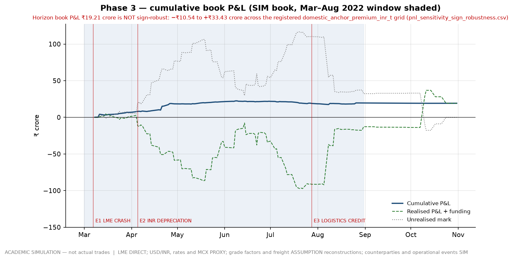
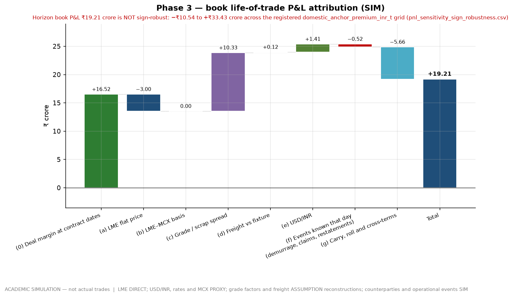
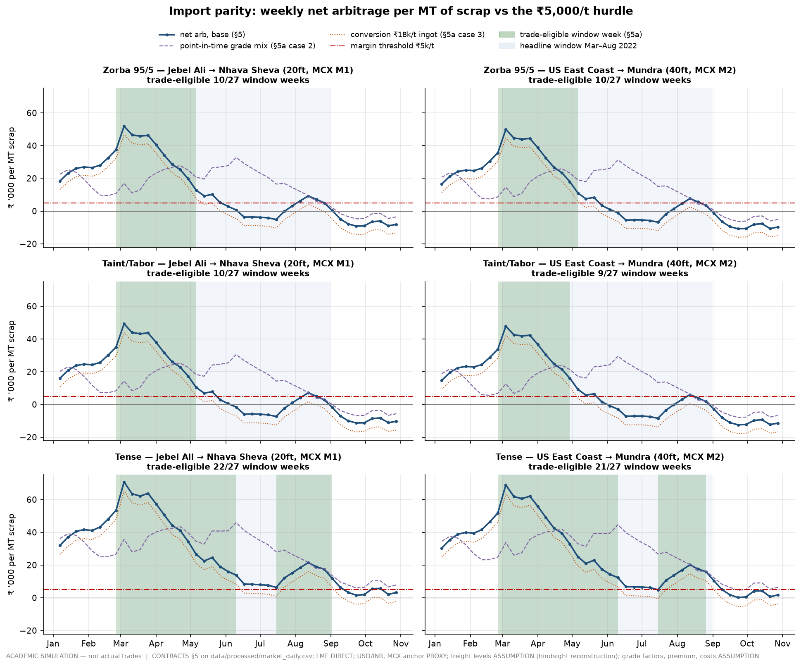
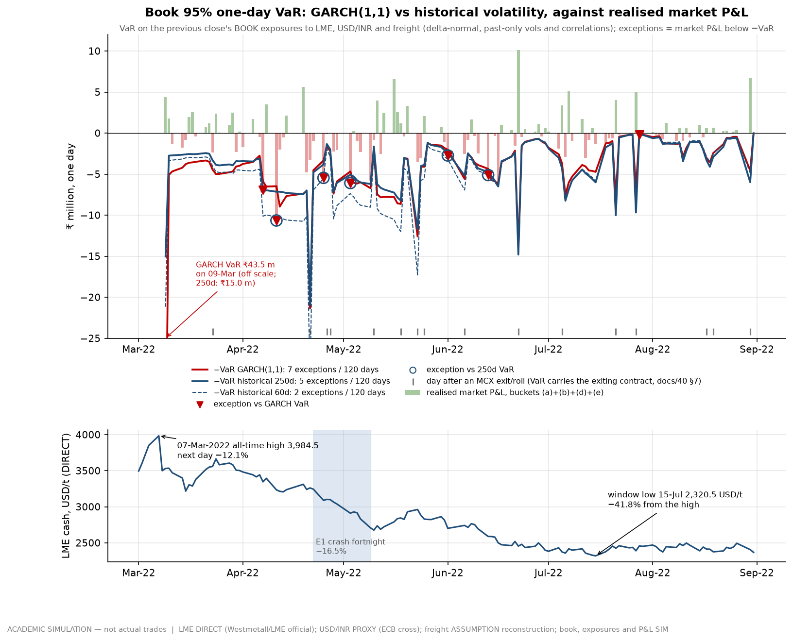
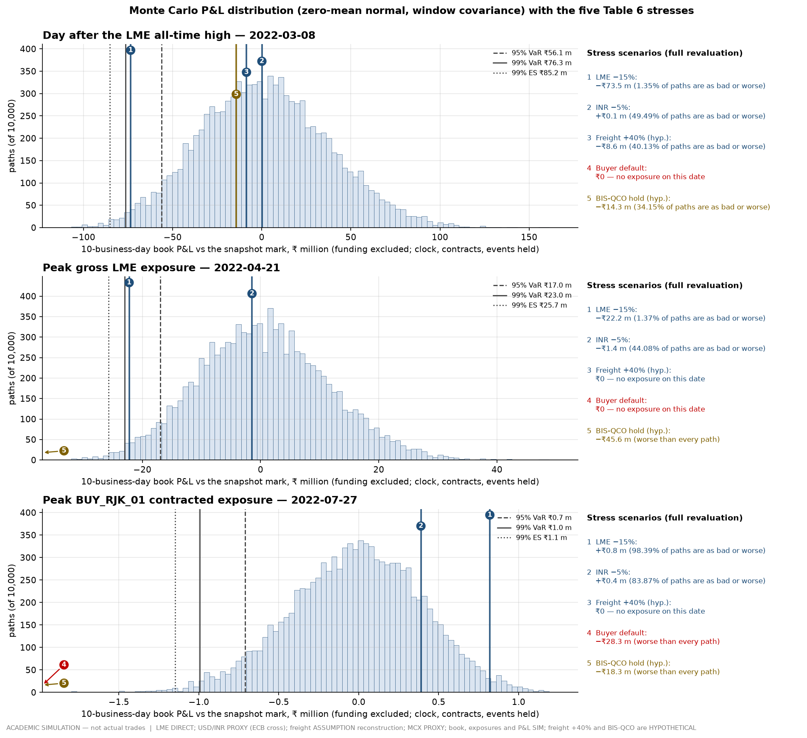
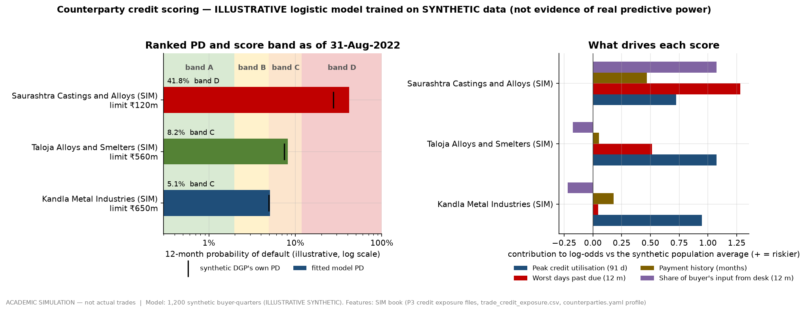
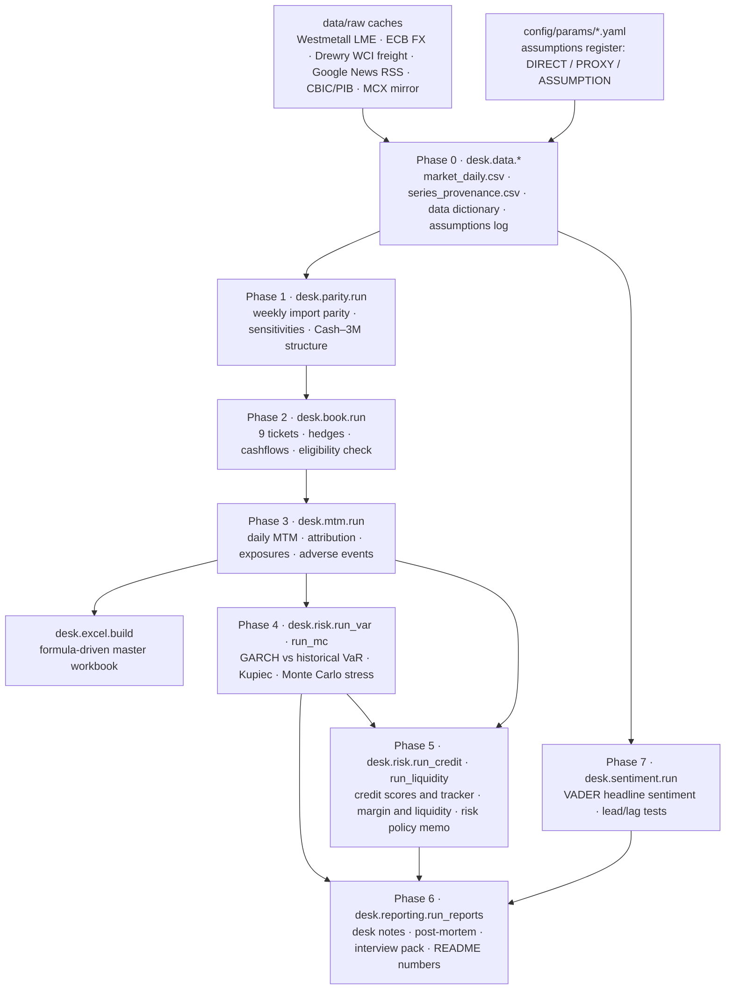

# Virtual Metals Trading Desk: importing aluminium scrap into India, March to August 2022

**Short on time? Read the [one-page summary (PDF)](outputs/reports/one_pager.pdf)** ([Markdown](outputs/reports/one_pager.md)): the desk, its headline P&L with its sensitivity band, and the risk findings on one A4 page.

> **ACADEMIC SIMULATION — not actual trades.** Every counterparty, vessel, bank, trade and operational event in
> this repository is fictional and labelled (SIM). The market data is real where a public source exists and is
> labelled PROXY or ASSUMPTION where it does not. Nothing here is investment advice.

I built and ran a simulated physical aluminium-scrap import desk, the way a trainee on a Hindalco, Vedanta, Tata
International or JSW metals desk would be expected to think about one. The desk buys Zorba, Taint/Tabor and Tense
from Jebel Ali and the US East Coast, ships them to Nhava Sheva and Mundra, and sells them to fictional Indian
smelters. It trades through the real March–August 2022 market: the LME all-time high, the crash that followed, and
the rupee's slide. It is built in phases.

- **Import-parity model.** Decides when a trade is allowed, on a rule declared before any result existed.
- **Nine trade tickets.** Each has SPA terms, Incoterms, LC terms, MCX and USD/INR hedges, and dated cashflows.
- **Daily mark-to-market.** P&L attribution closes to the rupee and is reproduced by a formula-driven Excel
  workbook.
- **Quant risk pack.** GARCH VaR, a Monte Carlo stress, logistic credit scoring, and margin and liquidity analysis.
- **Recruiter-facing reports.** Weekly desk notes, a post-mortem, a one-page risk policy memo and an interview pack.

Every number traces to a flagged source, and every weak spot is stated next to the number it weakens.

## Contents

1. [Headline results](#headline-results)
2. [What is real, what is a proxy, what is an assumption](#what-is-real-what-is-a-proxy-what-is-an-assumption)
3. [Key charts](#key-charts)
4. [How the desk was built: the data pipeline](#how-the-desk-was-built-the-data-pipeline)
5. [Folder structure](#folder-structure)
6. [How to re-run it](#how-to-re-run-it)
7. [Verification checklist](#verification-checklist)
8. [Why these quant methods and not others](#why-these-quant-methods-and-not-others)
9. [Deliverables against the spec](#deliverables-against-the-spec)
10. [Limitations and honest caveats](#limitations-and-honest-caveats)
11. [Interview preparation](#interview-preparation)

## Headline results

Every figure in this table (and in the other generated blocks) is written by `desk/reporting/run_reports.py` from the
published tables. None is typed by hand, and a test fails if the table goes stale.

<!-- BEGIN GENERATED: headline (desk.reporting.run_reports.refresh_readme) -->
| Result | Value | Source |
|---|---|---|
| The book | 9 tickets, 14,350 MT in 656 containers, traded 8-Mar-2022 to 3-Aug-2022 | [`trade_book.csv`](outputs/tables/trade_book.csv) |
| Book P&L to the horizon (31-Oct-2022) | **₹192.1 m** (₹13,384/MT); ₹195.9 m at the window end (31-Aug-2022) | [`attribution_daily.csv`](outputs/tables/attribution_daily.csv) |
| **…read only with its band** | **−₹105.4 m to +₹334.3 m** across the registered `domestic_anchor_premium_inr_t` grid; break-even −38,702 ₹/MT inside the grid — **not sign-robust** | [`pnl_sensitivity_sign_robustness.csv`](outputs/tables/pnl_sensitivity_sign_robustness.csv) |
| Where it came from (lifetime, ₹ m) | deal margin +₹165.2 m, grade spread +₹103.3 m, FX +₹14.1 m, freight +₹1.2 m, LME flat price −₹30.0 m, events −₹5.2 m, carry and roll −₹56.6 m, LME–MCX basis ₹0.0 m (proxy, by construction); residual ₹0 | [`attribution_daily.csv`](outputs/tables/attribution_daily.csv) |
| Tickets | largest T01 +₹64.3 m; worst T08 −₹11.7 m; positive in every registered re-pricing case: T02 (the post-mortem's subject) | [`pnl_sensitivity_pricing.csv`](outputs/tables/pnl_sensitivity_pricing.csv) |
| Trade discipline | 82 of 162 in-window parity cases eligible under the ex-ante rule (111 open on the base screen alone); 9 of 9 tickets pass it | [`parity_weekly.csv`](outputs/tables/parity_weekly.csv), [`trade_eligibility_check.csv`](outputs/tables/trade_eligibility_check.csv) |
| Daily 95 % VaR, 120 position days | mean GARCH ₹4.27 m against ₹3.98 m on the 250-day window; exceptions 7 and 5 (6 expected), Kupiec not rejected for both | [`var_summary.csv`](outputs/tables/var_summary.csv), [`kupiec.csv`](outputs/tables/kupiec.csv) |
| Monte Carlo 99 % 10-day VaR, 10,000 paths | ₹76.3 m (8-Mar), ₹23.0 m (21-Apr), ₹1.00 m (27-Jul); with an MCX basis factor ₹32.8 m and ₹14.6 m on the last two | [`mc_summary.csv`](outputs/tables/mc_summary.csv) |
| Riskiest buyer (synthetic-data model) | BUY_RJK_01: PD 41.8 %, band D; advances up to 1.83× its line, contracted exposure 2.57× the line | [`credit_scores.csv`](outputs/tables/credit_scores.csv) |
| Liquidity | funding need peaked at ₹1,179.0 m (20-Jul) against a ₹1,000 m line sized ex ante on the plan's average balance: 19 days over (none at ₹1,250 m, one ₹25 crore step higher); peak MCX initial margin ₹95.8 m | [`margin_liquidity_summary.csv`](outputs/tables/margin_liquidity_summary.csv) |
| Sentiment overlay | 649 real headlines over 28 weeks; 0 of 12 lead tests significant — no evidence that headline tone led LME; the March spike could not be tested, and 28 weeks can only rule out a strong lead | [`sentiment_summary.csv`](outputs/tables/sentiment_summary.csv) |
<!-- END GENERATED: headline -->

**Read the P&L line only with the band under it.** Most of the P&L is deal margin, set by the desk's own
sale-pricing rule. That rule rests on a domestic anchor premium that could not be verified for 2022. Across the
registered range of that one assumption, the book's P&L changes sign.

## What is real, what is a proxy, what is an assumption

| Flag | Meaning | Examples in this desk |
|---|---|---|
| **DIRECT** | Observed from a named public source | LME aluminium cash, 3M and stocks (LME official prices via Westmetall); HS 7602 duty rates (CBIC); MCX contract specs; RBI and Fed policy rates; real dated news headlines (Google News RSS) |
| **PROXY** | A real observable standing in for what the desk needs | USD/INR as an ECB cross (not the RBI reference rate); MCX Aluminium at duty-paid import parity (unit beta by construction); the DGCIS unit-value grade-factor path (published after the fact) |
| **ASSUMPTION** | A judgement, with its justification in the register | Container freight lane levels (hindsight-calibrated); the domestic anchor premium; conversion cost; bank lines; every desk policy limit; the synthetic credit training data |
| **SIM** | Fictional by design | Counterparties, vessels, forwarders, banks, the nine tickets, quality and logistics events |

<!-- BEGIN GENERATED: provenance (desk.reporting.run_reports.refresh_readme) -->
| Count | DIRECT | PROXY | ASSUMPTION | Total |
|---|--:|--:|--:|--:|
| Parameters in `config/params/*.yaml` | 51 | 16 | 165 | 232 |
| Columns of the daily market panel ([`series_provenance.csv`](data/processed/series_provenance.csv)) | 7 | 14 | 7 | 28 |

Verification status of the 232 parameters: **47 VERIFIED**, 24 PARTIAL, **46 PENDING** (each with its next step), and 115 N/A (desk policy, model design or scenario choices that no public source can verify).
<!-- END GENERATED: provenance -->

The full register is rendered in [`docs/00_assumptions_log.md`](docs/00_assumptions_log.md). Every processed column
is described in [`docs/00_data_dictionary.md`](docs/00_data_dictionary.md), and every volatile parameter's check is
logged in [`docs/verification_log.md`](docs/verification_log.md).

## Key charts

Every chart carries the simulation label in its footer.

**Cumulative book P&L through the window and to the settlement horizon**


**Where the book's P&L came from, by attribution bucket**


**The parity model: weekly net arbitrage and when the window was open**


**GARCH against historical-volatility VaR on the book**


**Monte Carlo P&L distributions with the five stress scenarios overlaid**


**MCX margin cash and funding need against the bank lines**


**Counterparty credit scores and bands**


**Weekly headline sentiment against LME cash**


## How the desk was built: the data pipeline

Stages talk to each other only through files, so any stage can be re-run on its own. Build order follows the spec
(Table 9); the stage registry is [`run_all.py`](run_all.py) and the interfaces are fixed in
[`CONTRACTS.md`](CONTRACTS.md).



## Folder structure

```
.
├── README.md                  this page
├── CONTRACTS.md               the shared build contract: units, flags, file schemas, the ex-ante trade rule
├── run_all.py                 rebuilds everything in spec build order (--list / --only / --from)
├── requirements.txt           pinned Python dependencies
├── config/
│   ├── params/*.yaml          the assumptions register: every parameter with value, unit, flag, source, verification
│   ├── counterparties.yaml    SIM suppliers and buyers, credit limits, scoring profiles
│   └── trades.yaml            the nine trade tickets (decisions only; derived numbers are recomputed)
├── data/
│   ├── raw/                   immutable download caches (+ _download_manifest.json with URL, date, sha256)
│   ├── manual/                optional drop-in official files that upgrade a PROXY to DIRECT
│   ├── interim/               derived evidence and audit tables (freight points, price evidence, MCX mirror)
│   └── processed/             the clean panels every later phase reads
├── desk/
│   ├── data/                  Phase 0 fetchers, panel builder, dictionary generator
│   ├── parity/                Phase 1 import parity model
│   ├── book/                  Phase 2 ticket schema, validation, trade book
│   ├── mtm/                   Phase 3 valuation, lifecycle, attribution, exposures, adverse events
│   ├── excel/                 master workbook builder
│   ├── risk/                  Phases 4–5 GARCH VaR, Monte Carlo, credit, liquidity, policy memo
│   ├── sentiment/             Phase 7 headline fetch and sentiment overlay
│   └── reporting/             Phase 6 chart style, PDF renderer, desk notes, post-mortem, interview pack, runner
├── outputs/
│   ├── tables/*.csv           every published number
│   ├── charts/*.png           every chart (SIM label in the footer)
│   ├── excel/                 Metals_Desk_Master.xlsx + reconciliation.json
│   └── reports/               desk notes, post-mortem, risk policy memo, interview pack (.md + .pdf)
├── docs/
│   ├── INDEX.md               every spec row mapped to the file and section that delivers it
│   ├── spec/                  the master spec (source of truth for scope)
│   ├── 00_*.md … 70_*.md      methodology and results, one page per component
│   ├── design/  research/     design synthesis and source notes
│   └── reviews/               review findings and the fix log
└── tests/                     pytest, one module per stage
```

## How to re-run it

The project uses Python 3.12 and a local virtual environment.

```sh
python3.12 -m venv .venv
.venv/bin/pip install -r requirements.txt

.venv/bin/python run_all.py --list                       # the stages, in build order
DESK_OFFLINE=1 .venv/bin/python run_all.py               # rebuild everything from data/raw caches, no network
DESK_OFFLINE=1 .venv/bin/python run_all.py --only P4     # one phase
DESK_OFFLINE=1 .venv/bin/python run_all.py --from P3     # resume from a phase onwards
DESK_OFFLINE=1 .venv/bin/python -c "import desk.reporting.interview_pack as m; m.main()"   # one stage module
```

- **`DESK_OFFLINE=1`** makes every fetcher use the cached raw data and never touch the network. Without it, the
  Phase 0 fetchers refresh their caches, with retries, because the network path can be flaky.
- **Stages communicate only through files** in `data/processed/` and `outputs/tables/`. After changing one phase,
  re-run from that phase onwards with `--from`.

**Tests.**

```sh
DESK_OFFLINE=1 .venv/bin/python -m pytest -q                                   # default suite; slow tests are skipped
DESK_OFFLINE=1 .venv/bin/python -m pytest -q tests/test_reports_runner.py      # one stage's tests
DESK_OFFLINE=1 DESK_RUN_SLOW=1 .venv/bin/python -m pytest -q tests/test_excel_reconciliation.py   # full Excel recalculation
```

> **Memory warning.** The slow Excel reconciliation recalculates every formula cell outside Excel. It peaks at about
> 2.8 GB of RAM (allow about 3 GB) and takes minutes. Run it on its own, with no other pipeline stage or test
> process running. On an 8 GB machine, run one stage or one test file at a time, and keep thread pools at one
> (`OMP_NUM_THREADS=1 OPENBLAS_NUM_THREADS=1 MKL_NUM_THREADS=1`).

## Verification checklist

- [x] **Deterministic.** All randomness seeds from `desk.RNG_SEED`, and PDFs are built with reportlab's invariant
  mode. Re-running a stage reproduces its CSVs, charts and PDFs byte for byte; the stage tests check this where it
  matters.
- [x] **Test suite.** [`tests/`](tests/) has one module per stage, covering determinism, no look-ahead, controls,
  and doc numbers against CSVs. Run it with the commands above.
<!-- BEGIN GENERATED: verification (desk.reporting.run_reports.refresh_readme) -->
- [x] **Attribution closes.** Largest |residual| across 1,154 trade-day rows: ₹0 (tolerance ₹1). Phase 3 controls: 205 of 215 PASS, 0 failing, the rest INFO ([`pnl_controls.csv`](outputs/tables/pnl_controls.csv)).
- [x] **Excel reconciliation PASS.** 132,447 formula cells recalculated outside Excel, 3,998 check cells, 0 failures ([`reconciliation.json`](outputs/excel/reconciliation.json)).
- [x] **Eligibility rule declared ex ante** (CONTRACTS §5a, before any Phase 1 result): 9 of 9 tickets pass ([`trade_eligibility_check.csv`](outputs/tables/trade_eligibility_check.csv)).
- [x] **Risk numbers tie to P&L.** Monte Carlo controls: 3 of 3 PASS ([`mc_controls.csv`](outputs/tables/mc_controls.csv)); liquidity controls: 11 of 11 PASS ([`margin_liquidity_controls.csv`](outputs/tables/margin_liquidity_controls.csv)).
<!-- END GENERATED: verification -->
- [x] **Hindsight is tested, not assumed.** Stages that write dated decisions are checked by perturbing data after
  the decision date and confirming nothing changes. These are the GARCH forecasts, the desk notes, the post-mortem
  thesis, the credit tracker and the sentiment z-scores.
- [x] **Reviewed.** The Phase 1–3 review findings and how each was resolved are in
  [`docs/reviews/phase1-3_fix_log.md`](docs/reviews/phase1-3_fix_log.md), with the raw findings in
  [`docs/reviews/phase1-3_review_findings.json`](docs/reviews/phase1-3_review_findings.json).
- [x] **Volatile parameters checked at source.** Duty, QCO status, MCX specs, forward premium and the Cash–3M spread
  each have a status and a next step in [`docs/verification_log.md`](docs/verification_log.md). PENDING items are
  listed as PENDING, not glossed.

## Why these quant methods and not others

I used GARCH(1,1) because a desk needs tomorrow's volatility rather than last year's, and a three-parameter model (ω, α, β) that reacts to a shock within a day and lets it decay is something a risk manager can check by hand, which is also why I report the lead test it lost. I used Monte Carlo because this book's averaging clauses, MCX hedges and FX conversions react to LME, the rupee and freight together, so ten thousand joint paths through the same valuation function that produces the daily P&L say more than a delta-normal number, while named scenarios cover what no covariance matrix contains, such as a buyer default or a customs hold. I used a four-feature logistic regression for credit because, with three buyers and no default history, a model whose coefficients a credit committee can read, trained openly on labelled synthetic data, is honest where a boosted-tree or neural classifier would fit noise with false confidence. Price-prediction models such as LSTMs and other deep learning were deliberately excluded: a physical desk earns on structure and hedges flat price, no credible trader claims to call LME direction with a neural net, and the one cheap signal I did test, headline sentiment, showed no evidence of leading the market, in a sample too short to rule out anything but a strong lead.

## Deliverables against the spec

The scope is defined by [`docs/spec/MASTER_SPEC_V3.md`](docs/spec/MASTER_SPEC_V3.md). Every row of Tables 3–8 is
mapped to the file and section that delivers it in **[`docs/INDEX.md`](docs/INDEX.md)**, including the gaps.

| Spec | Component | Main documents | Main outputs |
|---|---|---|---|
| Table 3 | Trade finder: import parity | [`docs/10_parity_model.md`](docs/10_parity_model.md) | `outputs/tables/parity_*.csv`, `term_structure_*.csv` |
| Table 4 | Mock trading book | [`docs/20_trade_book.md`](docs/20_trade_book.md) | [`config/trades.yaml`](config/trades.yaml), `trade_book.csv`, `trade_hedges.csv`, `trade_cashflows.csv` |
| Table 5 | Daily MTM and attribution | [`docs/30_mtm_attribution.md`](docs/30_mtm_attribution.md), [`docs/31_adverse_events.md`](docs/31_adverse_events.md), [`docs/35_excel_workbook.md`](docs/35_excel_workbook.md) | `mtm_daily.csv`, `attribution_daily.csv`, `adverse_event_*.csv`, [`Metals_Desk_Master.xlsx`](outputs/excel/Metals_Desk_Master.xlsx) |
| Table 6 | Risk pack | [`docs/40_var_garch.md`](docs/40_var_garch.md), [`docs/41_monte_carlo.md`](docs/41_monte_carlo.md), [`docs/50_credit_scoring.md`](docs/50_credit_scoring.md), [`docs/51_margin_liquidity.md`](docs/51_margin_liquidity.md) | `var_*.csv`, `kupiec.csv`, `mc_*.csv`, `credit_*.csv`, `margin_liquidity_*.csv`, [`risk_policy_memo.pdf`](outputs/reports/risk_policy_memo.pdf) |
| Table 7 | Desk reporting pack | [`docs/70_sentiment_overlay.md`](docs/70_sentiment_overlay.md), this README | [`outputs/reports/`](outputs/reports/): desk notes, [`post_mortem.pdf`](outputs/reports/post_mortem.pdf) |
| Table 8 | Quality bar | [`docs/verification_log.md`](docs/verification_log.md), [`docs/00_assumptions_log.md`](docs/00_assumptions_log.md) | [`interview_pack.pdf`](outputs/reports/interview_pack.pdf), tests, Excel reconciliation |

## Limitations and honest caveats

<!-- BEGIN GENERATED: caveats (desk.reporting.run_reports.refresh_readme) -->
1. **The headline is an assumption, not a result.** 86 % of lifetime P&L is deal margin from the desk's own sale-pricing rule on `domestic_anchor_premium_inr_t` (PENDING verification); the band is −₹105.4 m to +₹334.3 m.
2. **The grade path is hindsight.** Re-priced on the point-in-time grade mix the book makes ₹97.3 m, and grade spread turns −₹36.8 m.
3. **MCX is a proxy with unit beta by construction.** A third-party mirror gives beta 0.75 on weekly closes (t −4.9 against one); its daily 0.45 is biased down by MCX's evening close and is the pessimistic end, not a hedge ratio. Mean daily GARCH VaR is ₹4.27 m on the proxy, ₹8.5 m at the weekly beta and ₹17.3 m at the daily one; a basis factor raises Monte Carlo 99 % VaR from ₹1.00 m to ₹14.6 m on 27-Jul. Basis risk is under-represented in every base number.
4. **Freight is one factor and reconstructed.** The Gulf lane is 0.226 × the US lane every week, and lane levels are hindsight-calibrated.
5. **The book did not fit its own bank lines — on two stated conventions.** Funding need ₹1,179.0 m against a ₹1,000 m line sized ex ante on the plan's *average* balance (19 days over); one more ₹25 crore step (₹1,250 m) and the line is never breached. LCs outstanding ₹1,414.8 m against ₹1,000 m (17 days over), counted at face plus the LC tolerance; without the tolerance ₹1,286.2 m and 11 days. The lesson is to stress the plan's peak, not its average — a bank sanctions before the book exists.
6. **GARCH did not win its declared lead test.** The 250-day window crossed its alert level 3 trading days before GARCH into March; into the crash fortnight GARCH sat below both windows.
7. **Credit scores are illustrative.** The logistic model is fitted on 1,200 synthetic buyer-quarters, and the buyer profiles were written by the same author as the book.
8. **Stresses outside the distribution are hypothetical.** No BIS QCO applied to scrap in 2022; the QCO stress (a ₹45.6 m loss on 21-Apr) and the freight +40 % spike are labelled HYPOTHETICAL.
<!-- END GENERATED: caveats -->

Other limits that carry no single number:

- MCX holidays, daily price limits and SPAN margin are not modelled.
- Schedule slippage (a missed laycan) is sized, not simulated.
- Buyer default loss uses a stated recovery rather than a cargo-resale model.
- No joint case of a low anchor premium together with the point-in-time grade mix has been published.

## Interview preparation

- **[`outputs/reports/interview_pack.md`](outputs/reports/interview_pack.md)**
  ([PDF](outputs/reports/interview_pack.pdf)). The 17 toughest questions a physical metal trader would ask, with
  answers built on this book's numbers. It includes "Why GARCH instead of just historical volatility?" and "Why
  didn't you try to predict LME direction with machine learning?".
- **[`outputs/reports/post_mortem.md`](outputs/reports/post_mortem.md).** Two pages on the best trade, including what
  was luck.
- **[`outputs/reports/risk_policy_memo.md`](outputs/reports/risk_policy_memo.md).** The desk's limits, tested against
  its own book.
- **Weekly desk notes** in [`outputs/reports/`](outputs/reports/). Each is written strictly as of its own Friday
  close.
