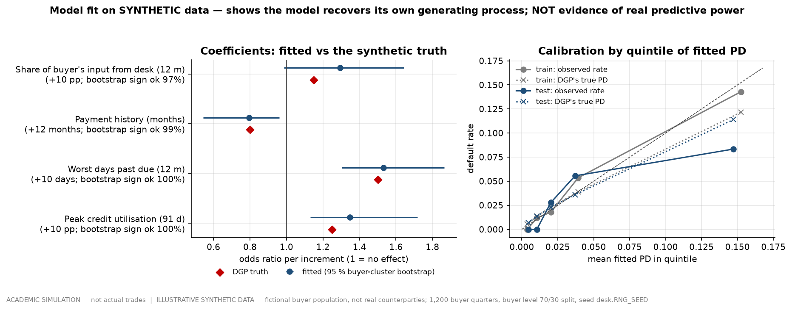
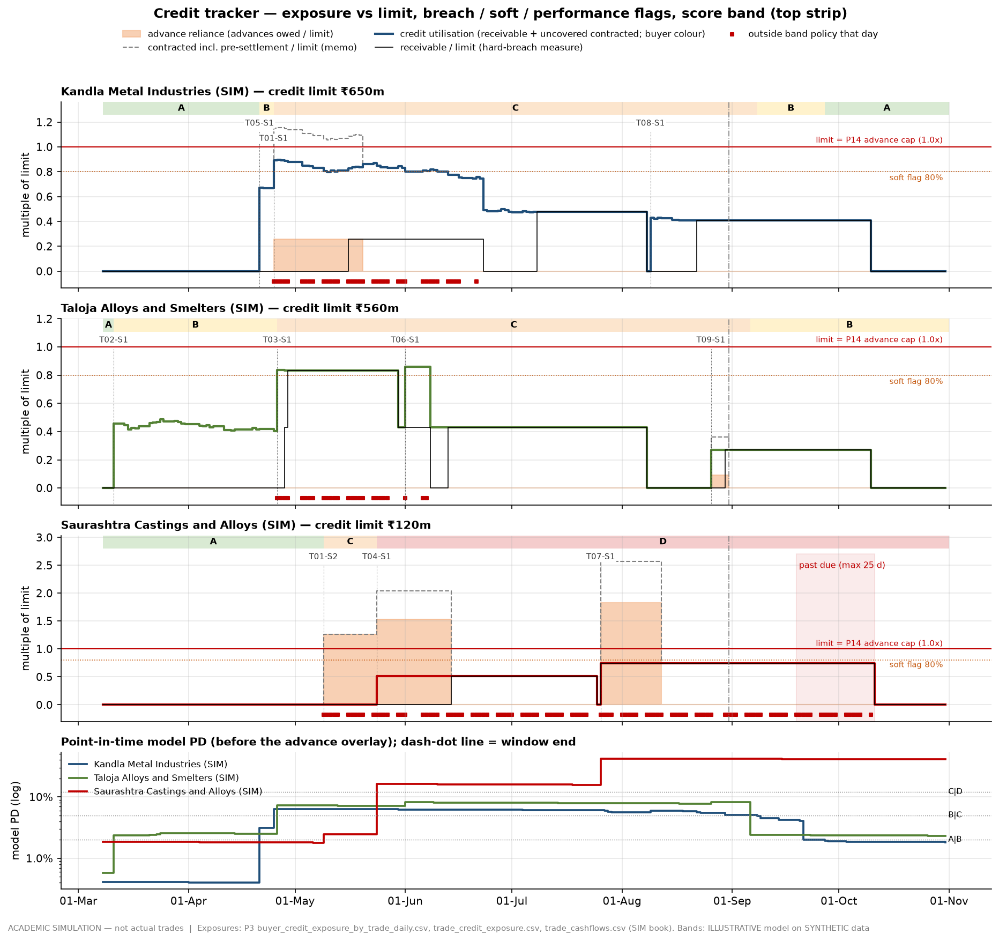

# 50 — Counterparty credit scoring and the credit tracker (MASTER_SPEC Table 6, rows 4.3 ★ and 4.4)

**ACADEMIC SIMULATION — not actual trades.** The three buyers and three suppliers scored and tracked here are
fictional (SIM). **The credit model is ILLUSTRATIVE and trained on SYNTHETIC data**: a population of 300 fictional
Gujarat foundries and secondary smelters, generated by a process written down in this page. Nothing below is
evidence that the model predicts real defaults, and no probability of default on this page is a measurement of any
real company.

```sh
cd ujjwal   # the repository root
DESK_OFFLINE=1 .venv/bin/python -c "import desk.risk.run_credit as m; m.main()"   # ~6 s, deterministic
DESK_OFFLINE=1 .venv/bin/python -m pytest -q tests/test_risk_credit.py
```

| Output | What it holds |
|---|---|
| `outputs/tables/credit_synthetic_training_data.csv` | 1,200 synthetic buyer-quarters: features, latent weakness, true PD, 12-month default flag, train/test split. Every row labelled `ILLUSTRATIVE SYNTHETIC DATA` |
| `outputs/tables/credit_model_coefficients.csv` | true vs fitted coefficients, odds ratios per stated increment, buyer-cluster bootstrap 95 % intervals and sign shares |
| `outputs/tables/credit_model_fit.csv` | AUC, Brier, log loss for train and test, each beside the DGP's own ("oracle") value |
| `outputs/tables/credit_model_calibration.csv` | quintile calibration, train and test |
| `outputs/tables/credit_model_sample_size.csv` | how often a fit on a fresh draw of the same process recovers each sign, at 600 / 1,200 / 4,000 rows |
| `outputs/tables/credit_band_policy.csv` | band → PD range → limit policy (§6; the risk memo quotes this) |
| `outputs/tables/credit_scores.csv` | the three SIM buyers ranked as of 2022-08-31, with feature values, contributions, band and limit action |
| `outputs/tables/credit_scores_sensitivity.csv` | the same ranking under ten variants of the assumptions it rests on |
| `outputs/tables/credit_tracker.csv` | date × counterparty (164 panel days × 6): exposures, limits, utilisation, breach / soft / performance flags, the score band as of that day, dated events |
| `outputs/tables/credit_tracker_bookings.csv` | each of the ten sale bookings tested against the band policy at the previous close (retrospective) |
| `outputs/charts/p5_credit_scores.png`, `p5_credit_tracker.png`, `p5_credit_model_fit.png` | the three figures in §4, §5 and §7 |

Code: `desk/risk/credit_scoring.py` (generator, model, bands), `desk/risk/credit_tracker.py` (point-in-time
exposures, features, flags, bookings), `desk/risk/run_credit.py` (stage, controls, charts). Parameters:
`config/params/risk_credit.yaml` (21 keys, all ASSUMPTION).

---

## 1. What this does and doesn't tell you

**Read this before any number below.**

**Does.**

* It shows a **credit process a committee can argue with**: four named behavioural features, four coefficients
  with signs and odds ratios, a PD, a band, and a written band → limit policy. Every step from exposure file to
  limit action can be traced by hand.
* It scores the three SIM buyers **point-in-time** from the simulated book's own exposure files. A score dated `d`
  uses only rows dated on or before `d`; a test rebuilds the tracker from inputs cut off at `d` and gets identical
  rows (§8).
* It puts **advance reliance** — the performance exposure Phase 2's rule P14 warned about and Phase 3 left open —
  on the tracker every day, next to the two credit measures, with its own flag and a documented overlay on the band.
* It shows that on this book the band policy would have **objected to five of ten sale bookings on the day before
  each was signed**, including all three BUY_RJK_01 advances (§7.4).

**Doesn't.**

* **It is not evidence of predictive power.** The model was trained on data generated from a logistic process with
  exactly the model's four features. Its test AUC of **0.80** says it recovered the generator, nothing more.
  A real portfolio would be misspecified, smaller, and have far fewer defaults.
* **The ranking of the SIM buyers is largely by construction.** `config/counterparties.yaml` was written with a
  `profile` block "so the Phase 5 logistic credit model has features that separate", by the same author who made
  BUY_RJK_01 the simulated late payer in adverse event #3. That the model ranks it worst is a consistency check on
  the simulation, **not a validation of the model**.
* **The PDs are not calibrated to India.** The population default rate is an ASSUMPTION of 4 %/yr (§3.1). Bands
  are absolute PD cut-offs, so this one number moves bands (§5.4); it does not move the ranking.
* **The weakest coefficient is weakly identified.** Order concentration came out with the right sign on this draw,
  but on 200 fresh draws of the *same* process at the *same* size the sign was right only **81.5 %** of the time
  (§4.3). A committee should treat concentration as a limit rule, not trust its fitted coefficient.
* **A behavioural score cannot see a name it has not lent to.** Before its first sale every buyer scores A,
  because utilisation and concentration are zero. BUY_RJK_01 was band A at the close before the desk relied on a
  ₹151.6 m advance from it; the advance overlay and P14 caught that booking, the model did not (§5.3).
* **No expected loss, LGD or exposure-at-default is modelled.** Advance failure costs the desk the replacement
  value of cargo it must resell with the hedge already lifted, not the advance itself; that loss is a market-risk
  number this page does not compute (§9).

**Why logistic regression and not gradient boosting or a neural net.** A credit committee has to be able to read
each coefficient, ask whether its sign makes sense, and see which feature moved a name from B to C. Four
coefficients allow that; `credit_scores.csv` publishes each buyer's log-odds contribution by feature. A black-box
model on 1,200 synthetic rows would fit the generator's noise, could not be challenged line by line, and would
claim a sophistication the data cannot support. The same reasoning excludes price-prediction models from the whole
desk (MASTER_SPEC Table 1).

---

## 2. Design in one paragraph

A **synthetic population** (§3) trains a four-feature **logistic regression** (§4). The model scores the three SIM
buyers every panel day from the **book's own exposure files** (§5), maps PD to a **band**, and downgrades the band
one notch when the buyer's **advance reliance** exceeded the P14 cap in the last quarter (§3.2). The band sets a
**limit policy** (§6). The **tracker** (§7) reports, per counterparty per day, the credit exposure, the receivable,
the advances still owed and the contracted total against the limit, raises hard / soft / performance / band-policy
flags, and carries the band as of that day. A retrospective **booking check** tests every sale against the band at
the previous close.

---

## 3. The synthetic data-generating process (ILLUSTRATIVE, SYNTHETIC)

### 3.1 Population, features and the true PD

`credit_scoring.generate_synthetic` draws **300 fictional buyers × 4 quarters = 1,200 buyer-quarters** with
`numpy.random.default_rng(desk.RNG_SEED)`. Each buyer has a latent weakness `w ~ N(0,1)`. Weak buyers run fuller
lines, pay later, have slightly shorter histories and source more from one importer, so the features are correlated
the way a real portfolio's are. **`w` never enters the default probability**: the true 12-month PD depends on the
four features only.

| Feature | Definition (training grain = one buyer-quarter) | Generator (`risk_credit.yaml`) | 1st / 50th / 99th pct |
|---|---|---|---|
| `utilisation_frac` | peak credit utilisation in the quarter: (receivable + contracted-not-invoiced not covered by an advance) / credit limit | `clip(0.50 + 0.15w + 0.20e, 0, 1.30)` | 0.00 / 0.50 / 1.03 |
| `dpd_max_days` | worst days past due in the trailing 12 months | 0 with prob. `1 − sigmoid(−0.3 + w)`, else `ceil(Exp(12·e^{0.35w}))`, cap 120 | 0 / 0 / 55 (45 % of rows > 0) |
| `history_months` | months of payment history with the desk | `exp(ln 30 − 0.2w + 0.7e_b) + 3 × quarter`, clip 1–180 | 8.5 / 34.6 / 171.8 |
| `order_concentration_frac` | share of the buyer's annual raw-material spend bought from this desk | `sigmoid(−1.8 + 0.5w + 0.8e_b + 0.3e_q)` | 0.013 / 0.141 / 0.621 |

`true_pd = sigmoid(b0 + Σ β_k x_k)`, with each `β_k = ln(odds ratio) / increment` from the register:

| Feature | Odds ratio (ASSUMPTION) | Per | Reasoning (full text in the YAML note) |
|---|---|---|---|
| utilisation | **1.25** | +10 pp | a buyer living near its limit has no headroom when its own customers pay late; 30 % → 90 % ≈ ×3.8 |
| days past due | **1.50** | +10 days | a missed due date is an observed payment failure, not a circumstance, so it is the strongest per-unit driver; 0 → 37 d ≈ ×4.5 |
| history | **0.80** | +12 months | thin-file names default more, but history is survivorship evidence, not a balance sheet, so the weakest effect |
| concentration | **1.15** | +10 pp | a buyer sourcing most of its input from one supplier on credit is using that supplier as a financier; 10 % → 60 % ≈ ×2.0 |

`b0 = −4.607` is solved so the population mean true PD equals **`credit_synth_base_default_rate_annual_frac` =
4 %** exactly (a test asserts it). That rate is an **ASSUMPTION**, inside the 2–5 %/yr band the Phase 5 brief sets,
and deliberately far below the only published Indian MSME figures found: the TransUnion CIBIL–SIDBI MSME Pulse
release of 8-Aug-2022 gives an MSME **NPA rate of 12.8 % in March 2022** (20.8 % at public sector banks, 9.6 % at
NBFCs, 5.6 % at private banks in FY22-Q4) and notes that about 70 % of 90+ DPD balances were originated up to March
2017. Those are balance-weighted **stock** ratios on multi-year bank loans dominated by old vintages; supplier trade
credit runs 30–45 days, is re-underwritten every parcel and is cut off at the first missed payment, so its annual
**flow** default rate should be lower. No published 2022 annual default rate for trade credit to Indian foundries
was found; the 4 % is a judgement and is flagged as one.

The realised draw has **50 defaults** (4.2 %). The train/test split is **by buyer** (210 / 90 buyers,
840 / 360 rows): a buyer's four quarters share its latent weakness, and a row-level split would leak it.
Simplifications, all stated in the code: observations of one buyer are treated as independent quarters with
overlapping 12-month outcome windows, and a defaulted buyer keeps being observed.

### 3.2 Why advance reliance is an overlay, not a feature

The brief allowed either. It is an **overlay** (`credit_performance_overlay_notches` = 1: downgrade one band if
advances owed exceeded `buyer_advance_limit_multiple_of_credit_limit` = 1.0× limit on any day of the last 91), and
the utilisation feature **excludes** advances still owed. Four reasons:

1. **It is exposure, not likelihood.** A PD is a property of the obligor; how much the desk loses if the obligor
   fails is a property of the facility. An advance that does not arrive leaves the desk with unsold cargo and a
   lifted hedge — a loss the size of a price move, not of the advance. Folding it into the PD and then multiplying
   the PD by the exposure would count it twice.
2. **It sits far outside any trainable support.** BUY_RJK_01's contracted exposure reached **2.57×** its limit; the
   training feature's 99th percentile is **1.03**. `credit_scores.csv` publishes the variant anyway:
   counting advances in utilisation gives BUY_RJK_01 a PD of **99.4 %**, which is the logistic curve extrapolating,
   not information (`alt_utilisation_in_support = False`).
3. **Phase 3 already removed that sum once.** docs/31 §3.4 records the correction: summing advances owed with
   receivables made the book look 2.57× over a line it never drew. Re-introducing the sum inside a PD would
   re-introduce the error.
4. **A notch is challengeable.** A committee can see the rule, see when it fired and switch it off
   (`no_overlay` in `credit_scores_sensitivity.csv`).

---

## 4. Fit results (fit to its own synthetic process — NOT real predictive power)



### 4.1 Coefficients

scikit-learn `LogisticRegression(C=inf)` (unpenalised, so coefficients compare directly with the DGP) on
standardised training features. Intervals: 500 buyer-cluster bootstrap refits.

| Feature | Odds ratio — truth | Fitted | Bootstrap 95 % | Sign matches DGP | Bootstrap share with right sign | Fitted OR per 1 sd |
|---|---|---|---|---|---|---|
| utilisation (per +10 pp) | 1.25 | **1.35** | 1.13 – 1.72 | yes | 99.6 % | 2.02 |
| days past due (per +10 d) | 1.50 | **1.53** | 1.30 – 1.87 | yes | 100 % | 1.71 |
| history (per +12 m) | 0.80 | **0.79** | 0.54 – 0.96 | yes | 99.0 % | 0.55 |
| concentration (per +10 pp) | 1.15 | **1.29** | 0.99 – 1.64 | yes | 96.6 % | 1.39 |
| intercept (raw units) | −4.607 | −5.289 | | | | |

All four signs match. Utilisation and concentration are **over-estimated** on this draw, and the concentration
interval touches 1 (no effect). Both over-estimates push the fitted PD of high-utilisation, high-concentration names
above the truth, which is exactly what happens to BUY_RJK_01 in §5.

### 4.2 Discrimination and calibration

| Metric | Train | Test | Test, the DGP's own PD ("oracle") |
|---|---|---|---|
| observations / defaults | 840 / 38 | 360 / 12 | |
| AUC | 0.850 | **0.801** | 0.787 |
| Brier score | 0.0376 | 0.0322 | 0.0314 (constant train rate: 0.0324) |
| mean fitted PD vs observed rate | 4.52 % / 4.52 % | 4.39 % / 3.33 % | |
| correlation fitted vs true PD | 0.988 | 0.980 | |

The fitted model's test AUC is *above* the oracle's: with 12 test defaults that is noise, and it is the clearest
sign of how little a 360-row test set can say. By quintile of fitted PD (test), the top quintile averages a fitted
**14.7 %** against a true 11.4 % and an observed 8.3 %: the model is over-confident at the top, again consistent
with §4.1.

### 4.3 Is 1,200 rows enough? (`credit_model_sample_size.csv`)

200 fresh draws of the same DGP at each size, refit, test on each draw's own buyer split:

| Buyer-quarters | Mean training defaults (EPV) | All four signs right | Concentration sign right | Test AUC, 5th–95th pct |
|---|---|---|---|---|
| 600 (the brief's upper example) | 16.9 (4.2) | 72.5 % | 78.0 % | 0.64 – 0.92 |
| **1,200 (used)** | 33.6 (8.4) | **80.5 %** | **81.5 %** | 0.68 – 0.88 |
| 4,000 | 111.9 (28.0) | 97.0 % | 97.0 % | 0.74 – 0.85 |

The size was fixed from a 20-draw pilot on an earlier draft of the generator, which suggested ~95 % sign recovery
at 1,200 rows. It was **not
re-chosen** after this 200-draw study; the study is published instead. The finding is the point: even a correctly
specified model on a data set larger than any single desk would hold gets its weakest coefficient's sign wrong about
one time in five. Utilisation and days past due are recovered in 100 % of draws at 1,200 rows.

---

## 5. Scoring the SIM buyers

### 5.1 Point-in-time features from the actual book

For each panel day `d` (the 164 engine days 2022-03-08 → 2022-10-31), using only rows dated ≤ `d`:

| Feature | Computed from | Notes |
|---|---|---|
| `feat_utilisation_peak_91d_frac` | max over (d−91, d] of **credit utilisation** = (receivable + presettlement − advances owed) / limit. Receivable and presettlement: `buyer_credit_exposure_by_trade_daily.csv` summed by buyer (P3). Advances owed: booking-time advance (`trade_credit_exposure.csv` invoice − credit value) until its `SALE_ADVANCE` settle date in `trade_cashflows.csv` (REALISED) | the desk's own limit definition (`config/counterparties.yaml` header, docs/20 rule C1 — the measure P04 checks at bookings), evaluated daily |
| `feat_dpd_max_12m_days` | max(`profile.prior_dpd_max_days`, max over (d−365, d] of P3 `days_past_due` mapped from trade to buyer) | ASSUMPTION: the profile's prior worst delinquency is dated inside the 12 months before the book, so it stays in window |
| `feat_history_months` | (d − `profile.relationship_start`) / 30.44 | |
| `feat_order_concentration_frac` | booking-time invoice value of sales to the buyer contracted in (d−365, d] ÷ (`annual_turnover_inr` × `secondary_raw_material_cost_share` 0.825) | pre-book invoices have no recorded values, so early readings are lower bounds. The profile's `group_concentration_frac` is **not** used: it is undefined in the schema and matches the whole book's final sales (BUY_RJK_01 0.58 vs 0.59 computed at 31-Aug), so using it before those sales were contracted would be look-ahead |
| overlay trigger `advance_reliance_peak_91d_multiple` | max over (d−91, d] of advances owed / limit | fires above 1.0× |

### 5.2 Ranking as of 2022-08-31 (`credit_scores.csv`)


| Rank | Buyer | Limit | Credit util. peak 91 d | Worst DPD 12 m | History (m) | Concentration | **Model PD** | DGP's own PD | Band model → final | Limit action |
|---|---|---|---|---|---|---|---|---|---|---|
| 1 | Saurashtra Castings and Alloys (SIM) `BUY_RJK_01` | ₹120 m | 0.744 | 37 | 18.7 | **0.593** | **41.8 %** | 27.6 % | **D → D** (overlay fired: 1.83× advance, already D) | REDUCE — line to ₹60 m; advance or CAD only; hedge stays on until the advance arrives |
| 2 | Taloja Alloys and Smelters (SIM) `BUY_JNPT_01` | ₹560 m | **0.861** | 19 | 40.5 | 0.109 | **8.2 %** | 7.5 % | **C → C** | FREEZE — no increase; security for credit balances; advance reliance ≤ 0.5× |
| 3 | Kandla Metal Industries (SIM) `BUY_MUN_01` | ₹650 m | 0.819 | 8 | 33.9 | 0.092 | **5.1 %** | 4.9 % | **C → C** (0.1 pp above the B line) | FREEZE (see §5.4: B under the DGP truth) |

Log-odds contributions against the synthetic average (the intercept alone is a 2.0 % PD):

| Buyer | utilisation | days past due | history | concentration | biggest driver |
|---|---|---|---|---|---|
| BUY_RJK_01 | +0.72 | **+1.28** | +0.47 | **+1.07** | worst DPD (37 days before the book began), then the desk's own concentration of sales into it |
| BUY_JNPT_01 | **+1.07** | +0.51 | +0.05 | −0.18 | utilisation: the line ran at 83–84 % from 26-Apr to 27-May and 86 % on 1–7 Jun |
| BUY_MUN_01 | **+0.95** | +0.05 | +0.18 | −0.22 | utilisation: 74–89 % of the line from 25-Apr to 22-Jun (≥ 80 % on 31 days to 10-Jun) |

The profile's `internal_rating_sim` (A / BBB / C) is shown as a memo only and is not a model input.

**What the fitted-vs-truth gap means.** BUY_RJK_01's fitted PD is 14 points above the process that generated the
training data, because the fit over-weights utilisation and concentration (§4.1). Its band is D either way. For the
two smelters the fit is within a point of the truth, but BUY_MUN_01 sits on a band boundary.

### 5.3 How each score moved (band changes in `credit_tracker.csv`)

| Buyer | Band path (date: model PD → final band) |
|---|---|
| BUY_MUN_01 | 08-Mar A (0.4 %) → 21-Apr **B** (3.2 %, T05 sale books 67 % of the line) → 25-Apr **C** (6.4 %, T01-S1 takes credit utilisation to 89 %) → 08-Sep B → 27-Sep A as the April–June peak leaves the 91-day window |
| BUY_JNPT_01 | 08-Mar A (0.6 %) → 11-Mar **B** (2.4 %, T02) → 26-Apr **C** (7.3 %, T03 takes it to 84 %) → 06-Sep B |
| BUY_RJK_01 | 08-Mar **A** (1.9 %) → 09-May **C** (model B at 2.5 %, **overlay**: T01-S2's 100 % advance is 1.26× the line) → 24-May **D** (16.3 %: T04 lifts credit utilisation to 51 % and concentration to 33 %) → D to the horizon; peak PD **42.4 % on 26-Jul** when T07 takes concentration to 59 % |

Three things to notice. First, **before the first sale every name is A** — a behavioural score has nothing to see.
BUY_RJK_01's A on 6-May, with a 37-day prior delinquency and 13 months of history, is the model's blind spot, and on
9-May it was the advance overlay, not the PD, that moved the band. Second, **the desk's own allocations drove
BUY_RJK_01 from B to D**: every parcel it sold there raised the concentration feature, so the score deteriorated
because of decisions the desk took. Third, **the T07 payment delay did not move the score**: the book's 25 days past
due (paid 26 days late on 11-Oct) is below the 37 days already in the profile, so the model had priced this
behaviour from the start; the tracker flags the delay separately (`flag_past_due`, 17 days).

### 5.4 Does the ranking survive its assumptions? (`credit_scores_sensitivity.csv`)

PD as of 2022-08-31; final band in brackets.

| Scenario | BUY_RJK_01 | BUY_JNPT_01 | BUY_MUN_01 | Rank order |
|---|---|---|---|---|
| base: fitted model | 41.8 % (D) | 8.2 % (C) | 5.1 % (C) | RJK > JNPT > MUN |
| DGP truth | 27.6 % (D) | 7.5 % (C) | 4.9 % (**B**) | same |
| refit without utilisation | 42.4 % (D) | 3.6 % (**B**) | 2.5 % (**B**) | same |
| refit without days past due | 28.5 % (D) | 5.6 % (C) | 5.4 % (C) | same |
| refit without history | 39.0 % (D) | 9.3 % (C) | 5.0 % (C) | same |
| refit without concentration | 25.1 % (D) | 11.7 % (C) | 7.3 % (C) | same |
| population base rate 2 % | 13.7 % (D) | 7.1 % (C) | 4.5 % (**B**) | same |
| population base rate 5 % | 43.5 % (D) | 9.8 % (C) | 6.1 % (C) | same |
| advances counted in utilisation (out of support) | 99.4 % (D) | 8.2 % (C) | 5.1 % (C) | same |
| overlay switched off | 41.8 % (D) | 8.2 % (C) | 5.1 % (C) | same |

**The ranking is robust; BUY_MUN_01's band is not.** BUY_RJK_01 is rank 1 and band D in all ten variants.
BUY_JNPT_01 is C in nine. BUY_MUN_01 flips between B and C with estimation noise, the base-rate assumption and the
utilisation feature. A committee should read it as "B/C boundary, driven entirely by how hard the desk ran its line
in April–June".

---

## 6. Band → limit policy (quoted by the risk policy memo, Table 6 row 4.6)

All values are desk-policy ASSUMPTIONS in `config/params/risk_credit.yaml`, set before the buyers were scored.
`credit_band_policy.csv` is the machine-readable copy.

| Band | 12-month PD | Max credit utilisation after a new sale | Max advance reliance (× limit) | Limit | Max credit days | Review | Action |
|---|---|---|---|---|---|---|---|
| **A** | < 2 % | 100 % | 1.0× (= P14) | current, eligible for increase | 45 | 180 d | MAINTAIN — eligible for a limit increase at the next review |
| **B** | 2 – 5 % | 90 % | 1.0× (= P14) | current | 30 | 90 d | MAINTAIN — watch utilisation; no increase without a clean review |
| **C** | 5 – 12 % | 75 % | 0.5× | frozen | 30, secured (PDC / BG) | 30 d | FREEZE — no increase; security for any credit balance; advance reliance capped at 0.5× |
| **D** | ≥ 12 % | 50 % | **0** | **cut to 50 %** | 0 (advance / CAD only) | 7 d | REDUCE — cut the line to 50 %; advance or cash-against-documents only; do not lift the hedge before the advance arrives |

Band cut-offs are set against the synthetic base rate: A below half of it, B to 1.25×, C to 3×, D above.
**Performance overlay:** if advances owed exceeded 1.0× the credit limit on any day of the last 91, the band is one
notch worse (floor D). Four bands because a committee can act on four — grow, hold, secure, exit to advance-only —
and cannot act on a decimal.

---

## 7. The credit tracker (Table 6 row 4.4)



### 7.1 Measures on every row

| Column | Meaning | Source |
|---|---|---|
| `receivable_inr` | P3 receivable: unsettled sale flows whose price is fixed (see the caveat in §9) | P3 by-trade file, summed |
| `presettlement_inr` | contracted, not yet fixed/invoiced, **including advances still owed** | P3 |
| `contracted_inr` | receivable + presettlement (the 2.57× memo measure) | P3 |
| `advance_pending_inr` | advances contracted and not yet received | P2 booking value, P3 receipt date |
| `credit_exposure_p04_basis_inr` | receivable + presettlement − advances owed: the desk's limit definition, daily | derived |
| `utilisation_*_frac`, `advance_reliance_multiple` | each measure ÷ `credit_limit_inr` | arithmetic |
| `days_past_due` | P3 trade-level DPD mapped to the buyer | P3 |
| `feat_*`, `pd_model_annual_frac`, `band_model`, `overlay_notches`, `band_final` | §5 as of that date | model |
| `events` | SALE_CONTRACTED (with P04 utilisation after), ADVANCE_RECEIVED, INVOICED, BALANCE_DUE, BALANCE_PAID (days late) | P2/P3; a non-panel date shows on the next panel day, never earlier |

Suppliers carry `credit_exposure_inr` = claims and refunds they owe the desk (P3 `supplier_exposure_inr`) against
`claims_exposure_limit_usd` × that day's USD/INR (PROXY), and `band_final = NOT_SCORED`: none of the model's four
features describes a supplier's claims risk, so scoring them would be decoration.

### 7.2 Flags

| Flag | Rule | Days raised (Mar–Oct) |
|---|---|---|
| `breach_hard_receivable` | receivable > limit (P3's measure, the brief's hard breach) | **0** for every buyer |
| `breach_hard_credit_p04_basis` | credit exposure > limit (desk definition) | **0** |
| `flag_soft_utilisation` | credit utilisation ≥ 80 % (`credit_soft_utilisation_frac`) | MUN **31** (25-Apr → 10-Jun), JNPT **26** (26-Apr → 7-Jun), RJK 0 |
| `flag_performance_advance_p14` | advances owed > 1.0× limit | RJK **37**; others 0 |
| `flag_contracted_over_limit` | contracted > limit (memo) | RJK 37, MUN 18 |
| `flag_past_due` | days past due > 0 | RJK 17 (19-Sep → 11-Oct) |
| `flag_band_utilisation` | credit utilisation above the band's cap that day | RJK 96, MUN 37, JNPT 26 |
| `flag_band_advance` | advances owed above the band's cap that day | RJK 37 |

Suppliers: peak claims utilisation **54.0 %** (SUP_JEA_01, ₹25.0 m against USD 600k on 10-May), 11.7 %
(SUP_USEC_01), 9.0 % (SUP_USEC_02); no breach, no soft flag.

### 7.3 Findings

1. **No limit was ever breached, on either credit measure, and that is the wrong comfort.** Peak receivable
   utilisation was 83.4 % (BUY_JNPT_01, 29-Apr) and peak credit utilisation 89.5 % (BUY_MUN_01, 26-Apr); both tie
   to P2/P3. The largest exposure on the book is not credit.
2. **BUY_RJK_01 is the book's performance exposure.** On 37 panel days the desk was relying on advances of 1.26×,
   1.53× and 1.83× this name's ₹120 m line (T01-S2 9–23 May; T04 24 May–13 Jun; T07 26 Jul–11 Aug), with contracted
   exposure peaking at **2.57× on 26-Jul**. Throughout, the name's credit utilisation never exceeded 74 %, so no
   limit test saw it. The T07 advance (₹219.3 m, about 15 % of the buyer's SIM annual turnover) arrived; had it not,
   the desk would have held 1,890 MT of unsold Tense with its hedge lifted.
3. **The desk made its weakest name riskier.** Sales to BUY_RJK_01 rose to 59 % of its estimated annual raw-material
   spend. The concentration feature alone adds +1.07 to its log-odds.
4. **The two smelters were run at their soft line for six weeks.** BUY_MUN_01 at or above 80 % on 31 panel days
   (25-Apr → 10-Jun, peak 89.5 %) and BUY_JNPT_01 at 83–86 % on 26 (26-Apr → 27-May and 1–7 Jun). That is what put
   both in band C.
5. **The payment delay was already in the price.** BUY_RJK_01 paid T07's balance 26 days late; its score did not
   change, because its profile already carried a 37-day delinquency.

### 7.4 Retrospective booking check (`credit_tracker_bookings.csv`)

**RETROSPECTIVE:** the band policy is a Phase 5 construct and the 2022 SIM desk did not run it. Each booking is
tested against the band at the **previous close** plus the booking's own terms, which the desk knew when it signed.

| Date | Sale | Buyer | Band at previous close (PD) | P04 util. after | Advance × limit | Credit days | Verdict |
|---|---|---|---|---|---|---|---|
| 11-Mar | T02-S1 | JNPT | A (0.6 %) | 45.4 % | 0 | 30 | within |
| 21-Apr | T05-S1 | MUN | A (0.4 %) | 66.7 % | 0 | 30 | within |
| 25-Apr | T01-S1 | MUN | B (3.2 %) | **92.6 %** > 90 % | 0.26 | 30 | **outside** |
| 26-Apr | T03-S1 | JNPT | B (2.5 %) | 88.5 % | 0 | 30 | within (then C) |
| 09-May | T01-S2 | RJK | A (1.8 %) | 0 | **1.26** > 1.0 | — (100 % advance) | **outside** |
| 24-May | T04-S1 | RJK | C (2.5 %, overlay) | 51.1 % | **1.53** > 0.5 | 30 | **outside** |
| 01-Jun | T06-S1 | JNPT | C (7.1 %) | **86.1 %** > 75 % | 0 | **45** > 30 | **outside** |
| 26-Jul | T07-S1 | RJK | D (15.8 %) | **78.3 %** > 50 % | **1.83** > 0 | **30** > 0 | **outside** |
| 09-Aug | T08-S1 | MUN | C (5.6 %) | 43.2 % | 0 | 30 | within |
| 26-Aug | T09-S1 | JNPT | C (7.8 %) | 27.1 % | 0.09 | 30 | within |

**Five of ten bookings are outside the band policy.** P14 had already warned on the three BUY_RJK_01 advances; the
band policy adds two credit bookings to the smelters (MUN T01-S1, JNPT T06-S1) that rule P04 passed because P04 caps
at 100 %. Under the D-band rules T07 would have gone ahead only as advance-in-the-bank before the hedge was lifted,
with no credit balance — which is also the answer to the payment delay that followed, although that delay was not
known on 26-Jul and is not used here.

---

## 8. Controls and tests

`run_credit.reconcile` raises unless every one passes (all PASS on this build):

| Control | Result |
|---|---|
| tracker receivable / presettlement / contracted vs `buyer_credit_exposure_daily.csv`, max abs | ≤ ₹0.01 |
| tracker receivable utilisation vs P3 `utilisation_frac`, max abs | ≤ 1e-4 |
| booking-time advance (P2) vs realised `SALE_ADVANCE` leg (P3), max abs | ≤ ₹1 |
| advances owed never exceed presettlement | holds |

`tests/test_risk_credit.py` (21 tests, ~2 s): generator determinism under `desk.RNG_SEED` and population rate =
registered assumption; buyer-level split and synthetic labels; DGP betas equal the registered odds ratios; **fitted
signs match the DGP**; bootstrap intervals and standardised-vs-raw coefficient identity; fit statistics labelled
not-real-power; band cut-offs and notch floor; band caps never looser than P14 and the 45-day credit cap;
**utilisation arithmetic** against P3's per-buyer and per-trade files and the three limits; the published P3/P2
figures (83.4 %, 74.4 %, 2.57×, 1.26×/1.53×/1.83×, zero breaches); booking-time advances = realised legs; DPD
mapped to the late buyer with the profile prior kept; concentration counts only contracted sales; overlay fires
exactly above the P14 cap; **no hindsight** — the tracker rebuilt from inputs truncated at 9-May, 26-Jul and 20-Sep
reproduces every earlier row exactly, and a companion test proves the truncation removes later bookings and blanks
T07's advance receipt (a deliberate look-ahead mutation of the concentration feature fails the test); booking
checks use the previous close. Re-running the stage reproduces every CSV byte for byte.

---

## 9. Limitations

* **Synthetic, correctly specified, and small.** See §1. Real default data would not be logistic in these four
  features, would have far fewer events, and would suffer selection (the desk only observes names it chose to sell
  to).
* **The profile is a design input.** `prior_dpd_max_days`, `relationship_start` and `annual_turnover_inr` are SIM
  values written by the book's author; they dominate BUY_RJK_01's score.
* **P3's receivable is "price fixed and unsettled", not "invoiced and unpaid".** On a fixed-price sale the credit
  balance counts as receivable from the contract date: T07-S1's ₹89.2 m balance is receivable from 26-Jul although
  `trade_book.csv` dates the invoice 16-Aug. The tracker keeps P3's definition so it ties to docs/31 §3.4; the
  credit-utilisation measure is unaffected, because it adds the not-advance-covered presettlement back.
* **Sale values against turnover.** Concentration divides INR sale values (as booked) by SIM turnover × a CRISIL
  cost share (PROXY); GST treatment of either is not stated, so the ratio is approximate.
* **No LGD, EAD or expected loss.** Loss given advance failure is the replacement cost of reselling the cargo with
  the hedge lifted; loss given receivable default depends on the PDCs held (BUY_RJK_01: ₹15 m, SIM) and recovery.
  Neither is computed. `desk.mtm.valuation.revalue_book`'s `buyer_default` stress writes off unsettled sale flows at
  (1 − recovery), which for an advance not yet paid is an upper bound, because the cargo would come back.
* **One-notch overlay, no stress on the score.** The overlay does not grade by how far above 1.0× the reliance ran
  (1.26× and 1.83× notch the same), and no macro or price-stress feature enters the PD, so the score does not react
  to the LME crash or falling domestic ingot prices that the event-3 narrative gives as the reason for the delay.

---

## 10. Provenance

| Input | Flag |
|---|---|
| Buyer receivable / presettlement / contracted, days past due, supplier claims exposure (`buyer_credit_exposure_by_trade_daily.csv`, `book_exposures_daily.csv`) | **SIM** book valued on PROXY / ASSUMPTION market inputs (P3) |
| Booking-time invoice, credit and advance values; P04 utilisation (`trade_credit_exposure.csv`) | **SIM** (P2) |
| Advance receipt and balance settle dates (`trade_cashflows.csv`, REALISED); the T07-PAY-1 delay | **SIM** |
| Credit limits, claims limits, relationship start, prior DPD, turnover, internal rating (`config/counterparties.yaml`) | **SIM** |
| `buyer_advance_limit_multiple_of_credit_limit` (1.0×), `max_domestic_credit_days` (45) | **ASSUMPTION** (desk policy, commercial.yaml) |
| `secondary_raw_material_cost_share` (0.825) | **PROXY** (CRISIL 80–85 % range midpoint) |
| USD/INR for supplier claims limits (`market_daily.csv`) | **PROXY** (ECB cross) |
| Synthetic DGP, odds ratios, base rate, feature windows, band cut-offs, band policy, overlay (`risk_credit.yaml`) | **ASSUMPTION** |
| MSME NPA figures quoted as context for the base rate (TransUnion CIBIL–SIDBI MSME Pulse, 8-Aug-2022 release) | **DIRECT** for what the release states; a different measure from the one assumed |
| Every PD, band and coefficient on this page | **ILLUSTRATIVE, SYNTHETIC-trained** |

## 11. Open items

1. **docs/31 §3.4 claim to correct (not this phase's file).** It says P2's P04 measure "evaluated daily rather than at
   bookings would exceed 100 % on BUY_MUN_01 and BUY_RJK_01". Evaluated daily here it peaks at **89.5 % (MUN)** and
   **74.4 % (RJK)**; the measure that exceeds 100 % is contracted incl. presettlement (115.4 % and 257.1 %).
2. **`desk/data/dictionary.py` `YAML_OWNERS`** has no entry for `risk_credit.yaml`, so the rendered assumptions log
   will show its owner as "unassigned"; and `docs/00_assumptions_log.md` needs a P0 re-render to list the 21 new keys.
3. Loss given advance failure (replacement cost with the hedge lifted) belongs in the Monte Carlo / stress set.
