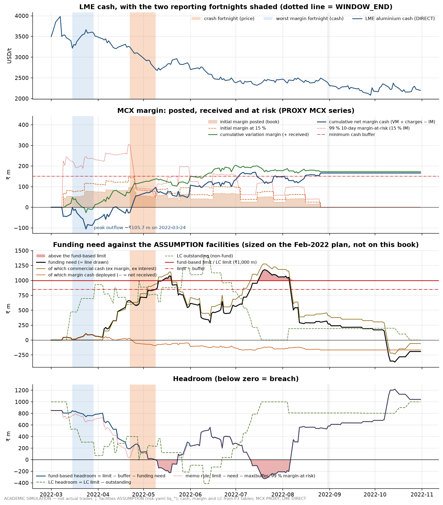
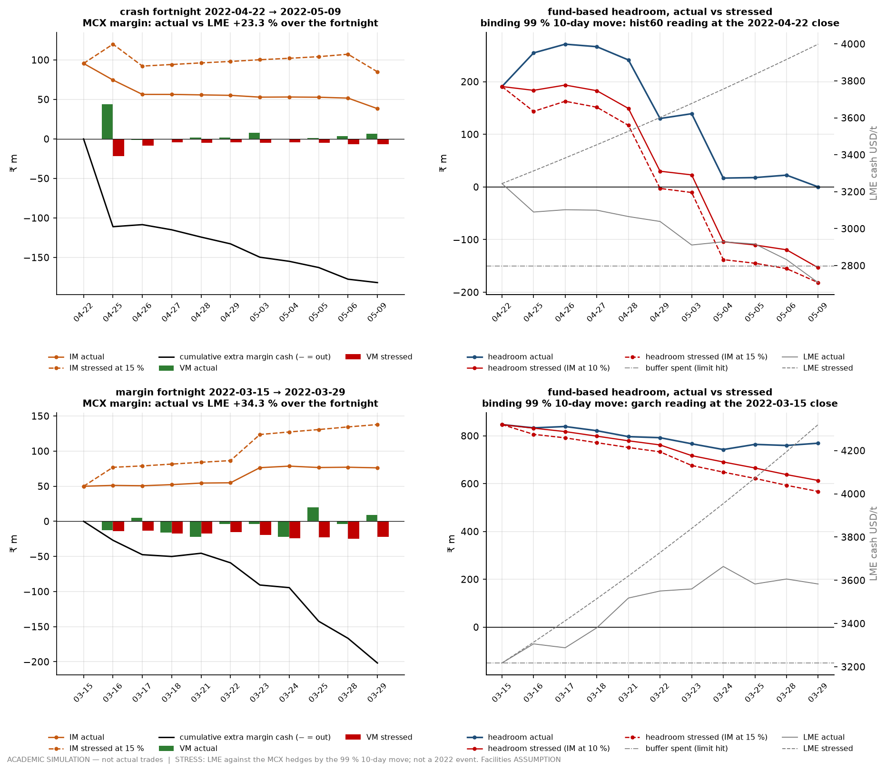

# 51 — Margin & liquidity through the crash fortnight, and the risk policy memo (MASTER_SPEC Table 6 rows 4.5 and 4.6)

> **ACADEMIC SIMULATION — not actual trades.** The book is simulated (every counterparty, vessel, delay and bank line
> is SIM). LME aluminium cash is **DIRECT**; USD/INR and the MCX series are **PROXIES** (ECB cross; duty-paid import
> parity with unit beta to LME x FX); freight levels and grade factors are hindsight **reconstructions**. The
> working-capital and LC facilities, the cash buffer and every policy limit are **ASSUMPTIONS**
> (`config/params/risk.yaml`, section "Phase 5 liquidity & policy"). Nothing here is a real bank sanction.
>
> **This page is about cash, not the result.** Where the book's P&L is mentioned (₹192.1 m at 2022-10-31), read it
> with its band: across the registered `domestic_anchor_premium_inr_t` grid the same nine tickets make **−₹105.4 m to
> +₹334.3 m**, break-even −38,702 ₹/t inside the grid (`pnl_sensitivity_sign_robustness.csv`). The headline is **not
> sign-robust**. The MCX margin numbers below do not depend on that premium; the commercial cash (every sale
> receipt) does.

```sh
cd /Users/sujaljindal/Desktop/ujjwal
DESK_OFFLINE=1 .venv/bin/python -c "import desk.risk.run_liquidity as m; m.main()"   # ~1.5 s, ~195 MB peak
DESK_OFFLINE=1 .venv/bin/python -m pytest -q tests/test_risk_liquidity.py            # 20 tests
```

Code: `desk/risk/liquidity.py` (cash decomposition, facilities, stress moves, margin-at-risk, fortnight re-mark),
`desk/risk/run_liquidity.py` (stage, summary, charts), `desk/risk/policy_memo.py` (limit evidence + memo),
`desk/reporting/pdf.py` (shared Markdown → PDF helper). Two back-to-back runs give byte-identical CSVs, PNGs and PDF.

| Output | What it holds |
|---|---|
| `outputs/tables/margin_liquidity.csv` | panel day 2022-03-01 → 2022-10-31: MCX margin flows and stocks, cash by category, funding need and its split, facility headroom and breach flags, LC outstanding, the 99 % move and margin-at-risk |
| `outputs/tables/margin_liquidity_fortnight.csv` | the crash fortnight and the worst margin fortnight, day by day: actual vs stressed VM, IM, extra margin cash, headroom |
| `outputs/tables/margin_liquidity_stress_moves.csv` | the point-in-time 99 % 10-day LME move at every close: each reading and the binding one |
| `outputs/tables/margin_liquidity_facility.csv` | the plan arithmetic behind each registered facility, and whether the register matches the rule |
| `outputs/tables/margin_liquidity_limit_grid.csv` | breach days at ₹750 m / ₹1,000 m / ₹1,250 m / ₹1,500 m lines, and the smallest lines with no breach |
| `outputs/tables/margin_liquidity_lc_lots.csv` | each of the 19 LC lots: face, opening date, release date |
| `outputs/tables/margin_liquidity_windows.csv` | the two fortnights and the rule that picked each (reporting-only) |
| `outputs/tables/margin_liquidity_summary.csv` | every number this page and the memo quote |
| `outputs/tables/margin_liquidity_controls.csv` | 11 reconciliations to the P3 files; the stage raises if any fails |
| `outputs/tables/margin_liquidity_policy_limits.csv` | each memo limit: value, register key, book evidence, source, breach days and dates, remediation |
| `outputs/charts/p5_liquidity_margin.png`, `p5_liquidity_fortnight.png` | §4 |
| `outputs/reports/risk_policy_memo.md`, `.pdf` | the one-page memo (§7) |

---

## 0. The finding on one page

1. **The margin strain was in March, not in the crash fortnight.** The crash fortnight (22-Apr → 9-May, LME cash
   −16.5 %) *paid the desk*: +₹65.0 m of variation margin and +₹121.6 m of net margin cash as hedges were lifted and
   their initial margin released. The worst ten margin days were 15-Mar → 29-Mar, when cash rallied +11.4 % off the
   post-high low: −₹50.6 m of VM and −₹77.1 m of net margin cash. Cumulative margin cash bottomed at **−₹105.7 m on
   24-Mar** (docs/31 §1.4); book initial margin peaked at **₹95.8 m on 21-Apr** (₹143.7 m at a stressed 15 %).
2. **The liquidity problem was working capital, not margin.** Funding need — settled cash plus the interest P3
   accrues — peaked at **₹1,179.0 m on 20-Jul**: commercial cash ₹1,275.5 m (purchases −₹2,146.3 m paid, sales
   +₹1,140.2 m received, IGST −₹156.0 m still awaiting credit, duty −₹49.5 m) plus ₹19.2 m of interest, *less*
   ₹115.6 m of margin cash the hedges had already brought in. From 25-Apr the MCX short was a net **source** of
   liquidity (cumulative margin cash +₹39.0 m that day, +₹169.6 m by 14-Jul).
3. **A line sized on the desk's own plan does not hold this book.** Sized before the window on the Feb-2022 plan
   (30,000 MT/yr at Phase 1's cash cycle ⇒ ₹969.8 m average funded balance ⇒ ₹1,000 m line; ₹150 m undrawn buffer),
   the book **breaks the buffer on 30 days (10-May → 5-Aug)** and **the line itself on 19 days (16-May → 19-May,
   18-Jul → 5-Aug)**, worst ₹179.0 m over the limit on 20-Jul. The LC line (₹1,000 m by the same rule) is breached
   on **17 days (28-Apr → 21-Jun)**, peak **₹1,414.8 m on 13-Jun** (USD 18.1 m on 10-Jun). No-breach lines would have
   been ₹1,387 m (with its 15 % buffer) and ₹1,415 m. Nothing was sized to make the book fit, and it does not.
   **But read the breach with its two conventions.** The line is sanctioned on the plan's *average* funded balance,
   rounded up in ₹25 crore steps: one step higher (₹1,250 m) the line is never breached (12 buffer days remain; the LC
   line at ₹1,250 m is still over on 3 days, `margin_liquidity_limit_grid.csv`). And LC use is counted at the planned
   face plus the 5–10 % amount tolerance for the whole life of the credit (§1.4), which overstates it (without the
   tolerance: ₹1,286.2 m peak, 11 days over). The lesson is
   not "size the lines on the book" — a bank sanctions before the book exists — but **stress the plan's peak (usance
   maturities bunching, IGST awaiting credit, buyer credit running behind supplier payment), not its average.**
4. **The stress: LME against the hedges in the crash fortnight.** Had LME *risen* by the 99 % 10-day move known at
   the 22-Apr close (+23.3 %, the 60-day-vol reading; GARCH +13.3 %, 250-day +15.5 %, empirical +11.4 %) instead of
   falling, the 709-lot short would have called **₹153.5 m more margin by 9-May, ₹181.8 m with initial margin
   re-struck at 15 %**. Headroom on 9-May goes from +₹0.2 m (actual) to **−₹181.6 m**: 6 buffer-breach days and 2
   days over the line (6- and 9-May), while the cargo gains about **₹427 m of mark — not cash**. On the GARCH reading
   alone (+13.3 %) the call is ₹146.6 m and the line holds (4 buffer days). For comparison, the Phase 4.2 Monte
   Carlo's LME marginal (Mar–Aug covariance, a hindsight number for an April date) is +18.6 %.
5. **Margin-at-risk and funding peaked at different times.** The daily 99 % margin-at-risk peaked at **₹304.4 m on
   21-Apr** and exceeded the ₹150 m buffer on 51 days (9-Mar → 1-Jul) — but those were the months the line was
   lightly drawn. The memo's liquidity rule (need + max(buffer, margin-at-risk) ≤ line) breaches on exactly the same
   30 days as the plain buffer: in 2022 the binding constraint was the cash cycle, not the hedge.

---

## 1. Method

### 1.1 Cash, decomposed (and reconciled)

`trade_cashflows.csv` rows with `scenario = REALISED` are summed by settle date (a non-panel settle lands on the next
panel day, never earlier) into nine categories: `purchase`, `sale`, `duty`, `igst` (the BS pair), `freight`,
`logistics_claims`, `bank_charges`, `fx_forward`, `mcx_margin` (VM, IM, charges, slippage). Their cumulative sum
reproduces P3's `cash_balance_inr` (BOOK) to ₹0.10, and the MCX category reproduces the VM table's cumulative net
margin cash to ₹0.06. The margin columns themselves come from `mcx_variation_margin.csv` grouped by date:
`im_required_inr` is a **stock** (daily sum), VM, charges and IM changes are **flows** (docs/30 §7's memo-column warning).

### 1.2 Funding need and headroom

```
funding_need_total   = −(cash_balance + funding_accrued_cum)          interest P3 accrues is debited to the line
                     = commercial_funding_need + margin_cash_deployed + interest_accrued
commercial_need      = −(cash_balance − cum_margin_cash)
margin_cash_deployed = −cum_margin_cash = IM posted − cumulative VM − cumulative charges   (negative = net received)
fb_drawn             = max(0, funding_need_total)
undrawn              = fb_limit − funding_need_total
headroom             = fb_limit − min_cash_buffer − funding_need_total
flag_buffer_breach   = headroom < 0;   flag_fb_limit_breach = funding_need_total > fb_limit
```

The brief writes "headroom = facility + buffer − funding need − margin". Here the buffer enters with a **minus**
sign: it is cash that must stay undrawn, so a buffer the desk could spend is not counted as headroom. `undrawn_inr`
is published as the before-buffer reading. Margin is inside the funding need (it is cash that went through the same
line), so the formula is the brief's `facility − buffer − need − margin` with need split out as commercial + interest.

### 1.3 The facilities (ASSUMPTION, sized ex ante on the plan)

A bank sizes a working-capital line at sanction on the borrower's plan, not on a peak it has not yet seen. So every
input is the last Phase 1 parity week before the window (**2022-02-25**) and a plan throughput taken from the spec
range, and each limit is that plan requirement rounded **up** to the next ₹25 crore (`margin_liquidity_facility.csv`;
a test asserts the register equals the rule).

| | Rule | Plan requirement | Sanctioned |
|---|---|---|---|
| Fund-based WC line | 30,000 MT/yr x mean over six grade x lane cases of (`finance_inr_t` + `igst_finance_inr_t`) / 9.50 % = ₹32,326 funded rupee-years per tonne (≈ 62.8 days of the ₹187,774/t landed cost) | ₹969.8 m average funded balance | **₹1,000 m** |
| Non-fund LC line | 30,000 MT/yr x ₹177,064 CIF per tonne x 60-day plan LC tenor / 365 | ₹873.2 m average LC outstanding | **₹1,000 m** |
| Minimum undrawn buffer | 15 % of the line (treasury convention 10–20 %) | anchor: IM at 10 % on two months of plan throughput hedged at the 25-Feb MCX M1 proxy (₹273.24/kg) = ₹136.6 m | **₹150 m** |

Throughput: MASTER_SPEC Table 4 asks for 8–10 trades of 1,000–5,000 MT over six months; a first-year plan at the lower
middle is ~15,000 MT a half-year. The realised book (14,350 MT, ~2,390 MT a month) came in 4 % under it, so the test
is about cash **timing**, not volume. Two honest caveats: the sanction is on the plan's **average** balance (a
holding-period assessment; parcel businesses are lumpy and banks expect peaks to be met by buffers and ad-hoc limits),
and the 25-Feb grade factor and freight level are Phase 1 reconstructions. The breach verdict is sensitive to that
convention: the next ₹25 crore step (₹1,250 m) has no day over the fund-based line (§2.3).

### 1.4 LC outstanding

One row per bill-of-lading lot (`margin_liquidity_lc_lots.csv`, 19 lots). Face = the purchase value planned at the
trade date (`PLANNED_AT_TRADE_DATE` provisional + final, or invoice) x (1 + the ticket's LC tolerance, 5 % or 10 %):
what a desk can put on an application before the quotational period prices. The credit is outstanding from
`lc_open_date` to the day its principal is paid (sight: document payment; usance: maturity). INR at each day's USD/INR
(PROXY). The usance tickets keep their credits on the line for three to three-and-a-half months: T02 (90 d)
USD 2.94 m, about ₹224 m, from 21-Mar to 12-Jul; T05 (60 d) USD 5.30 m, about ₹407 m, from 28-Apr to 18-Jul; T09 (60 d)
USD 2.41 m after the window. That is what pushes June over.

**Convention that overstates LC use.** Counting the planned face *plus* the 5–10 % amount tolerance until the principal
is paid is the conservative reading. It is right for an unused credit, but once a usance bill is accepted the bank's
liability is the bill's invoice value until maturity. A memo column bounds the effect: without the tolerance on any
lot (`memo_lc_outstanding_ex_tolerance_inr`; summary `memo_lc_outstanding_ex_tolerance_inr_max`,
`memo_days_lc_limit_breach_ex_tolerance`) the peak is ₹1,286.2 m on 13-Jun and the line is over on 11 days, not 17 —
still breached. Counting accepted bills at their final invoice value would land between the two; it is not modelled
(open issue §10).

### 1.5 The two fortnights (reporting-only, drawn after the fact)

| Window | Rule | Dates | LME cash |
|---|---|---|---|
| **Crash fortnight** (base) | CONTRACTS §7a.3: the 10-trading-day return window (11 observations) with the most negative LME cash return in Mar–Aug (`adverse_event_windows.csv` E1_CRASH_FORTNIGHT) | 2022-04-22 → 2022-05-09 | −16.5 % |
| **Worst margin fortnight** | the same 11-observation convention applied to cash: the 10 days with the most negative summed net margin cash (VM + charges − IM change) | 2022-03-15 → 2022-03-29 | +11.4 % |

Why the contract's crash fortnight rather than "the fortnight after the 7-Mar high": the convention is already fixed
in CONTRACTS and used by P3's event tables and the P4 VaR summary, so every phase reports the same fortnight; choosing
a new one here would let a reader pick whichever looks worse. The second window is added because the brief is about
*margin*, and the price rule and the cash rule select different fortnights. Neither window is an input to any number
except the stress that is explicitly run on it.

### 1.6 The 99 % 10-day move (point-in-time)

At each close *t*, four readings of the 10-day LME cash log move (`margin_liquidity_stress_moves.csv`):

* **GARCH(1,1)** — the Phase 4.1 forecast made at close *t* (the `var_vol_forecasts.csv` row dated the next panel day;
  its parameters were estimated on returns to that fit's `sample_end` ≤ *t*), aggregated with its own term structure
  Σₖ [σ²∞ + pᵏ⁻¹(σ²₁ − σ²∞)], so a spike decays at the fitted persistence instead of being scaled by √10;
* **250-day and 60-day historical** — the Phase 4.1 rolling vols x √10 (constant-vol assumption);
* **empirical** — the 99th (1st) percentile of overlapping 10-day log returns from 2018-01-02 to *t*.

Each Normal reading is z₀.₉₉ = 2.326 x the 10-day sigma. The **binding** move is the largest: docs/40 §6.3 and §11.3
show the Normal understating LME tails (8-Mar was −4.5 σ even on GARCH), and a liquidity buffer is sized for the tail.

**The brief asks for "the MC 99 % move".** The Phase 4.2 Monte Carlo estimates its covariance on Mar–Aug 2022, which
for an April stress date includes four months of the future. Its LME marginal (daily stdev 0.023167 from
`mc_factor_stats.csv` x √10 x z₀.₉₉ = +18.6 %) is therefore published in `margin_liquidity_summary.csv` as a
**hindsight memo, never binding**. The point-in-time binding move at the crash fortnight's start (+23.3 %) is larger
than it, and larger than the Monte Carlo's Student-t variant would give (its 99 % quantile is ~12 % above the Normal).

| Reading at the 22-Apr close | 10-day log move | as a price move |
|---|---|---|
| GARCH (term structure; σ₁ 1.72 %, p 0.966) | 0.1245 | +13.3 % |
| 250-day historical (1.96 %) | 0.1443 | +15.5 % |
| **60-day historical (2.84 %) — binding** | **0.2092** | **+23.3 %** |
| empirical 2018 → 22-Apr (up / down) | 0.1077 / −0.1245 | +11.4 % / −11.7 % |
| memo: Monte Carlo window covariance (hindsight) | 0.1704 | +18.6 % |

At the 15-Mar close the binding reading is GARCH (σ₁ 4.22 %: +34.3 % over 10 days), because the 8-Mar shock was one
week old.

### 1.7 Margin-at-risk (daily)

For the MCX lines open after close *t* (VM-table rows whose action is not `exit`/`roll_out`), with *x* the day's
binding move: because the proxy settle is proportional to LME cash (the domestic premium is 0; FX and carry held),
a log move *x* re-marks every line by eˣ, so

```
VM(x)   = Σ kg x settle x (eˣ − 1)            IM(x) = Σ im x eˣ          IM₁₅(x) = Σ im₁₅% x eˣ
call    = −VM(x) + (IM(x) − IM)               call₁₅ = −VM(x) + (IM₁₅(x) − IM)
```

both directions are tried and the worse kept (`mar_99_inr`, `mar_99_stressed_im_inr`, `mar_direction`). A test
recomputes 21-Apr by hand.

### 1.8 The fortnight stress (path)

The stressed LME path is L_s(k) = L(start) x exp(±m x k/10), k = 0..10 (≈ 2 % a day for a 20 % move, inside MCX's
4–9 % daily price limits). `remark_fortnight` scales each line's settle on day k by r_k = L_s(k)/L_a(k): VM on a line
held over the day becomes the actual VM plus kg x (settle x (r_k − 1) − prev_settle x (r_{k−1} − 1)); entries and
roll-ins keep their actual VM (they fill at that day's price either way); IM becomes im x r_k, or im₁₅% x r_k if the
exchange re-strikes margin. **Passing the actual LME path reproduces P3's VM and IM exactly** (a test asserts it on both
fortnights). Contracts, exits, rolls, FX and the commercial cash are held at what happened; the physical cargo's gain
from the same move is published as `memo_physical_mtm_gain_inr` (start-day `lme_delta_physical_mt` x ΔL x USD/INR,
linear). Both directions are computed; the one that calls more cash is published.

---

## 2. Results

### 2.1 Margin through the window (`margin_liquidity.csv`)

| | ₹ m | date |
|---|---|---|
| Peak cumulative margin **outflow** (VM + charges − IM) | **−105.7** | 24-Mar |
| Peak cumulative margin **inflow** | +169.6 | 14-Jul |
| Peak book initial margin (at 10 %) / at 15 % | 95.8 / 143.7 | 21-Apr |
| Peak gross open MCX lots | 709 | 21-Apr |
| Peak 99 % 10-day margin-at-risk (IM at 10 %) / (IM at 15 %) | 245.3 / **304.4** | 21-Apr |
| Days margin-at-risk (15 % IM) above the ₹150 m buffer | 51 | 9-Mar → 1-Jul |
| Lifetime interest accrued on the line (P3 funding) | 32.6 | to 31-Oct |

### 2.2 The two fortnights (`margin_liquidity_fortnight.csv`)

| | Crash fortnight 22-Apr → 9-May | Worst margin fortnight 15-Mar → 29-Mar |
|---|---|---|
| LME cash, actual | −16.5 % | +11.4 % |
| Net MCX lots at the start close | −709 | −374 |
| VM actual | **+₹65.0 m** | −₹50.6 m |
| Net margin cash actual (VM + charges − ΔIM) | +₹121.6 m | **−₹77.1 m** |
| Binding 99 % move at the start close | +23.3 % (60-day) | +34.3 % (GARCH) |
| VM stressed | −₹70.2 m | −₹190.8 m |
| Extra margin cash out by the last day (IM 10 % / IM 15 %) | ₹153.5 m / **₹181.8 m** | ₹155.8 m / ₹201.8 m |
| Headroom, actual → stressed (15 % IM), worst day | +₹0.2 m → **−₹181.6 m** (9-May) | ₹742.7 m → ₹567.5 m |
| Buffer-breach days / days over the line, stressed (15 % IM) | **6 / 2** | 0 / 0 |
| sensitivity: GARCH reading only — move, extra cash (15 % IM), breach days | +13.3 %, ₹146.6 m, 4 / 0 | (GARCH is binding) |
| memo: unrealised gain on the physical from the same move | ₹427.0 m | ₹122.0 m |

The March stress calls more margin than the April one, but March had room: funding need was ₹107 m on 24-Mar. In the
crash fortnight the same kind of call lands on a line already drawn to ₹849.8 m (9-May), because T01's and T03's
parcels and half of T04's had been paid at sight (₹789.3 m) and ₹107.6 m of IGST was awaiting credit, while no sale had
yet been collected. **The desk would have been solvent on its marks and illiquid on its line.**

### 2.3 Funding against the facilities (`margin_liquidity.csv`, `margin_liquidity_limit_grid.csv`)

| Line | Registered | Peak use | Buffer-breach days | Days over the line | Worst excess |
|---|---|---|---|---|---|
| Fund-based WC | ₹1,000 m, buffer ₹150 m | ₹1,179.0 m (118 %) on 20-Jul | **30** (10-May → 5-Aug) | **19** (16-May → 5-Aug) | ₹179.0 m (20-Jul) |
| Non-fund LC | ₹1,000 m | ₹1,414.8 m (141 %) on 13-Jun | — | **17** (28-Apr → 21-Jun) | ₹414.8 m (13-Jun) |
| Both (memo) | — | ₹1,973.8 m on 27-May (FB ₹760.4 m + LC ₹1,213.4 m) | | | |

| Fund-based line (15 % buffer) | ₹750 m | **₹1,000 m** | ₹1,250 m | ₹1,500 m | no-breach minimum |
|---|---|---|---|---|---|
| Buffer-breach days | 47 | **30** | 12 | 0 | ₹1,387 m |
| Days over the line | 38 | **19** | 0 | 0 | |

| LC line | ₹750 m | **₹1,000 m** | ₹1,250 m | ₹1,500 m | no-breach minimum |
|---|---|---|---|---|---|
| Days over the line | 52 | **17** | 3 | 0 | ₹1,415 m |

---

## 3. What drives the breaches

* **May (16–19-May over the line):** T01, T03 and T04 had been paid at sight (₹906.5 m of purchases by 11-May) and
  IGST awaiting credit rose to ₹166.1 m by 19-May, while no sale had been collected. The first sale cash — T01's
  ₹168.8 m advance on 20-May — ended the breach.
* **July (18-Jul → 5-Aug over the line):** the usance maturities of T02 (4- and 12-Jul, ₹98.0 m and ₹92.8 m) and T05
  (11- and 18-Jul, ₹149.0 m and ₹159.3 m) and T08's second sight payment (6-Jul, ₹121.1 m) fell into two weeks: ₹613 m
  net of T05's final price adjustment. T05's and T06's sale balances (₹310.1 m and ₹240.8 m) arrived only on 8-Aug,
  which ended the breach (funding need ₹1,053.0 m on 5-Aug, ₹502.8 m on 8-Aug). Usance deferred the cash but bunched it.
* **June (LC line):** T06, T07 and T08 opened LCs between 13-May and 10-Jun while T02's and T05's usance credits
  (USD 8.2 m with tolerance) were still outstanding.
* **Not margin:** on the peak day the hedges had returned ₹115.6 m net; margin was a net source from 25-Apr.

---

## 4. Charts



`p5_liquidity_margin.png` — four panels over 1-Mar → 31-Oct with both fortnights shaded and WINDOW_END dotted: LME
cash; MCX initial margin (and at 15 %), cumulative VM and net margin cash, the daily 99 % margin-at-risk against the
buffer; funding need and its split against the line, the buffer line and LC outstanding; headroom (fund-based, LC,
and the memo's rule), breaches shaded.



`p5_liquidity_fortnight.png` — one row per fortnight: daily VM actual vs stressed, IM actual vs stressed at 15 %, and
the cumulative extra margin cash; headroom actual vs stressed (IM 10 % and 15 %) with the LME actual and stressed
paths. Labelled STRESS — not a 2022 event.

---

## 5. Controls and tests

`margin_liquidity_controls.csv` (all PASS, tolerance ₹1): cash categories vs P3 `cash_balance_inr` (max ₹0.10); MCX
category vs VM-table cumulative margin cash (₹0.06); `MCX_VARIATION_MARGIN` legs vs VM-table VM (₹0.00);
`MCX_INITIAL_MARGIN` legs vs IM stock (₹0.05); transaction and slippage legs vs charges (₹0.00); IM stock vs P3
`mcx_im_inr` (₹0.01); VM-table net margin identity (₹0.03); cumulative margin cash = VM + charges − IM stock (₹0.07);
funding-need decomposition; headroom arithmetic; open lots vs P3 `mcx_lots_open` (0).

`tests/test_risk_liquidity.py` (20 tests): margin cash rebuilt independently from the VM table and from the realised
MCX cashflows; categories add back to P3 cash; facility headroom arithmetic and flag logic; registered limits equal
the plan rule and are dated before the window; limit grid monotone; LC outstanding rebuilt from the lot table;
re-marking on the actual path reproduces P3's VM and IM; the adverse stress uses the largest point-in-time reading and
breaches more than actual; the stress move at a close is unchanged when every price after that close is deleted, and
its GARCH parameters were estimated before it; margin-at-risk by hand; the margin fortnight is the brute-force worst;
build determinism; the PDF helper (parsing, one page, byte-identical rebuild, SIM label enforced); the memo is one
page and re-renders byte-identically; it is dated after HORIZON_END; every number it quotes is recomputed from its
source table; limit breach counts recomputed.

---

## 6. Limitations

* **MCX is a proxy with unit beta.** Margin is computed on duty-paid parity; the third-party mirror has beta 0.452
  (R² 0.29) to it on daily changes (`mcx_basis_risk.csv`), 0.75 on weekly changes (`var_mcx_beta.csv`; the daily
  figure is biased down by asynchronous closes, docs/40 §4.3). Real margin calls would include basis moves this page cannot see, and
  **basis risk is under-represented** in every number here.
* **No SPAN, no ELM detail, no intraday calls, no daily price limits.** Initial margin is a flat 10 % (15 % stressed)
  of contract value (`mcx_al_margin_used_frac`, PENDING verification). The 8-Mar proxy move exceeded MCX's 9 % limit.
* **The stress holds everything but LME.** Positions, rolls and exits stay as executed; a desk facing a +23 % rally would
  have re-hedged, delayed purchases or sold forward. FX is held at the actual path. Square-root-of-time scaling for the
  rolling vols ignores autocorrelation; the path spreads the move evenly.
* **No drawing power.** Indian cash-credit lines are capped by drawing power (stock + receivables less margin), which
  is not modelled; the realised constraint could bind earlier.
* **Interest is P3's symmetric accrual** (a positive balance earns the line rate); there is no separate deposit rate,
  commitment fee or penal interest on over-limit days.
* **Facilities are assumptions**, sized on a plan whose cost per tonne partly rests on reconstructed grade factors and
  freight. The limit grid is the answer to "what if the line were different".
* **LC faces use the values planned at each trade date** (a floating-price ticket's face is its trade-date estimate,
  not the price its quotational period later fixed); tolerance is the ticket's own. Buyer's credit, packing credit and bill discounting are not modelled.
* **Sale receipts inherit the headline's premium sensitivity:** a lower domestic anchor premium lowers every receipt,
  so commercial funding need would be higher than shown.

---

## 7. The risk policy memo (Table 6 row 4.6)

`outputs/reports/risk_policy_memo.md` and `.pdf` — one A4 page (asserted by the stage and by a test), from the Head
of Desk (SIM) to the Risk Committee (SIM), dated **7 November 2022** (`policy_memo_date`, after HORIZON_END, so
nothing it quotes was unknowable on its date). The limits are `policy_*` ASSUMPTIONS in `risk.yaml`, each note quoting
the evidence it was set against; `desk/risk/policy_memo.py` recomputes that evidence from the published tables and
prints, beside every limit, **whether the 2022 book would have breached it** (`margin_liquidity_policy_limits.csv`).
Checks that include the MCX leg skip the 16 exit/roll position dates P4.1 flags (docs/40 §7.1); stop-loss and booking
checks read the previous close.

| Area | Limit | Book record | Verdict |
|---|---|---|---|
| Position | gross physical ≤ 5,000 MT and ≤ USD 15 m | peak 4,450 MT / USD 14.5 m (21-Apr); unsold 4,980 MT (6-Apr) | within **by construction** (set just above the book's peak, so not evidence) — not raised, because that size already used the whole line |
| Unhedged | net ≤ 1,000 MT, ≤ USD 3 m; ≤ 25 % of physical (≥ 1,000 MT) | 5 / 2 / 26 of 99 clean days; worst 1,817 MT naked session 8-Mar | breached → rebalance within 2 sessions |
| Hedge | MCX 0.80–1.10 per decision; roll ≥ 7 trading days pre-expiry; FX forwards ≥ 90 % (physical + forwards) | T04 0.50; 13/13 rolls on time; T06 60 % | breached (T04, T06) → re-size or prior exception |
| Stop-loss | ticket −₹10 m review, −₹20 m hedge to 1.0 + no same-grade adds; book −₹40 m no new purchases | T04, T05, T07, T08 at review; T08 hard stop 1-Aug; book past −₹40 m from 1-Aug | **T09 (3-Aug, same grade as T08) would have been refused; it finished +₹10.0 m on base marks** |
| VaR | 1-day 95 % ≤ ₹10 m on max(GARCH, 250-day) | once on clean days: ₹43.5 m on 9-Mar (5 counting roll artefacts) | breached (naked session) |
| Counterparty | credit_band_policy.csv bands; never lift a hedge before an advance lands | 5 of 10 bookings outside; BUY_RJK_01 advances > 1.0x its line on 37 days (peak 1.83x, contracted 2.57x) | breached → RJK line ₹120 m → ₹60 m, advance/CAD only |
| Freight | fix FOB freight ≤ 10 trading days; stop ≤ fixture + 20 %; no proxy hedge | 8 / 6 / 2 days; stops +18.4 / 12.7 / 14.2 % | within |
| Liquidity | ₹1,000 m WC + ₹1,000 m LC; need + max(₹150 m, 99 % margin-at-risk at 15 % IM) ≤ line | §2.3 | breached 30 / 19 / 17 days → ad-hoc ₹500 m on each line for peak months, or stagger usance and purchases |

The memo also states, in its header, that the headline P&L is not sign-robust (with the band), and that hedge
effectiveness rests on the unit-beta proxy: mean GARCH VaR ₹8.5 m at the mirror's weekly beta (0.75) and ₹17.3 m at
its daily beta (0.45, biased down by asynchronous closes — the pessimistic end), against ₹4.27 m. The Position row
says its "within" is true by construction (the limit was set just above the book's peak), the Stop-loss row that its
levels were chosen with the drawdowns in view, and the VaR row that grade spread (daily σ ₹2.2 m) and the cash–3M
spread (memo VaR +18 %) sit outside the VaR limit. Its last line lists what the limits cannot see.

---

## 8. What this does and doesn't tell you

**What it does tell you.** On this book's own cash, a desk that hedged its metal on MCX would have lived through the
2022 crash comfortably on margin — the crash *paid* it — and would still have run out of bank line twice, in May and
in July, because buying at sight, waiting weeks for IGST credit and bunching usance maturities tie up far more cash
than variation margin ever did. A line sized sensibly on the desk's own plan is breached on 19 days; the LC line on 17.
If LME had rallied instead of crashing in late April, the hedge that protected the P&L would have drained ₹150–180 m of
cash in a fortnight while the cargo's matching gain stayed a mark; that is the classic physical-hedger liquidity
squeeze, and the numbers say it would have put this book over its line.

**What it doesn't tell you.** It is not evidence of what a real bank would have sanctioned or tolerated: the facilities,
buffer and plan are assumptions, and a real desk would have negotiated an ad-hoc limit, used buyer's credit or slowed
purchases long before 16-May. The margin numbers rest on an MCX proxy that moves one-for-one with LME x FX, so they miss
basis moves (the mirror's beta is 0.75 weekly, 0.45 on biased daily data) and the exchange's actual SPAN margins. The stress holds positions, FX and the
calendar fixed and uses a volatility forecast, not a scenario anyone predicted; a different defensible reading changes
it — on GARCH alone (+13.3 %) the call is ₹146.6 m, headroom falls to −₹146.4 m and the line itself is not breached
(4 buffer days, 0 over the line). The daily 99 % margin-at-risk is a sizing yardstick, not a
probability statement about 2022. And because sale receipts depend on the not-sign-robust domestic premium, the
commercial funding need is only as good as the headline P&L's weakest assumption.

---

## 9. Provenance

| Input | File | Flag |
|---|---|---|
| MCX hedge lines, VM, IM, charges | `outputs/tables/mcx_variation_margin.csv` (P3) | PROXY (MCX) / SIM (positions) |
| Cash balance, IM stock, exposures | `outputs/tables/book_exposures_daily.csv` (P3) | SIM, inherits P3 flags |
| Realised and planned cashflows | `outputs/tables/trade_cashflows.csv` (P3) | SIM |
| Funding accrual | `outputs/tables/mtm_daily.csv` FUNDING legs (P3) | ASSUMPTION (`wc_rate_inr_pa`) |
| LME cash, USD/INR, MCX M1 | `data/processed/market_daily.csv` (P0) | DIRECT / PROXY / PROXY |
| Volatility forecasts, GARCH fits | `var_vol_forecasts.csv`, `var_garch_params.csv` (P4.1) | model on DIRECT / PROXY |
| Monte Carlo LME vol (memo) | `mc_factor_stats.csv` (P4.2) | model on DIRECT |
| Plan cost per tonne | `parity_weekly.csv` week 2022-02-25 (P1) | ASSUMPTION / reconstruction |
| Crash fortnight | `adverse_event_windows.csv` (P3) | reporting-only rule |
| LC terms | `trade_book.csv` (P2) | SIM |
| Memo evidence | `var_daily.csv`, `var_summary.csv`, `attribution_daily.csv`, `trade_hedges.csv`, `credit_*.csv`, `pnl_sensitivity_sign_robustness.csv`, `mcx_basis_risk.csv`, `adverse_event_3_freight_stress_hypothetical.csv` | as published by their phases |
| Facilities, buffer, stress settings, policy limits | `config/params/risk.yaml` `liq_*`, `policy_*` (24 keys) | ASSUMPTION |

---

## 10. Open issues for other phases

1. **P3 — exposures on MCX exit/roll dates** (docs/40 open item 1) still carry the closing contract; the memo's
   exposure checks skip those 16 dates rather than fix them.
2. **P3 — drawing power.** A `drawing_power_inr` (inventory mark + receivables less a bank margin) would let the
   liquidity test include the cash-credit cap Indian banks actually apply.
3. **P4.2 — liquidity stress in the Monte Carlo.** The Monte Carlo revalues P&L; a margin-cash distribution from the
   same paths (MCX VM + IM change per path) would replace the single-path stress here with a percentile.
4. **P6 — reports** can reuse `desk/reporting/pdf.py` (`render_markdown_pdf`, `PdfStyle`, `count_pdf_pages`); the memo's
   `MEMO_STYLE` shows the dense one-page settings.
5. **P0 — `docs/00_assumptions_log.md`** needs a re-render to list the 24 new `liq_*` / `policy_*` keys.
6. **P5 — LC use at acceptance.** Count an accepted usance bill at its final invoice value (not planned face plus
   tolerance) from acceptance to maturity. The memo column without tolerance brackets it (₹1,286.2 m peak, 11 days
   over the ₹1,000 m line, against ₹1,414.8 m and 17 days in the base).
