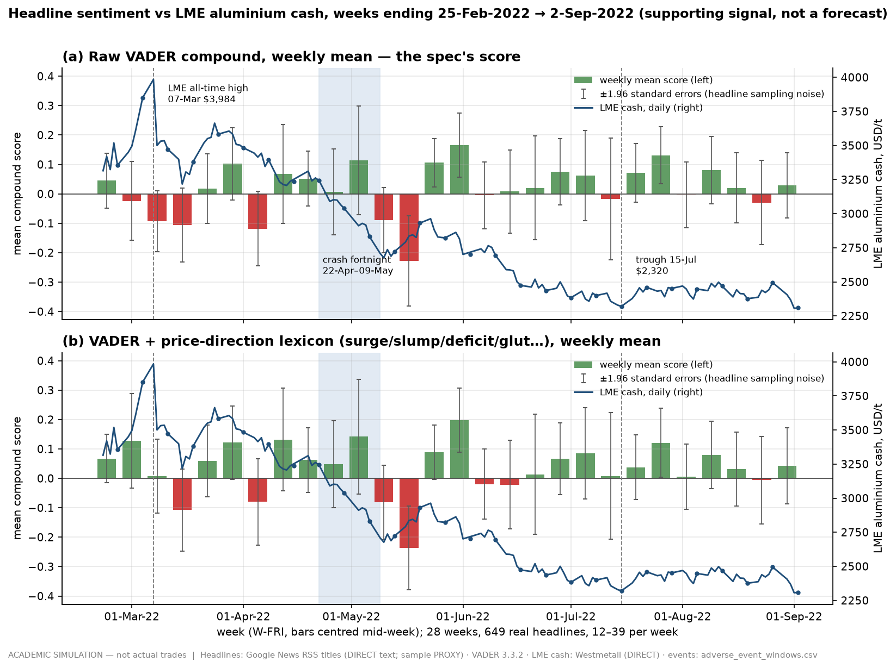
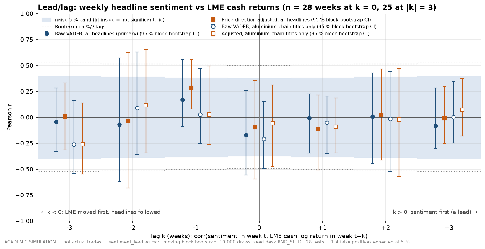

# 70 — Sentiment overlay on real headlines (MASTER_SPEC Table 7 row 5.2 ☆, optional)

> **ACADEMIC SIMULATION — not actual trades.** This page touches no trade, position or P&L of the simulated book.
> Its inputs are real and public: **649 news headlines** returned by Google News RSS for the 28 weeks ending
> 2022-02-25 → 2022-09-02 (**DIRECT** for the title text, publisher and date; the *selection* of headlines is a
> **PROXY** for the week's news flow, see `docs/research/news_notes.md`), and **LME aluminium official cash prices**
> (**DIRECT**, Westmetall republication, via `market_daily.csv`). The scores are a model output: VADER is a published
> general-purpose lexicon, and the small metals lexicon added on top is an **ASSUMPTION** (`config/params/risk.yaml`,
> section "Phase 7 sentiment overlay"). The price turns used as anchors are the P3 reporting-only event windows.
>
> **A supporting signal, not a forecasting model.** Nothing here is used by any trade decision, VaR or stress number.

```sh
cd ujjwal   # the repository root
DESK_OFFLINE=1 .venv/bin/python -c "import desk.sentiment.run as m; m.main()"   # ~3 s, <200 MB
DESK_OFFLINE=1 .venv/bin/python -m pytest -q tests/test_sentiment.py            # ~10 s
```

Code: `desk/sentiment/run.py` (one stage module; `build()` computes every table in memory, `main()` writes the tables,
the two charts and the generated tables inside this page). Tables marked "generated" below are rewritten by `main()`
between marker comments, so the numbers in them cannot drift from the CSVs; the prose quotes the same tables.

---

## 0. The finding on one page

| Question | Answer | Where |
|---|---|---|
| Is there a usable weekly score? | A noisy one. Raw VADER gives **47 %** of headlines a score of exactly 0; weekly means sit near zero (average +0.016, s.d. 0.086), and about **60 %** of their week-to-week variance is what headline sampling noise alone would produce. | `sentiment_summary.csv` |
| Does it move with LME in the same week? | **No.** r = **−0.17** raw (naive p = 0.38), −0.09 adjusted (p = 0.63). The raw sign is the *wrong* way round for a price signal, because supply-shock headlines such as "Russia - Ukraine war pushes up the prices of nickel and aluminum" read as bad news. | `sentiment_leadlag.csv`, k = 0 |
| Does it lead LME by 1–3 weeks? | **No evidence that it does.** 0 of 12 lead tests (4 variants × 3 lags) is significant at the naive 5 % level, none survives Bonferroni, and no lead interval from the block bootstrap excludes zero. | `sentiment_leadlag.csv`, k > 0 |
| Did sentiment lead the **March 2022 spike**? | **Cannot be tested, and nothing suggests it did.** The headline sample starts with the week ending 25-Feb, after LME cash had already risen 8.3 % (log) in three weeks, and no past-only z-score exists before 25-Mar. In the week of the biggest rise (ending 4-Mar, LME +13.8 %) raw VADER was **−0.024**; the adjusted score (+0.127) turned positive *in* that week, not before it. | `sentiment_episodes.csv` MARCH_SPIKE_UP / MARCH_TOP |
| Did sentiment lead the **May–July reversal**? | **No evidence that it did.** Before the April–May crash fortnight the declared rule technically fired once (8-Apr, z = −1.34), but the next week pointed the other way (15-Apr, z = +1.10), a hit that size had roughly a **26 %** chance in any three-week window, and the 8-Apr headlines behind it were mostly about LME *nickel*-trading chaos and a Kenyan scrap-metal ban, not aluminium prices. Into the 15-Jul trough the rule did not fire at all (z = +0.73, +0.58, −0.28). | `sentiment_episodes.csv` CRASH_FORTNIGHT / JULY_TROUGH |
| What *does* it show? | Headlines describe price moves as, or after, they happen. The only interval that excludes zero is LME leading the adjusted score by one week (r = +0.29), and even that is not significant on the naive t-test (p = 0.15). | §4.2 |

**Plainly: there is no evidence that headline tone led LME aluminium.** The March spike and the 7-March top could not
be tested (no past-only z-score exists before 25-Mar); into the April–May crash the one rule hit reversed the next week
and was about nickel; into the July trough the rule did not fire. And 28 weeks can only rule out a *strong* lead
(|r| above about 0.37–0.40, §2.6), not a weak one. It is fit to colour a desk note (for example: the week's
headlines were dominated by the LME nickel suspension), not to time a trade.

---

## 1. Why this page exists, and what it is not

The spec asks for a lightweight classifier over real aluminium/steel headlines, turned into a weekly "market
sentiment score" that the desk notes can quote next to price action, and says it must be a supporting signal, not a
forecasting model. This page does exactly that and then does the one extra thing a trader would ask for before
quoting it: it checks, honestly and with the sample size in view, whether the score moved *before* prices did. It found
no evidence that it did, in a sample that can only detect a strong effect. The page says so rather than tuning
words or windows until something lines up.

Why VADER rather than FinBERT: the spec allows either. VADER is a printed word list with fixed rules, so every score
can be traced to the words that produced it; it is deterministic; and it needs no model download on an 8 GB machine.
Its weakness on commodity language is real and is shown here (§4.4) rather than hidden. A FinBERT run is listed as an
open item (§9); it would change the classifier, not the sample size problem.

---

## 2. Method

### 2.1 Input

`data/processed/headlines_weekly.csv` (P0, `desk.sentiment.fetch_news`): 649 headlines, one row each, already assigned
to W-FRI weeks (Saturday 00:00 UTC → Friday 23:59:59 UTC) by publication date and filtered for relevance. Each row is
joined 1:1 to its row in `data/interim/news/_audit_headlines.csv` for two fields the fetcher recorded: which relevance
terms the title matched, and whether the title cites a later calendar date (a possible re-titled page). The stage
raises if the join is not exact. Titles are scored as returned — never edited, never paraphrased.

A declared sub-sample, **aluminium-chain titles**, keeps the 334 headlines whose title matches one of
`fetch_news.CORE_TERMS` (aluminium, aluminum, alumina, bauxite, smelt*, scrap*, LME) rather than only the generic
`metal` / `steel` terms. It exists because P0 found the kept set tilted towards Indian steel and equity stories.

### 2.2 Raw score: VADER compound

Each title gets VADER's `compound` score (vaderSentiment 3.3.2, lexicon unchanged): the sum of word valences, adjusted
for negation, intensifiers, "but" and capitals, squashed into [−1, +1]. A headline is **positive** at
compound ≥ +0.05 and **negative** at ≤ −0.05 (`sent_vader_pos_threshold` / `sent_vader_neg_threshold`, the tool
authors' published cut-offs, adopted unchanged). This raw score is the **primary** series: it is what the spec asks
for, and nothing about it was chosen by us.

### 2.3 Adjusted score: a small, pre-declared price-direction lexicon

VADER was built for social-media text. On metals headlines it has two blind spots: it has **no entry** for the verbs
that carry price direction (surge, soar, rally, rise, plunge, slump, tumble, fall, decline, slide …), and it scores
some market words **against** price (deficit −1.7 and shortage −1.0 are bad news in general English but bullish for a
metal price). The adjusted score is VADER with a small overlay (`sent_domain_lexicon`), fixed on 2026-09-16 **before
any correlation with LME was computed** and not revised afterwards. Every overlay word gets the same size, ±1.5
(`sent_domain_valence_abs`, the mean absolute valence of VADER's own 7,506 words, rounded down), so no individual
weight could be tuned.

Rules: (1) only words whose price direction is the same in nearly all market-report usage; (2) inflections listed
explicitly, because VADER does not stem; (3) a word is added only if VADER lacks it, or overwritten only if VADER gives
it the wrong sign for price or a tone that is not a price direction; words VADER already signs the right way (gain,
drop, crash, falling, low, lower, weak, strong, recession) are left alone. `tests/test_sentiment.py` enforces rule (3).

| Words (all inflections listed in the register) | Adjusted valence | VADER's own | Why |
|---|---|---|---|
| surge, soar, jump, rally, rise / rose, climb, rebound | +1.5 | absent | Price-movement verbs; in a market headline the subject is almost always a price. |
| bullish / bearish | +1.5 / −1.5 | absent | Explicit market direction. |
| deficit, deficits | +1.5 | −1.7 / absent | A market deficit (demand > supply) is bullish for price. |
| shortage, shortages | +1.5 | −1.0 / −0.6 | Scarcity is bullish for price (*scrap shortage*). |
| tight, tighter, tightness | +1.5 | absent | A *tight market* is bullish. (*tightening* deliberately excluded: monetary tightening is bearish for metals.) |
| slump, plunge, tumble, fall / fell, slide / slid, decline, sink / sank, slip, dip, plummet | −1.5 | absent | Price-movement verbs, down. |
| drops, dropped, crashes, crashed | −1.5 | absent (drop −1.1 and crash −1.7 already right-signed, untouched) | Missing inflections. |
| glut, gluts, surplus, surpluses, oversupply | −1.5 | absent | Excess supply is bearish. |
| slowdown | −1.5 | absent | A demand slowdown is bearish (recession −1.8 already right-signed). |
| soften, softens, softened, softer | −1.5 | absent | *Prices soften* is bearish. |
| demand | removed (scored like any non-lexicon word) | −0.5 | A neutral topic noun in a commodity headline (*demand outlook*), not bad news. |

**Deliberately not adjusted**, because their price direction depends on context: *war, sanctions, crisis* (a supply
shock is bullish, a demand shock bearish), *cut(s)* (production cut bullish, price cut bearish), *curbs, halt,
closure, hike(s)* (a rate hike is bearish, a price hike bullish), *ease, cool* (also policy words), *recovery* (also a
recycling term: *scrap recovery*), *high, record, peak* (record high vs record low). These are the words behind most
of the gap between VADER tone and price direction (§4.4), and the overlay leaves that gap in place rather than guess.

**Measured effect** (`sentiment_summary.csv`, `sentiment_lexicon.csv` column `n_headlines_hit`): 110 of 649 headlines
contain at least one overlay word and 64 change class (positive / neutral / negative). The most frequent hits are
*demand* (20), *rise* (14), *fall* and *surge* (8 each). The overlay assumes the thing that rises or falls is a price;
29 of the 110 hits are in titles that also name shares, stocks, output, production, trade flows or profits, where that
assumption probably fails ("Tata Steel output falls 3% to 7.57 MT in Q4 …", "Indices snap 5-day winning streak, Sensex tumbles 709 points …") — flagged per headline in
`lexicon_subject_caveat`, not corrected. The weekly raw and adjusted means correlate at 0.90: the overlay changes the
emphasis of a handful of weeks (mostly March), not the overall picture.

### 2.4 Weekly aggregation and a z-score with no look-ahead

Per week and per score: `n`, `mean` (the **weekly market sentiment score**), `median`, `se` (standard error of the
mean), `pos_share`, `neg_share`, `neutral_share`. The median is 0 in 27 of 28 weeks because most titles contain no
lexicon word; it is published for completeness, the mean is the score.

`z_score` compares a week's mean with the mean and standard deviation of **all earlier weeks only** (expanding window;
the week itself and every later week excluded), and stays blank until four earlier weeks exist
(`sent_zscore_min_past_weeks`). So the z-score dated Friday *t* uses nothing published after Friday *t*
(`tests/test_sentiment.py::test_zscore_uses_only_past_weeks` rewrites every later week and checks nothing changes).
The cost, stated rather than hidden: there is **no z-score for any week before 25-Mar-2022**, so the March episodes
cannot be tested on it.

### 2.5 LME weekly return

The last LME official cash close inside each W-FRI week (the same Saturday–Friday weeks as the headlines) and the log
return from the previous week's last close. Headline week *t* and return week *t* therefore cover the same dates.
Every weekly return quoted on this page is a **log** return (the +13.8 % spike week is +14.8 % as a simple return).
Publication stamps are day-granular (P0 notes), so a headline dated Friday may appear after that day's LME official
price; that blurs *k* = 0 but cannot create a false lead at *k* ≥ 1.

### 2.6 Lead/lag statistics

For lag *k* ∈ {−3, …, +3}: the correlation between sentiment in week *t* and the LME return in week *t + k*.
*k* > 0 means sentiment comes first (a lead); *k* < 0 means prices came first. Four declared variants: raw and
adjusted, all headlines and aluminium-chain titles (primary = raw, all headlines). For each of the 28 correlations:

* Pearson r with the **naive** t-test p-value and Fisher 95 % interval (both assume independent weeks);
* a **moving-block bootstrap** 95 % percentile interval (blocks of 3 consecutive week-pairs,
  `sent_bootstrap_block_weeks`; 10,000 draws; seeded from `desk.RNG_SEED`), because weekly series are not
  independent — though with 25–28 pairs a bootstrap interval is itself rough;
* Spearman ρ, which is not driven by the two March shock weeks (+13.8 % and −10.4 %) that dominate return variance.

**Multiple testing.** 28 correlations at 5 % would produce about 1.4 "significant" results by chance alone, and 7 lags
per variant is a search. A lag is flagged against both the naive 5 % level and a Bonferroni 5 %/7 level.
**With 25–28 pairs, a correlation must exceed |r| ≈ 0.37–0.40 to pass even the naive test** — the sample can only detect a
strong relationship, and absence of evidence here is not evidence of absence of a weak one.

### 2.7 Episode lead test

The anchors are **price** turns, chosen by rules on prices only and never on sentiment. Each anchor is the last close
before the move:

| Anchor | Date | Move | Rule |
|---|---|---|---|
| MARCH_SPIKE_UP | 2022-02-25 | up | the week with the largest weekly LME cash log return inside the P4 `var_lead_episodes` LME_MARCH_SPIKE window (week ending 4-Mar, +13.8 %); the move starts after the previous week's close |
| MARCH_TOP | 2022-03-07 | down | `E1_LME_CRASH` start in `adverse_event_windows.csv` — the all-time-high close |
| CRASH_FORTNIGHT | 2022-04-22 | down | `E1_CRASH_FORTNIGHT` start — the 10-return window with the worst return |
| JULY_TROUGH | 2022-07-15 | up | `E1_LME_CRASH` end — the lowest close after the high |

Declared rule (`sent_signal_z_abs`): **SIGNAL FIRED** if, in one of the three weeks ending on or before the anchor
close, the past-only z-score pointed the way of the coming move by at least 1 standard deviation; **DID NOT LEAD** if
z-scores exist and none did; **NOT TESTABLE** if no z-score exists in those weeks. One sigma is a lenient bar, so the
table also prints the **base rate** (how often the same condition held in all other weeks) and the implied chance of
at least one hit in a three-week window. Two columns were added **after** the first run, as descriptions, not as
changes to the rule: `contrary_hit_weeks` (a ≥ 1σ signal the *other* way in the same weeks) and
`verdict_alt_window`. The latter exists because the register note first described the window as "the three complete
weeks before the week of the turn" while the code, written before any result, used weeks ending on or before the
anchor close; the two differ only for Friday anchors, and they give the same verdicts (§4.3).

---

## 3. Coverage

28 of 28 weeks have headlines: median 24 per week, minimum 12 (week ending 24-Jun), maximum 39 (week ending 11-Mar,
the LME nickel crisis). 334 of the 649 are aluminium-chain titles (4 to 19 per week). Seven titles cite a later
calendar date and were reviewed at P0 as genuine forward-looking headlines; they are scored like any other and flagged
in `cites_later_date`. The per-week counts, sources and query mix are in `docs/research/news_notes.md`; weekly counts
move with Google's ranking as much as with events, so this page uses average tone and never volume.

---

## 4. Results

### 4.1 Weekly scores (generated from `sentiment_weekly.csv`)

<!-- WEEKLY:START (generated by desk.sentiment.run; do not hand-edit) -->

| week_end | n | raw mean | raw z (past-only) | adj mean | adj z | pos / neg share (raw) | LME cash USD/t | LME log ret |
|---|---|---|---|---|---|---|---|---|
| 2022-02-25 | 17 | +0.045 | — | +0.067 | — | 29% / 12% | 3,355.5 | +1.24% |
| 2022-03-04 | 16 | -0.024 | — | +0.127 | — | 6% / 19% | 3,851.0 | +13.77% |
| 2022-03-11 | 39 | -0.093 | — | +0.008 | — | 21% / 41% | 3,472.0 | -10.36% |
| 2022-03-18 | 34 | -0.106 | — | -0.107 | — | 21% / 38% | 3,380.5 | -2.67% |
| 2022-03-25 | 26 | +0.018 | +0.90 | +0.059 | +0.36 | 35% / 23% | 3,583.0 | +5.82% |
| 2022-04-01 | 19 | +0.102 | +2.02 | +0.121 | +1.03 | 32% / 11% | 3,483.0 | -2.83% |
| 2022-04-08 | 23 | -0.118 | -1.34 | -0.080 | -1.45 | 17% / 30% | 3,395.0 | -2.56% |
| 2022-04-15 | 17 | +0.068 | +1.10 | +0.132 | +1.12 | 24% / 18% | 3,237.5 | -4.75% |
| 2022-04-22 | 29 | +0.052 | +0.77 | +0.062 | +0.23 | 28% / 28% | 3,244.0 | +0.20% |
| 2022-04-29 | 25 | +0.007 | +0.17 | +0.048 | +0.05 | 36% / 32% | 3,039.0 | -6.53% |
| 2022-05-06 | 18 | +0.114 | +1.52 | +0.142 | +1.19 | 50% / 22% | 2,832.5 | -7.04% |
| 2022-05-13 | 17 | -0.089 | -1.16 | -0.082 | -1.61 | 12% / 35% | 2,723.0 | -3.94% |
| 2022-05-20 | 14 | -0.229 | -2.74 | -0.236 | -3.12 | 0% / 43% | 2,931.0 | +7.36% |
| 2022-05-27 | 31 | +0.106 | +1.24 | +0.089 | +0.60 | 35% / 19% | 2,823.0 | -3.75% |
| 2022-06-03 | 25 | +0.166 | +1.72 | +0.198 | +1.55 | 44% / 12% | 2,701.5 | -4.40% |
| 2022-06-10 | 26 | -0.005 | -0.06 | -0.019 | -0.48 | 19% / 23% | 2,695.0 | -0.24% |
| 2022-06-17 | 24 | +0.008 | +0.07 | -0.021 | -0.48 | 25% / 25% | 2,474.0 | -8.56% |
| 2022-06-24 | 12 | +0.020 | +0.18 | +0.014 | -0.15 | 42% / 25% | 2,436.0 | -1.55% |
| 2022-07-01 | 24 | +0.074 | +0.73 | +0.066 | +0.35 | 25% / 12% | 2,384.0 | -2.16% |
| 2022-07-08 | 24 | +0.063 | +0.58 | +0.085 | +0.52 | 38% / 17% | 2,399.5 | +0.65% |
| 2022-07-15 | 15 | -0.018 | -0.28 | +0.008 | -0.25 | 47% / 47% | 2,320.5 | -3.35% |
| 2022-07-22 | 26 | +0.072 | +0.68 | +0.038 | +0.06 | 35% / 15% | 2,460.0 | +5.84% |
| 2022-07-29 | 27 | +0.131 | +1.30 | +0.121 | +0.90 | 41% / 7% | 2,452.0 | -0.33% |
| 2022-08-05 | 29 | -0.003 | -0.20 | +0.005 | -0.32 | 17% / 24% | 2,447.5 | -0.18% |
| 2022-08-12 | 20 | +0.080 | +0.71 | +0.080 | +0.47 | 25% / 15% | 2,468.5 | +0.85% |
| 2022-08-19 | 25 | +0.020 | +0.03 | +0.031 | -0.06 | 28% / 24% | 2,376.0 | -3.82% |
| 2022-08-26 | 25 | -0.030 | -0.53 | -0.006 | -0.46 | 28% / 40% | 2,495.0 | +4.89% |
| 2022-09-02 | 22 | +0.030 | +0.16 | +0.043 | +0.09 | 27% / 14% | 2,309.0 | -7.75% |

<!-- WEEKLY:END -->



`p7_sentiment_vs_lme.png`: weekly mean score as bars (with ±1.96 standard errors from the headline sample), LME cash on
the right axis, the 7-Mar high and 15-Jul trough dashed, the crash fortnight shaded. The error bars are the point: only 4 of the
28 raw weekly means (3 adjusted) are further from zero than 1.96 standard errors, and most weeks are within
sampling noise of each other (`n_weeks_95ci_excludes_zero_*`).

### 4.2 Lead/lag (generated from `sentiment_leadlag.csv`)

<!-- LEADLAG:START (generated by desk.sentiment.run; do not hand-edit) -->

| variant | k | reading | n | r | naive p | Fisher 95 % CI | block-bootstrap 95 % CI | Spearman ρ | sig. naive 5 % | sig. Bonferroni |
|---|---|---|---|---|---|---|---|---|---|---|
| vader_all | -3 | LME leads sentiment by 3 weeks | 25 | -0.04 | 0.838 | [-0.43, +0.36] | [-0.33, +0.28] | -0.20 | no | no |
| vader_all | -2 | LME leads sentiment by 2 weeks | 26 | -0.07 | 0.738 | [-0.44, +0.33] | [-0.62, +0.57] | -0.05 | no | no |
| vader_all | -1 | LME leads sentiment by 1 week | 27 | +0.17 | 0.400 | [-0.23, +0.52] | [-0.09, +0.56] | +0.23 | no | no |
| vader_all | 0 | same week | 28 | -0.17 | 0.382 | [-0.51, +0.22] | [-0.56, +0.26] | -0.11 | no | no |
| vader_all | +1 | sentiment leads LME by 1 week | 27 | -0.01 | 0.972 | [-0.39, +0.37] | [-0.34, +0.23] | +0.08 | no | no |
| vader_all | +2 | sentiment leads LME by 2 weeks | 26 | +0.01 | 0.973 | [-0.38, +0.39] | [-0.44, +0.43] | +0.04 | no | no |
| vader_all | +3 | sentiment leads LME by 3 weeks | 25 | -0.08 | 0.688 | [-0.46, +0.32] | [-0.30, +0.28] | -0.16 | no | no |
| adjusted_all | -3 | LME leads sentiment by 3 weeks | 25 | +0.01 | 0.975 | [-0.39, +0.40] | [-0.31, +0.33] | -0.18 | no | no |
| adjusted_all | -2 | LME leads sentiment by 2 weeks | 26 | -0.03 | 0.874 | [-0.41, +0.36] | [-0.68, +0.63] | -0.04 | no | no |
| adjusted_all | -1 | LME leads sentiment by 1 week | 27 | +0.29 | 0.147 | [-0.10, +0.60] | [+0.08, +0.56] | +0.33 | no | no |
| adjusted_all | 0 | same week | 28 | -0.09 | 0.632 | [-0.45, +0.29] | [-0.60, +0.36] | -0.04 | no | no |
| adjusted_all | +1 | sentiment leads LME by 1 week | 27 | -0.11 | 0.575 | [-0.47, +0.28] | [-0.51, +0.22] | -0.10 | no | no |
| adjusted_all | +2 | sentiment leads LME by 2 weeks | 26 | +0.02 | 0.917 | [-0.37, +0.41] | [-0.41, +0.47] | -0.02 | no | no |
| adjusted_all | +3 | sentiment leads LME by 3 weeks | 25 | -0.01 | 0.962 | [-0.40, +0.39] | [-0.25, +0.30] | -0.11 | no | no |
| vader_core | -3 | LME leads sentiment by 3 weeks | 25 | -0.26 | 0.207 | [-0.60, +0.15] | [-0.54, +0.16] | -0.26 | no | no |
| vader_core | -2 | LME leads sentiment by 2 weeks | 26 | +0.09 | 0.659 | [-0.31, +0.46] | [-0.36, +0.63] | +0.10 | no | no |
| vader_core | -1 | LME leads sentiment by 1 week | 27 | +0.03 | 0.888 | [-0.36, +0.40] | [-0.25, +0.47] | +0.09 | no | no |
| vader_core | 0 | same week | 28 | -0.21 | 0.287 | [-0.54, +0.18] | [-0.49, +0.15] | -0.12 | no | no |
| vader_core | +1 | sentiment leads LME by 1 week | 27 | -0.05 | 0.799 | [-0.42, +0.34] | [-0.35, +0.20] | +0.01 | no | no |
| vader_core | +2 | sentiment leads LME by 2 weeks | 26 | -0.02 | 0.941 | [-0.40, +0.37] | [-0.52, +0.44] | -0.04 | no | no |
| vader_core | +3 | sentiment leads LME by 3 weeks | 25 | +0.00 | 0.997 | [-0.39, +0.40] | [-0.25, +0.34] | +0.02 | no | no |
| adjusted_core | -3 | LME leads sentiment by 3 weeks | 25 | -0.26 | 0.208 | [-0.59, +0.15] | [-0.55, +0.14] | -0.29 | no | no |
| adjusted_core | -2 | LME leads sentiment by 2 weeks | 26 | +0.12 | 0.562 | [-0.28, +0.48] | [-0.34, +0.66] | +0.15 | no | no |
| adjusted_core | -1 | LME leads sentiment by 1 week | 27 | +0.03 | 0.889 | [-0.36, +0.40] | [-0.26, +0.49] | +0.14 | no | no |
| adjusted_core | 0 | same week | 28 | -0.06 | 0.769 | [-0.42, +0.32] | [-0.47, +0.31] | +0.04 | no | no |
| adjusted_core | +1 | sentiment leads LME by 1 week | 27 | -0.09 | 0.645 | [-0.46, +0.30] | [-0.34, +0.19] | -0.05 | no | no |
| adjusted_core | +2 | sentiment leads LME by 2 weeks | 26 | -0.02 | 0.915 | [-0.41, +0.37] | [-0.57, +0.47] | -0.05 | no | no |
| adjusted_core | +3 | sentiment leads LME by 3 weeks | 25 | +0.07 | 0.732 | [-0.33, +0.45] | [-0.18, +0.37] | +0.07 | no | no |

<!-- LEADLAG:END -->



Reading it:

* **Same week (k = 0).** Raw r = −0.17, adjusted −0.09, aluminium-chain raw −0.21: all negative, none significant.
  For a price signal the sign is wrong; §4.4 shows why.
* **Sentiment leading (k = +1 … +3).** Every r lies between −0.11 and +0.07. Nothing to see, in any variant.
* **Prices leading (k = −1).** The raw (+0.17) and adjusted (+0.29) scores are higher the week after LME rose. The
  adjusted one is the only one of 28 bootstrap intervals that excludes zero ([+0.08, +0.56]), but its naive p is 0.15
  and its Fisher interval includes zero, and one hit in 28 is what chance delivers. It is consistent with headlines
  reporting last week's move, and it is not evidence of anything.
* **k = −3, aluminium-chain titles.** r ≈ −0.26 in both scores, p ≈ 0.21: noise.

Two diagnostics explain why nothing shows up. The weekly score has essentially no persistence (AR(1) +0.02 raw,
−0.04 adjusted), and about 60 % (raw) and 65 % (adjusted) of its week-to-week variance equals the average squared
standard error of a weekly mean — the variance that re-drawing 12–39 headlines would create with no change in the news
at all (`noise_share_weekly_var_*`). A series that is mostly sampling noise cannot correlate strongly with anything.

### 4.3 Did sentiment lead the March spike, or the May–July reversal? (generated from `sentiment_episodes.csv`)

<!-- EPISODES:START (generated by desk.sentiment.run; do not hand-edit) -->

| anchor (move after this close) | direction | variant | lead weeks (≤ anchor) | weeks with headlines / z | lead z-scores | declared verdict | base rate in other weeks | chance of ≥1 hit | opposite-way signals in the same weeks | LME next 3 weeks (log) |
|---|---|---|---|---|---|---|---|---|---|---|
| MARCH_SPIKE_UP 2022-02-25 | up | vader_all | 2022-02-11, 2022-02-18, 2022-02-25 | 1 / 0 | — | **NOT TESTABLE** | 25% of 24 |  | none | +0.7% |
| MARCH_SPIKE_UP 2022-02-25 | up | adjusted_all | 2022-02-11, 2022-02-18, 2022-02-25 | 1 / 0 | — | **NOT TESTABLE** | 17% of 24 |  | none | +0.7% |
| MARCH_TOP 2022-03-07 | down | vader_all | 2022-02-18, 2022-02-25, 2022-03-04 | 2 / 0 | — | **NOT TESTABLE** | 12% of 24 |  | none | -7.2% |
| MARCH_TOP 2022-03-07 | down | adjusted_all | 2022-02-18, 2022-02-25, 2022-03-04 | 2 / 0 | — | **NOT TESTABLE** | 12% of 24 |  | none | -7.2% |
| CRASH_FORTNIGHT 2022-04-22 | down | vader_all | 2022-04-08, 2022-04-15, 2022-04-22 | 3 / 3 | -1.34, +1.10, +0.77 | **SIGNAL FIRED** (2022-04-08) | 10% of 21 | 26% | 2022-04-15 | -17.5% |
| CRASH_FORTNIGHT 2022-04-22 | down | adjusted_all | 2022-04-08, 2022-04-15, 2022-04-22 | 3 / 3 | -1.45, +1.12, +0.23 | **SIGNAL FIRED** (2022-04-08) | 10% of 21 | 26% | 2022-04-15 | -17.5% |
| JULY_TROUGH 2022-07-15 | up | vader_all | 2022-07-01, 2022-07-08, 2022-07-15 | 3 / 3 | +0.73, +0.58, -0.28 | **DID NOT LEAD** | 29% of 21 | 64% | none | +5.3% |
| JULY_TROUGH 2022-07-15 | up | adjusted_all | 2022-07-01, 2022-07-08, 2022-07-15 | 3 / 3 | +0.35, +0.52, -0.25 | **DID NOT LEAD** | 19% of 21 | 47% | none | +5.3% |

<!-- EPISODES:END -->

**The March spike and the 7-March top — not testable; no sign of a lead.** The headline sample begins with the week
ending 25-Feb-2022. By then LME cash had already risen 8.3 % (log) over the three weeks to 25-Feb, and the first past-only z-score is
dated 25-Mar. The only honest statement is descriptive, and it uses hindsight (comparing with the whole sample): raw VADER
was +0.045 in the week ending 25-Feb and **−0.024 in the week ending 4-Mar, when LME cash had its largest weekly rise
(+13.8 %)**, then −0.093 and −0.106 in the two crash weeks after the high. The adjusted score was +0.067, **+0.127**,
+0.008 and −0.107: it rose *with* the spike week and fell *with* the crash, which is headlines reporting prices, not
anticipating them. Nothing in the sample turned before the 7-March top.

**The April–May crash fortnight — the rule fired, and it does not count as a lead.** On the declared rule, raw and
adjusted sentiment "fired" in the week ending 8-Apr (z = −1.34 / −1.45), two weeks before the fortnight began at the
22-Apr close. Three facts undo it: the next week, 15-Apr, pointed the other way at +1.10 / +1.12 (`contrary_hit_weeks`);
at the 9.5 % base rate, one bearish hit in a three-week window had about a 26 % chance with no information at all; and
the most negative 8-Apr headlines were mostly about the LME's handling of the March *nickel* suspension, plus a Kenyan
scrap-metal ban and a story on LME stockpiles at multi-decade lows — bullish for price, scored negative (§5). LME cash
was also already falling (−2.8 % in the week to 1-Apr, −2.6 % in the week of the signal, −7.1 % over the three lead
weeks), so a bearish week of headlines is at least as consistent with reporting as with anticipation. On the note's first window wording (1-Apr, 8-Apr, 15-Apr) the verdict is the same, and the 1-Apr week
was even more bullish (z = +2.02 raw).

**The July trough — did not lead.** For the rebound after the 15-Jul low the rule needed a z-score of +1 or more in
the weeks ending 1-Jul, 8-Jul or 15-Jul. Raw was +0.73, +0.58 and −0.28; adjusted +0.35, +0.52, −0.25. No signal, on
either window wording.

**Overall: no evidence that sentiment led either episode.** The March spike could not be tested (and the score was
contemporaneous where visible); into the May–July reversal the one rule hit reversed the next week and the July trough
drew no signal. With 28 weeks that rules out only a strong lead. The weekly score is a description of the week's
headlines, not a forecast of the next week's price.

### 4.4 Why raw VADER has the wrong sign for a price signal

VADER scores the *emotional tone* of English, and in 2022 the events that pushed aluminium up were bad news. In the
week of the biggest rise (ending 4-Mar), the most negative headline on the raw score was
"Russia - Ukraine war pushes up the prices of nickel and aluminum" (gizchina.com, −0.60): a bullish price headline,
scored as the week's worst news because of *war*, and left unchanged by the overlay because *pushes up* is not a
single word and *war* is deliberately not adjusted. The most negative week of the whole sample, ending 20-May
(raw −0.229, z = −2.74), was a week in which LME cash **rose 7.4 %**; its lowest scores came from a union dispute at
an aluminium plant, a DIY article on "Square Cuts On Aluminum Extrusion" (VADER reads *cuts* and *no* as negative), and
two war stories — one of them "Steel materials prices surge as impact of Ukraine war bites" (building.co.uk, raw
−0.60, still −0.34 adjusted), another price-up headline read as bad news. At the other end, some of the week's most positive titles are off-topic items the P0 keyword
filter lets through (an aluminium façade guide, aluminium-free deodorants). This is the published reason the score is
a supporting colour and not a signal.

---

## 5. Headlines for the desk notes (generated from `sentiment_week_extremes.csv`)

For each key week, the most negative and most positive headline on the raw score (verbatim, cut at 15 words; the CSV
holds full titles, the next-ranked headline and the Google News link via `sentiment_headlines_scored.csv`). Key weeks
are chosen by **price** rules — largest weekly rise and fall, the all-time-high week, the crash-fortnight weeks, the
trough week and the week after — plus three weeks chosen by **sentiment** and labelled as such: the lowest and highest
weekly raw score, and the week the lead rule fired. These are real
public RSS items; the desk notes may quote them as "headlines that week", never as what moved the price.

<!-- HEADLINES:START (generated by desk.sentiment.run; do not hand-edit) -->

| week_end | why this week | side | raw | adj | source | title (verbatim; cut at 15 words) |
|---|---|---|---|---|---|---|
| 2022-03-04 | largest weekly LME rise (+13.8%) | most negative | -0.599 | -0.599 | gizchina.com | Russia - Ukraine war pushes up the prices of nickel and aluminum |
| 2022-03-04 | largest weekly LME rise (+13.8%) | most positive | +0.778 | +0.778 | HUB-4.COM | Material handler instead of excavator in metal recycling: greater performance, efficiency and safety for metal … |
| 2022-03-11 | LME all-time high (7-Mar) and first crash days; largest weekly LME fall (-10.4%) | most negative | -0.802 | -0.802 | WSJ | Nickel Market Crisis Sends London Metal Exchange Scrambling to Prevent Damage |
| 2022-03-11 | LME all-time high (7-Mar) and first crash days; largest weekly LME fall (-10.4%) | most positive | +0.586 | +0.743 | barrons.com | How Much Is a Nickel Coin Worth? More Than a Dime, Thanks to a Surge … |
| 2022-04-08 | lead rule fired before CRASH_FORTNIGHT (week chosen by SENTIMENT, not price) | most negative | -0.784 | -0.784 | standardmedia.co.ke | Scrap metal ban: Box prices spike as artisans transfer pain to parents |
| 2022-04-08 | lead rule fired before CRASH_FORTNIGHT (week chosen by SENTIMENT, not price) | most positive | +0.361 | +0.361 | Mining Weekly | Sovereign Metals discovers largest natural rutile deposit in Malawi |
| 2022-04-29 | crash fortnight | most negative | -0.572 | -0.572 | Bloomberg.com | LME CEO Backtracks on Exit Plan After Nickel Market Chaos |
| 2022-04-29 | crash fortnight | most positive | +0.637 | +0.637 | Architecture & Design | Aluminium Cladding: 5 Best Aluminium Façade Systems Available in Australia |
| 2022-05-06 | crash fortnight | most negative | -0.758 | -0.718 | Luxembourg Times | ArcelorMittal sees global steel demand drop on Ukraine war |
| 2022-05-06 | crash fortnight | most positive | +0.796 | +0.796 | AsiaOne | Best aluminium-free deodorants that are safe for pregnancy, Lifestyle News |
| 2022-05-13 | crash fortnight | most negative | -0.572 | -0.572 | Reuters | CME explores nickel contract after LME trade chaos |
| 2022-05-13 | crash fortnight | most positive | +0.296 | +0.296 | Crux Investor | Transition Metals (XTM) - Sustainable Prospect Generator |
| 2022-05-20 | lowest weekly raw score (-0.229; week chosen by SENTIMENT, not price) | most negative | -0.807 | -0.807 | World Socialist Web Site | Outraged Arconic aluminum workers speak out against USW’s contract proposal: “It’s a bad deal!” |
| 2022-05-20 | lowest weekly raw score (-0.229; week chosen by SENTIMENT, not price) | most positive | — | — | — | (no headline past the VADER threshold) |
| 2022-06-03 | highest weekly raw score (+0.166; week chosen by SENTIMENT, not price) | most negative | -0.494 | -0.402 | World Bank Blogs | Global metal markets: Weakening demand amid constrained supply? |
| 2022-06-03 | highest weekly raw score (+0.166; week chosen by SENTIMENT, not price) | most positive | +0.593 | +0.593 | Free Malaysia Today | Sun sets on 120-year-old smelting plant but tin’s future looks bright |
| 2022-07-15 | LME trough (15-Jul) | most negative | -0.681 | -0.625 | The Northern Miner | Weak steel demand puts pressure on iron ore prices, BofA says |
| 2022-07-15 | LME trough (15-Jul) | most positive | +0.577 | +0.577 | letsrecycle.com | Ward acquires York scrap metal firm L Clancey & Sons |
| 2022-07-22 | week after the trough | most negative | -0.735 | -0.735 | mining.com | Europe’s energy crisis risks slashing aluminum production further |
| 2022-07-22 | week after the trough | most positive | +0.542 | +0.542 | Vedanta Aluminium Metal Limited | Growing Usage of Aluminium in the Auto Industry bolsters Sustainability & Safety. |

Same key weeks, ranked on the **adjusted** score instead (where it picks a different headline):

| week_end | side | raw | adj | lexicon words hit | source | title (verbatim; cut at 15 words) |
|---|---|---|---|---|---|---|
| 2022-04-08 | most positive | +0.318 | +0.586 | rising | Business Standard | Rising raw material cost pushes steel prices to fresh record highs |
| 2022-05-13 | most positive | +0.000 | +0.361 | soaring | ET Infra | Indian Railways 90,000 wagon purchase plan hit by soaring steel and wheel set prices |
| 2022-06-03 | most positive | +0.440 | +0.660 | rose | NST Online | Press Metal Aluminium net profit rose 104.66pc to RM421.02mil in Q1 due to higher aluminium … |

<!-- HEADLINES:END -->

---

## 6. Biases and limitations

* **Google News ranking.** Each weekly query returns a small ranked subset (median 10 items per feed), chosen by an
  opaque algorithm that may favour recent re-crawls and popular publishers. The cached XML is a frozen sample, not the
  news flow a 2022 trader saw.
* **Publisher mix.** English-language wires, Indian business dailies and free trade press dominate; price-reporting
  agencies that set physical scrap benchmarks (Fastmarkets, Argus, Platts, BigMint, Mysteel) are nearly absent, and
  there are no Chinese- or Hindi-language sources. The desk's actual market — Gulf and US scrap into Indian secondary
  smelters — is barely covered by name.
* **Headline re-titling.** Google returns a page's *current* title with its *original* date. The P0 fetcher excludes
  "Update:" titles and flags titles citing later dates, but a quietly re-edited headline could still carry later
  information into an earlier week. This would bias the score towards *reporting* the price, which is what it shows
  anyway; it cannot manufacture a lead that is not there.
* **Relevance filter noise.** Title keywords keep off-topic items (bicycles, cladding, deodorants) and Indian steel
  and equity stories, and drop base-metal stories whose titles only say "nickel" or "copper". The aluminium-chain
  variant narrows this and changes no conclusion.
* **VADER is a general-purpose social-media lexicon**, not trained on commodity text. It misses price verbs, reads
  supply shocks as bad news and treats "cuts", "crisis" and "demand" as tone. The overlay fixes a declared handful of
  words, leaves the ambiguous ones alone, and misfires where the rising or falling thing is not a price (29 of 110
  overlay hits).
* **Titles, not articles.** Only feed metadata is stored (P0 terms-of-use note), so the score never sees an article
  body, and one title stands for one article regardless of reach.
* **Sample size.** 28 weekly observations, 25–28 pairs per lag, four variants, seven lags. Only strong correlations
  (|r| > 0.37) could register; the intervals are wide and approximate.
* **Episode anchors are hindsight.** The price turns are identified after the fact (P3 reporting-only windows); they
  select which weeks to *describe*. The z-score itself is point-in-time.

---

## 7. What this does and doesn't tell you

**Does.** It tells you, week by week, whether the real headlines a Google News search returns about aluminium, scrap,
LME metals and Indian steel read as good or bad news, how noisy that reading is, and which headlines drove it — with
every score traceable to a word list. It shows that the tone moved *with or after* LME prices, never convincingly
before them: it cannot be tested into the March spike or the 7-March top, its one technical "signal"
before the April–May crash reversed the next week and was about nickel, and it did not see the July trough coming. It
shows why a general-purpose sentiment tool gets commodity news backwards in a supply-shock year: war and sanctions read
as bad news while pushing prices up. For the desk notes it is useful colour (which stories dominated a week's
headlines) and a reminder that headlines are a lagging description of the market.

**Doesn't.** It is not a forecasting model and not a trading signal, and it must never be quoted as the reason a price
moved or a trade was done. It does not measure what a trader in Mumbai actually read, what price-reporting agencies
said, or what Chinese or Indian-language press reported. It does not prove that sentiment has *no* predictive value
for aluminium — 28 weeks can only rule out a strong relationship in this sample — and a different classifier (FinBERT),
a different headline source or a longer history could show something this does not. The adjusted score is one
declared judgement about 82 words, not a validated commodity lexicon. And it says nothing about the simulated book's
P&L, risk or decisions.

---

## 8. Outputs and tests

| File | Grain | What |
|---|---|---|
| `outputs/tables/sentiment_headlines_scored.csv` | headline (649) | P0 fields (verbatim title, source, date, query, link), relevance terms, `core_chain`, `cites_later_date`, VADER compound/pos/neu/neg and class, adjusted compound and class, overlay words hit, `lexicon_subject_caveat` |
| `sentiment_weekly.csv` | week (28) | `n, mean, median, se, pos_share, neg_share, neutral_share, z_score` (raw), the same `adj_*`, `n_lexicon_hit`, `core_n, core_mean, core_adj_mean`, `n_cites_later_date`, `lme_close_date, lme_cash_usd_t, lme_cash_logret`, `in_window` |
| `sentiment_leadlag.csv` | variant × lag (28) | n, Pearson r, naive p, Fisher CI, block-bootstrap CI, Spearman ρ and p, naive and Bonferroni flags |
| `sentiment_episodes.csv` | anchor × variant (8) | rule, lead weeks, z-scores, verdict, hits, contrary hits, base rate, chance of a hit, LME returns, alternative-window verdict |
| `sentiment_episode_weeks.csv` | anchor × week | the three lead weeks and three following weeks with scores, z-scores and LME returns |
| `sentiment_week_extremes.csv` | week × score × side × rank | the two most negative and most positive headlines per week (beyond the VADER thresholds), verbatim with source |
| `sentiment_lexicon.csv` | overlay word (82) | group, VADER's valence, adjusted valence, action (added / flipped / removed), headlines hit |
| `sentiment_summary.csv` | metric | every summary number quoted on this page |
| `outputs/charts/p7_sentiment_vs_lme.png` | | weekly bars (raw, adjusted) with sampling error bars, LME cash, key events |
| `outputs/charts/p7_sentiment_leadlag.png` | | r by lag for the four variants with bootstrap intervals, naive and Bonferroni bands |

`tests/test_sentiment.py`:
* **Determinism:** two in-memory builds are identical, and a rebuild written to a temporary folder is byte-identical
  to the published CSVs.
* **Weekly aggregation:** hand-computed n, mean, median, shares (threshold equality counts, as VADER documents) and
  standard error on a synthetic frame; weeks with no headline stay blank; the published weekly table re-aggregates
  from the scored headlines and its LME returns rebuild from `market_daily.csv`.
* **No look-ahead:** rewriting every week after *t* leaves every z-score up to *t* unchanged; z-scores match a
  hand-computed past-only formula and are blank before the fourth week; the episode verdicts use only weeks up to the
  anchor close.
* **Lead/lag convention:** a synthetic return that copies sentiment one week later gives r = 1 at k = +1; bootstrap
  intervals are seeded and repeatable.
* **Lexicon discipline:** every overlay word is either absent from VADER or flipped in sign (only deficit, shortage,
  shortages) or removed (demand); the raw analyser's lexicon is untouched; the test phrase *Aluminium prices surge* scores 0 raw and
  positive adjusted.
* **Honesty:** titles in the scored table are exactly the P0 titles; every title quoted in §5 of this page exists
  verbatim, with the same source, in `headlines_weekly.csv`; the page carries the simulation label and this section's
  heading; every `sent_*` register key is a flagged ASSUMPTION with a note.

---

## 9. Open items

1. **FinBERT sensitivity** (spec "if time"): would replace the word list with a finance-trained classifier; memory
   budget on this machine is the constraint. Expected to fix some tone-vs-price confusion, not the n = 28 problem.
2. **P6 desk notes** may quote `sentiment_weekly.csv` (`mean`, `z_score`, `pos_share`, `neg_share`) and
   `sentiment_week_extremes.csv` for a given week. Quote the score with its standard error or as "within noise", call
   it headline tone, and never present it as a cause of price action or a reason for a trade.
3. A stricter P0 relevance filter (e.g. requiring an aluminium-chain term) would be a P0 change; the aluminium-chain
   variant here shows it would not change the conclusion.
4. The only non-zero hint in the data is prices leading the adjusted score by one week; a longer headline history
   (2018–2021) would be needed to test it, and it would still be a description of reporting, not a signal.
