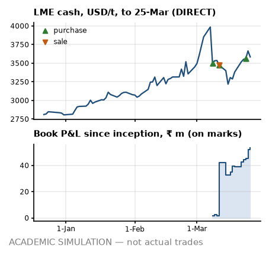

# Desk note 1 — week ending 25-Mar-2022

**Meridian Non-Ferrous Trading Pvt Ltd (SIM) — Aluminium Scrap Desk, Mumbai** · To: Head of Trading (SIM) · From: scrap desk (SIM) · Written after the 25-Mar-2022 close; uses no price, position, trade or event dated later. The anchor premium, grade factors, freight levels and the INR 3M rate are reconstructions that use later publications (footnotes).

> **ACADEMIC SIMULATION — not actual trades.** Counterparties, vessels, tickets and operational events are simulated. LME prices are DIRECT; USD/INR and MCX are PROXY; grade factors and freight levels are hindsight reconstructions (footnotes). **Bottom line:** Bought T03; a 99 % margin call would be bigger than the cash buffer; the parity board is wide open.

## What I saw

- **LME.** Cash closed USD 3,583/t (+202.5 on the week, +6.0 %); 3M USD 3,590.5. Inside the noise at 0.7 sigma on our GARCH vol. Still 10.1 % under the 7-Mar record close of USD 3,984.5.
- **Cash–3M.** −7.5 USD/t, contango, narrower than −19.5 a week ago. M+1 cash averaging implies USD 5.8/t under 3M, so our cash-average purchases (T02) price below the 3M screen in expectation. On the LME a short rolled forward earns the carry; our MCX proxy is in contango by construction, so I bank no roll gain from it².
- **Rupee.** USD/INR 76.19 (+8 paise on the week); 3M forward premium⁸ 3.24 % a year. Rupee steady. MCX² near month ₹295.69/kg (+6.0 %).
- **Freight¹.** Gulf lane USD 21.91/t, US East Coast USD 97.14/t; −10.6 % in four weeks. Nothing open to fix: FOB freight is booked and CFR cargo carries it in the price; the slide only helps the next FOB bid.
- **Headlines³.** Mean VADER tone +0.02 on 26 headlines (s.e. 0.06, z +0.90 against past weeks): inside the noise — colour, not a signal. Loudest aluminium-chain headline from a regular publisher: “COMMENTARY: Australian alumina ban will squeeze Rusal and aluminium” (Reuters, VADER −0.56).

## What I did

- **Bought T03:** 1,200 MT Taint/Tabor, Jebel Ali → Nhava Sheva, 60 × 20ft from Khaleej Metal Resources FZE (SIM); CFR Nhava Sheva, India at USD 2,470/t fixed, sight LC. It cleared all three parity screens in the week to 18-Mar: ₹43,205/MT base, ₹10,406 point-in-time⁴, ₹37,822 with conversion stressed (hurdle ₹5,000). I size to the smallest of the three.
- **MCX².** T02 rolled 74 lots Mar→Apr. T03 sold 143 Apr lots at ₹295.70/kg against the unsold cargo.
- **Paper and boxes.** LC opened for T02 (90-day usance).
- **Cash.** MCX margin −₹56.8 m net.
- *Earlier in March:* bought T01 and T02; sold T02-S1.

## P&L attribution

<!-- widths: 0.13, 0.085, 0.085, 0.085, 0.085, 0.095, 0.085, 0.085, 0.11, 0.09 -->
| ₹ m | (0) Deal | (a) LME | (b) Basis² | (c) Grade⁴ | (d) Freight¹ | (e) FX | (f) Events | (g) Carry/roll | **Total** |
|---|--:|--:|--:|--:|--:|--:|--:|--:|--:|
| Week | +0.6 | +2.2 | 0.0 | +11.3 | 0.0 | −0.2 | 0.0 | +0.5 | **+14.4** |
| March to date | +39.5 | +4.7 | 0.0 | +3.5 | +1.0 | +2.6 | 0.0 | +2.3 | **+53.5** |
| Since 1-Mar | +39.5 | +4.7 | 0.0 | +3.5 | +1.0 | +2.6 | 0.0 | +2.3 | **+53.5** |

Grade-spread marks added ₹11.3 m: a reconstructed series⁴, so I do not lean on it. One day this week followed an MCX exit or roll, where the engine keeps the closed contract in the delta: part of the move lands in (a) and is reversed in (g), so read the two together. Book P&L since inception ₹53.5 m on marks, with the cash account at −₹85.5 m. The sales booked so far hang it on our unverified domestic premium⁷: ₹28.2 m to ₹65.6 m across the registered range (−55,000 to +13,000 ₹/MT against −9,000 base); positive across all of it.

## Risks next week

- **Position.** Net LME +279 MT: physical +3,087, MCX −2,808 on 517 lots short (hedge ratio 0.91); unsold 3,720 MT. Hedged to within 9 % of the physical. FX: physical plus forwards long USD 1.99 m, MCX² leg short USD 10.06 m — I read them separately, because the netted number hides the offset.
- **VaR (1-day 95 %), into the next session.** GARCH ₹4.78 m (σ 2.77 %), 250-day ₹3.82 m (σ 1.92 %), 60-day ₹4.74 m. GARCH is the higher read: the latest shocks still dominate its memory. Exceptions so far: GARCH 0, 250-day 0 in 13 days.
- **Credit⁵.** Line use on today's exposure: BUY_JNPT_01 47 % of ₹560 m (band B); BUY_MUN_01 0 % of ₹650 m (band A); BUY_RJK_01 0 % of ₹120 m (band A).
- **Cash⁶.** Funding need ₹85.7 m on the ₹1,000 m working-capital line; headroom after the ₹150 m buffer ₹764.3 m. Initial margin ₹76.7 m. A 99 % 10-day LME move against the hedges (+22.5 %, 60-day vol) calls ₹189.4 m — more than the buffer. LC line ₹695.8 m of ₹1,000 m.
- **Parity for next week's decisions⁴.** 6 of 6 grade × lane cases clear all three screens; best is Tense on Jebel Ali → Nhava Sheva at ₹63,749/MT base, ₹37,534 point-in-time. Wide open: cash and credit set the size, not the board.

---

¹ **Freight:** lane levels are a reconstruction whose level inputs were published after this note (Drewry WCI shape = PROXY, lane level = ASSUMPTION), and the Gulf lane is a fixed multiple of the US lane, so freight is one factor, not two.
² **MCX:** a duty-paid import-parity proxy built from LME × USD/INR, not MCX bhavcopy. It has unit beta to LME by construction, so basis (b) reads zero and hedge effectiveness is overstated, and its curve is always in contango (INR carry), so roll gains are an artefact.
³ **Headlines:** real Google News RSS titles (DIRECT text, PROXY selection), scored with VADER; a supporting signal, never a reason for a trade.
⁴ **Grade factors:** the parity board, the unsold-cargo marks and bucket (c) use a reconstructed grade-factor mix; the point-in-time mix is shown where it matters.
⁵ **Credit:** bands come from an illustrative logistic model fitted to synthetic data, applied to this book's own utilisation and payment history as of this close; the band policy is a retrospective test the desk did not run at the time.
⁶ **Facilities:** the working-capital line, LC line and buffer are ASSUMPTIONS sized on the 25-Feb-2022 plan, not on this book.
⁷ **Premium:** the domestic anchor premium behind every sale price, and its registered range, come from price prints published after this note; they are simulation assumptions, not evidence a desk had at the time.
⁸ **Rates:** the INR 3M rate behind the forward premium, forward rates and the MCX² proxy's carry is the OECD average for the whole calendar month (PROXY), published after it ends: up to one month of look-ahead.
