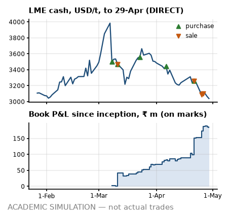

# Desk note 2 — week ending 29-Apr-2022

**Meridian Non-Ferrous Trading Pvt Ltd (SIM) — Aluminium Scrap Desk, Mumbai** · To: Head of Trading (SIM) · From: scrap desk (SIM) · Written after the 29-Apr-2022 close; uses no price, position, trade or event dated later. The anchor premium, grade factors, freight levels and the INR 3M rate are reconstructions that use later publications (footnotes).

> **ACADEMIC SIMULATION — not actual trades.** Counterparties, vessels, tickets and operational events are simulated. LME prices are DIRECT; USD/INR and MCX are PROXY; grade factors and freight levels are hindsight reconstructions (footnotes). **Bottom line:** Sold T01-S1 and T03-S1; the book is running 647 MT of long metal the hedge does not cover; two buyers are over the credit early-warning line; the parity board is wide open.

## What I saw

- **LME.** Cash closed USD 3,039/t (−205 on the week, −6.3 %); 3M USD 3,044. Soft week, 1.7 sigma on our GARCH vol: a real move, but inside what this vol allows. Still 23.7 % under the 7-Mar record close of USD 3,984.5.
- **Cash–3M.** −5.0 USD/t, contango, narrower than −17.0 a week ago. M+1 cash averaging implies USD 4.1/t under 3M, so our cash-average purchases (T02 and T05) price below the 3M screen in expectation. On the LME a short rolled forward earns the carry; our MCX proxy is in contango by construction, so I bank no roll gain from it².
- **Rupee.** USD/INR 76.51 (+6 paise on the week); 3M forward premium⁸ 3.08 % a year. Rupee steady. MCX² near month ₹251.69/kg (−6.3 %).
- **Freight¹.** Gulf lane USD 21.20/t, US East Coast USD 94.01/t; +0.4 % in four weeks. Nothing open to fix: FOB freight is booked and CFR cargo carries it in the price.
- **Headlines³.** Mean VADER tone +0.01 on 25 headlines (s.e. 0.07, z +0.17 against past weeks): inside the noise — colour, not a signal. Loudest aluminium-chain headline from a regular publisher: “LME CEO Backtracks on Exit Plan After Nickel Market Chaos” (Bloomberg.com, VADER −0.57).

## What I did

- **Sold T01-S1** to Kandla Metal Industries Pvt Ltd (SIM) (BUY_MUN_01): 1,680 MT at ₹201,000/MT fixed, 50 % advance, balance on 30-day credit; line use after booking 93 % on the planned invoice. **That breaks the band policy⁵:** band B at the previous close allows line use to 90 %; this sale takes 93 %.
- **Sold T03-S1** to Taloja Alloys and Smelters Pvt Ltd (SIM) (BUY_JNPT_01): 1,200 MT at ₹201,250/MT fixed, 30-day credit; line use after booking 88 % on the planned invoice.
- **MCX².** T01 lifted 200 May lots at ₹257.23/kg. T02 lifted 74 May lots at ₹257.23/kg; bought 145 May lots at ₹257.23/kg against the floating purchase. T03 lifted 143 May lots at ₹258.11/kg.
- **Forwards⁸.** Bought USD 1.52 m at 76.75 for T04's invoice.
- **Paper and boxes.** LC opened for T05 (60-day usance, confirmed); on board: T04 L1; arrived: T03 L2; cleared: T02 L2 and T03 L1.
- **Cash.** Out USD 1.48 m to suppliers (T03); MCX margin +₹86.5 m net.
- *Earlier in April:* bought T04 and T05; sold T05-S1.

## P&L attribution

<!-- widths: 0.13, 0.085, 0.085, 0.085, 0.085, 0.095, 0.085, 0.085, 0.11, 0.09 -->
| ₹ m | (0) Deal | (a) LME | (b) Basis² | (c) Grade⁴ | (d) Freight¹ | (e) FX | (f) Events | (g) Carry/roll | **Total** |
|---|--:|--:|--:|--:|--:|--:|--:|--:|--:|
| Week | +29.9 | −9.7 | 0.0 | +11.4 | 0.0 | −0.1 | 0.0 | −0.4 | **+31.0** |
| April to date | +76.9 | −29.1 | 0.0 | +63.9 | 0.0 | +0.9 | 0.0 | +2.9 | **+115.5** |
| Since 1-Mar | +115.8 | −26.3 | 0.0 | +79.9 | +1.0 | +6.7 | 0.0 | +7.1 | **+184.2** |

The week was the contract dates: ₹29.9 m of deal margin booked at signature. Two days this week followed an MCX exit or roll, where the engine keeps the closed contract in the delta: part of the move lands in (a) and is reversed in (g), so read the two together. Book P&L since inception ₹184.2 m on marks, with the cash account at −₹716.8 m. The sales booked so far hang it on our unverified domestic premium⁷: ₹56.4 m to ₹245.3 m across the registered range (−55,000 to +13,000 ₹/MT against −9,000 base); positive across all of it.

## Risks next week

- **Position.** Net LME +647 MT: physical +1,445, MCX −798 on 147 lots short (hedge ratio 0.55); unsold 2,100 MT. That is a long position, not rounding: the hedge lags the physical. FX: physical plus forwards long USD 5.38 m, MCX² leg short USD 2.43 m — I read them separately, because the netted number hides the offset.
- **VaR (1-day 95 %), into the next session.** GARCH ₹4.68 m (σ 1.82 %), 250-day ₹5.06 m (σ 1.98 %), 60-day ₹7.36 m. The two agree. The 60-day window is the hot read: it holds the recent sell-off at full weight. Exceptions so far: GARCH 3, 250-day 2 in 36 days.
- **Credit⁵.** Line use on today's exposure: BUY_MUN_01 88 % of ₹650 m (band C); BUY_JNPT_01 83 % of ₹560 m (band C); BUY_RJK_01 0 % of ₹120 m (band A). BUY_MUN_01 and BUY_JNPT_01 are over the 80 % early-warning line: no new open credit to them until cash comes in.
- **Cash⁶.** Funding need ₹720.0 m on the ₹1,000 m working-capital line; headroom after the ₹150 m buffer ₹130.0 m. Initial margin ₹55.2 m. A 99 % 10-day LME move against the hedges (+23.9 %, 60-day vol) calls ₹57.5 m, inside the buffer. LC line ₹886.3 m of ₹1,000 m.
- **Parity for next week's decisions⁴.** 6 of 6 grade × lane cases clear all three screens; best is Tense on Jebel Ali → Nhava Sheva at ₹34,443/MT base, ₹39,730 point-in-time. Wide open: cash and credit set the size, not the board.
- **Diary (contract dates next week).** T02 purchase pricing on the LME cash average.

---

¹ **Freight:** lane levels are a reconstruction whose level inputs were published after this note (Drewry WCI shape = PROXY, lane level = ASSUMPTION), and the Gulf lane is a fixed multiple of the US lane, so freight is one factor, not two.
² **MCX:** a duty-paid import-parity proxy built from LME × USD/INR, not MCX bhavcopy. It has unit beta to LME by construction, so basis (b) reads zero and hedge effectiveness is overstated, and its curve is always in contango (INR carry), so roll gains are an artefact.
³ **Headlines:** real Google News RSS titles (DIRECT text, PROXY selection), scored with VADER; a supporting signal, never a reason for a trade.
⁴ **Grade factors:** the parity board, the unsold-cargo marks and bucket (c) use a reconstructed grade-factor mix; the point-in-time mix is shown where it matters.
⁵ **Credit:** bands come from an illustrative logistic model fitted to synthetic data, applied to this book's own utilisation and payment history as of this close; the band policy is a retrospective test the desk did not run at the time.
⁶ **Facilities:** the working-capital line, LC line and buffer are ASSUMPTIONS sized on the 25-Feb-2022 plan, not on this book.
⁷ **Premium:** the domestic anchor premium behind every sale price, and its registered range, come from price prints published after this note; they are simulation assumptions, not evidence a desk had at the time.
⁸ **Rates:** the INR 3M rate behind the forward premium, forward rates and the MCX² proxy's carry is the OECD average for the whole calendar month (PROXY), published after it ends: up to one month of look-ahead.
