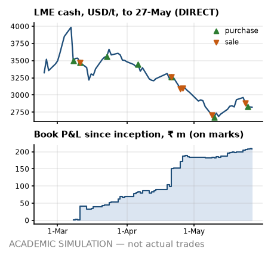

# Desk note 3 — week ending 27-May-2022

**Meridian Non-Ferrous Trading Pvt Ltd (SIM) — Aluminium Scrap Desk, Mumbai** · To: Head of Trading (SIM) · From: scrap desk (SIM) · Written after the 27-May-2022 close; uses no price, position, trade or event dated later. The anchor premium, grade factors, freight levels and the INR 3M rate are reconstructions that use later publications (footnotes).

> **ACADEMIC SIMULATION — not actual trades.** Counterparties, vessels, tickets and operational events are simulated. LME prices are DIRECT; USD/INR and MCX are PROXY; grade factors and freight levels are hindsight reconstructions (footnotes). **Bottom line:** Bought T07 and sold T04-S1; the LC line is over its limit; two buyers are over the credit early-warning line; a 99 % margin call would be bigger than the cash buffer.

## What I saw

- **LME.** Cash closed USD 2,823/t (−108 on the week, −3.7 %); 3M USD 2,847. Inside the noise at 0.8 sigma on our GARCH vol. Still 29.2 % under the 7-Mar record close of USD 3,984.5.
- **Cash–3M.** −24.0 USD/t, contango, wider than −4.0 a week ago. M+1 cash averaging implies USD 19.1/t under 3M, so our cash-average purchases (T02 and T05) price below the 3M screen in expectation. On the LME a short rolled forward earns the carry; our MCX proxy is in contango by construction, so I bank no roll gain from it².
- **Rupee.** USD/INR 77.59 (−9 paise on the week); 3M forward premium⁸ 3.64 % a year. Rupee steady. MCX² near month ₹237.23/kg (−3.9 %).
- **Freight¹.** Gulf lane USD 20.06/t, US East Coast USD 88.94/t; −5.4 % in four weeks. Nothing open to fix: FOB freight is booked and CFR cargo carries it in the price; the slide only helps the next FOB bid.
- **Headlines³.** Mean VADER tone +0.11 on 31 headlines (s.e. 0.04, z +1.24 against past weeks): inside the noise — colour, not a signal. Loudest aluminium-chain headline from a regular publisher: “COMMENTARY: Europe's aluminium output slides as energy crunch bites” (Reuters, VADER +0.27).

## What I did

- **Bought T07:** 1,890 MT Tense, US East Coast → Mundra, 90 × 40ft from Delaware Bay Metals LLC (SIM); FOB Wilmington, DE, USA at USD 2,086/t fixed, sight LC. It cleared all three parity screens in the week to 20-May: ₹22,935/MT base, ₹39,374 point-in-time⁴, ₹17,436 with conversion stressed (hurdle ₹5,000).
- **Sold T04-S1** to Saurashtra Castings and Alloys Pvt Ltd (SIM) (BUY_RJK_01): 1,260 MT at ₹194,500/MT fixed, 75 % advance, balance on 30-day credit; line use after booking 51 % on the planned invoice. **That breaks the band policy⁵:** band C at the previous close allows advances to 0.50× the line; this sale takes 1.53× the line in advances.
- **MCX².** T04 lifted 87 Jun lots at ₹243.16/kg. T07 sold 247 Jun lots at ₹238.72/kg against the unsold cargo.
- **Forwards⁸.** Bought USD 0.83 m at 77.73 for T06's invoice; bought USD 0.17 m at 77.84 for T07's freight.
- **Freight¹.** Fixed T07: 90 × 40ft at USD 1,900/box, 1.7 % over the index at fixture; stop at USD 2,170.
- **Paper and boxes.** LC opened for T07 (sight); on board: T06 L1; cleared: T01 L2 and T01 L3.
- **Cash.** In ₹151.6 m from buyers (T01-S2); MCX margin −₹1.3 m net.
- *Earlier in May:* bought T06; sold T01-S2 (outside the band policy⁵).

## P&L attribution

<!-- widths: 0.13, 0.085, 0.085, 0.085, 0.085, 0.095, 0.085, 0.085, 0.11, 0.09 -->
| ₹ m | (0) Deal | (a) LME | (b) Basis² | (c) Grade⁴ | (d) Freight¹ | (e) FX | (f) Events | (g) Carry/roll | **Total** |
|---|--:|--:|--:|--:|--:|--:|--:|--:|--:|
| Week | +3.3 | −5.0 | 0.0 | +6.1 | +0.2 | +0.4 | 0.0 | +3.6 | **+8.5** |
| May to date | +6.7 | −8.6 | 0.0 | +25.3 | +0.2 | +5.4 | 0.0 | −4.6 | **+24.3** |
| Since 1-Mar | +122.5 | −34.9 | 0.0 | +105.2 | +1.2 | +12.1 | 0.0 | +2.5 | **+208.6** |

Grade-spread marks added ₹6.1 m: a reconstructed series⁴, so I do not lean on it. Two days this week followed an MCX exit or roll, where the engine keeps the closed contract in the delta: part of the move lands in (a) and is reversed in (g), so read the two together. Book P&L since inception ₹208.6 m on marks, with the cash account at −₹750.7 m. The sales booked so far hang it on our unverified domestic premium⁷: ₹38.1 m to ₹290.1 m across the registered range (−55,000 to +13,000 ₹/MT against −9,000 base); positive across all of it.

## Risks next week

- **Position.** Net LME +228 MT: physical +3,098, MCX −2,870 on 528 lots short (hedge ratio 0.93); unsold 3,190 MT. Hedged to within 7 % of the physical. FX: physical plus forwards long USD 7.10 m, MCX² leg short USD 8.10 m — I read them separately, because the netted number hides the offset.
- **VaR (1-day 95 %), into the next session.** GARCH ₹1.51 m (σ 1.80 %), 250-day ₹1.69 m (σ 2.02 %), 60-day ₹2.32 m. The two agree. The 60-day window is the hot read: it holds the recent sell-off at full weight. Exceptions so far: GARCH 4, 250-day 3 in 55 days.
- **Credit⁵.** Line use on today's exposure: BUY_JNPT_01 83 % of ₹560 m (band C); BUY_MUN_01 83 % of ₹650 m (band C); BUY_RJK_01 51 % of ₹120 m (band D). BUY_JNPT_01 and BUY_MUN_01 are over the 80 % early-warning line: no new open credit to them until cash comes in. BUY_RJK_01 also carries advances of 1.53× its line: if one fails I hold unsold cargo with the hedge already lifted, so no hedge comes off before the money lands.
- **Cash⁶.** Funding need ₹760.4 m on the ₹1,000 m working-capital line; headroom after the ₹150 m buffer ₹89.6 m. Initial margin ₹62.9 m. A 99 % 10-day LME move against the hedges (+22.8 %, 60-day vol) calls ₹157.9 m — more than the buffer. LC line ₹1,213.4 m of ₹1,000 m: over limit, so no new LC until usance runs off.
- **Parity for next week's decisions⁴.** 2 of 6 grade × lane cases clear all three screens; best is Tense on Jebel Ali → Nhava Sheva at ₹19,037/MT base, ₹40,772 point-in-time. Selective: only these cases, and small.
- **Diary (contract dates next week).** T02 and T05 purchase pricing on the LME cash average.

---

¹ **Freight:** lane levels are a reconstruction whose level inputs were published after this note (Drewry WCI shape = PROXY, lane level = ASSUMPTION), and the Gulf lane is a fixed multiple of the US lane, so freight is one factor, not two.
² **MCX:** a duty-paid import-parity proxy built from LME × USD/INR, not MCX bhavcopy. It has unit beta to LME by construction, so basis (b) reads zero and hedge effectiveness is overstated, and its curve is always in contango (INR carry), so roll gains are an artefact.
³ **Headlines:** real Google News RSS titles (DIRECT text, PROXY selection), scored with VADER; a supporting signal, never a reason for a trade.
⁴ **Grade factors:** the parity board, the unsold-cargo marks and bucket (c) use a reconstructed grade-factor mix; the point-in-time mix is shown where it matters.
⁵ **Credit:** bands come from an illustrative logistic model fitted to synthetic data, applied to this book's own utilisation and payment history as of this close; the band policy is a retrospective test the desk did not run at the time.
⁶ **Facilities:** the working-capital line, LC line and buffer are ASSUMPTIONS sized on the 25-Feb-2022 plan, not on this book.
⁷ **Premium:** the domestic anchor premium behind every sale price, and its registered range, come from price prints published after this note; they are simulation assumptions, not evidence a desk had at the time.
⁸ **Rates:** the INR 3M rate behind the forward premium, forward rates and the MCX² proxy's carry is the OECD average for the whole calendar month (PROXY), published after it ends: up to one month of look-ahead.
