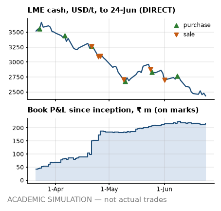

# Desk note 4 — week ending 24-Jun-2022

**Meridian Non-Ferrous Trading Pvt Ltd (SIM) — Aluminium Scrap Desk, Mumbai** · To: Head of Trading (SIM) · From: scrap desk (SIM) · Written after the 24-Jun-2022 close; uses no price, position, trade or event dated later. The anchor premium, grade factors, freight levels and the INR 3M rate are reconstructions that use later publications (footnotes).

> **ACADEMIC SIMULATION — not actual trades.** Counterparties, vessels, tickets and operational events are simulated. LME prices are DIRECT; USD/INR and MCX are PROXY; grade factors and freight levels are hindsight reconstructions (footnotes). **Bottom line:** No new tickets; a 99 % margin call would be bigger than the cash buffer; the parity window is shut.

## What I saw

- **LME.** Cash closed USD 2,436/t (−38 on the week, −1.5 %); 3M USD 2,450.5. Inside the noise at 0.3 sigma on our GARCH vol. Still 38.9 % under the 7-Mar record close of USD 3,984.5.
- **Cash–3M.** −14.5 USD/t, contango, narrower than −28.0 a week ago. M+1 cash averaging implies USD 11.2/t under 3M, so our cash-average purchases (T05 and T08) price below the 3M screen in expectation. On the LME a short rolled forward earns the carry; our MCX proxy is in contango by construction, so I bank no roll gain from it².
- **Rupee.** USD/INR 78.30 (+22 paise on the week); 3M forward premium⁸ 3.44 % a year. Rupee steady. MCX² near month ₹206.64/kg (−1.4 %).
- **Freight¹.** Gulf lane USD 18.42/t, US East Coast USD 81.66/t; −8.2 % in four weeks. Nothing open to fix: FOB freight is booked and CFR cargo carries it in the price; the slide only helps the next FOB bid.
- **Headlines³.** Mean VADER tone +0.02 on 12 headlines (s.e. 0.09, z +0.18 against past weeks): inside the noise — colour, not a signal.

## What I did

- **MCX².** T05 rolled 105 lots Jun→Jul. T07 rolled 247 lots Jun→Jul.
- **Forwards⁸.** Bought USD 1.53 m at 78.48 for T08's provisional payment.
- **Paper and boxes.** On board: T08 L1; arrived: T05 L1; cleared: T06 L2 and T04 L2.
- **Cash.** In ₹168.8 m from buyers (T01-S1); out USD 1.97 m to suppliers (T07); MCX margin +₹9.2 m net.
- *Earlier in June:* bought T08; sold T06-S1 (outside the band policy⁵).

## P&L attribution

<!-- widths: 0.13, 0.085, 0.085, 0.085, 0.085, 0.095, 0.085, 0.085, 0.11, 0.09 -->
| ₹ m | (0) Deal | (a) LME | (b) Basis² | (c) Grade⁴ | (d) Freight¹ | (e) FX | (f) Events | (g) Carry/roll | **Total** |
|---|--:|--:|--:|--:|--:|--:|--:|--:|--:|
| Week | −0.2 | +9.9 | 0.0 | +1.5 | 0.0 | −0.9 | 0.0 | −12.2 | **−1.9** |
| June to date | +6.0 | −8.2 | 0.0 | +14.9 | 0.0 | −0.7 | 0.0 | −10.7 | **+1.3** |
| Since 1-Mar | +128.5 | −43.4 | 0.0 | +124.4 | +1.2 | +11.3 | 0.0 | −6.9 | **+215.0** |

Carry and cross-terms took ₹12.2 m: funding on the cash we are out, plus the LME × FX cross-term on USD cargo. One day this week followed an MCX exit or roll, where the engine keeps the closed contract in the delta: part of the move lands in (a) and is reversed in (g), so read the two together. Book P&L since inception ₹215.0 m on marks, with the cash account at −₹430.5 m. The sales booked so far hang it on our unverified domestic premium⁷: ₹18.6 m to ₹308.9 m across the registered range (−55,000 to +13,000 ₹/MT against −9,000 base); positive across all of it.

## Risks next week

- **Position.** Net LME −58 MT: physical +3,374, MCX −3,432 on 631 lots short (hedge ratio 1.02); unsold 3,570 MT. Hedged to within 2 % of the physical. FX: physical plus forwards long USD 10.24 m, MCX² leg short USD 8.36 m — I read them separately, because the netted number hides the offset.
- **VaR (1-day 95 %), into the next session.** GARCH ₹0.74 m (σ 1.89 %), 250-day ₹0.77 m (σ 2.07 %), 60-day ₹0.73 m. The two agree. Exceptions so far: GARCH 6, 250-day 5 in 73 days.
- **Credit⁵.** Line use on today's exposure: BUY_RJK_01 51 % of ₹120 m (band D); BUY_MUN_01 48 % of ₹650 m (band C); BUY_JNPT_01 43 % of ₹560 m (band C). BUY_RJK_01 is band D on its advance reliance in the last quarter; the band policy⁵ would allow it no open credit, yet ₹61.3 m is open from sales already booked.
- **Cash⁶.** Funding need ₹444.0 m on the ₹1,000 m working-capital line; headroom after the ₹150 m buffer ₹406.0 m. Initial margin ₹65.5 m. A 99 % 10-day LME move against the hedges (+16.4 %, 250-day vol) calls ₹118.4 m — more than the buffer. LC line ₹960.0 m of ₹1,000 m.
- **Parity for next week's decisions⁴.** 0 of 6 grade × lane cases clear all three screens. Window shut: no new purchases next week.
- **Diary (contract dates next week).** T05 and T08 purchase pricing on the LME cash average; T05-S1 sale pricing on the MCX average.

---

¹ **Freight:** lane levels are a reconstruction whose level inputs were published after this note (Drewry WCI shape = PROXY, lane level = ASSUMPTION), and the Gulf lane is a fixed multiple of the US lane, so freight is one factor, not two.
² **MCX:** a duty-paid import-parity proxy built from LME × USD/INR, not MCX bhavcopy. It has unit beta to LME by construction, so basis (b) reads zero and hedge effectiveness is overstated, and its curve is always in contango (INR carry), so roll gains are an artefact.
³ **Headlines:** real Google News RSS titles (DIRECT text, PROXY selection), scored with VADER; a supporting signal, never a reason for a trade.
⁴ **Grade factors:** the parity board, the unsold-cargo marks and bucket (c) use a reconstructed grade-factor mix; the point-in-time mix is shown where it matters.
⁵ **Credit:** bands come from an illustrative logistic model fitted to synthetic data, applied to this book's own utilisation and payment history as of this close; the band policy is a retrospective test the desk did not run at the time.
⁶ **Facilities:** the working-capital line, LC line and buffer are ASSUMPTIONS sized on the 25-Feb-2022 plan, not on this book.
⁷ **Premium:** the domestic anchor premium behind every sale price, and its registered range, come from price prints published after this note; they are simulation assumptions, not evidence a desk had at the time.
⁸ **Rates:** the INR 3M rate behind the forward premium, forward rates and the MCX² proxy's carry is the OECD average for the whole calendar month (PROXY), published after it ends: up to one month of look-ahead.
