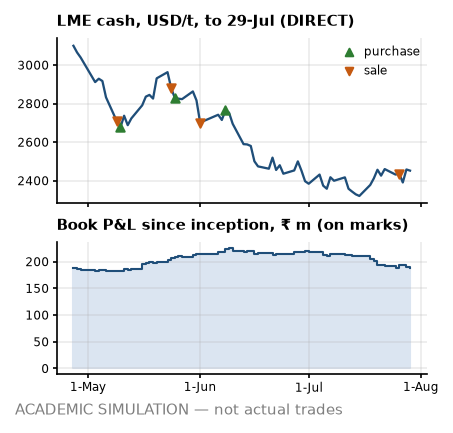

# Desk note 5 — week ending 29-Jul-2022

**Meridian Non-Ferrous Trading Pvt Ltd (SIM) — Aluminium Scrap Desk, Mumbai** · To: Head of Trading (SIM) · From: scrap desk (SIM) · Written after the 29-Jul-2022 close; uses no price, position, trade or event dated later. The anchor premium, grade factors, freight levels and the INR 3M rate are reconstructions that use later publications (footnotes).

> **ACADEMIC SIMULATION — not actual trades.** Counterparties, vessels, tickets and operational events are simulated. LME prices are DIRECT; USD/INR and MCX are PROXY; grade factors and freight levels are hindsight reconstructions (footnotes). **Bottom line:** The funding need is over the working-capital line, and that is the constraint on everything; sold T07-S1; the credit risk that matters is advance reliance, not receivables; only two of the six parity cases clear all three screens.

## What I saw

- **LME.** Cash closed USD 2,452/t (−8 on the week, −0.3 %); 3M USD 2,438. Inside the noise at 0.1 sigma on our GARCH vol. Still 38.5 % under the 7-Mar record close of USD 3,984.5.
- **Cash–3M.** +14.0 USD/t, backwardation, wider than +2.5 a week ago. Nearby metal is tight: M+1 cash averaging implies USD 11.5/t over 3M, so a cash-average purchase costs more than the 3M screen, and on the LME a short rolled forward now pays the spread. No reason to hold metal for carry.
- **Rupee.** USD/INR 79.31 (−55 paise on the week); 3M forward premium⁸ 2.90 % a year. Rupee firmer. MCX² near month ₹210.52/kg (−1.1 %).
- **Freight¹.** Gulf lane USD 15.68/t, US East Coast USD 69.51/t; −11.2 % in four weeks. Nothing open to fix: FOB freight is booked and CFR cargo carries it in the price; the slide only helps the next FOB bid.
- **Headlines³.** Mean VADER tone +0.13 on 27 headlines (s.e. 0.05, z +1.30 against past weeks): inside the noise — colour, not a signal. Loudest aluminium-chain headline from a regular publisher: “Aluminum Corp. of China Shares Rise After Latest Acquisition” (WSJ, VADER +0.30).

## What I did

- **Sold T07-S1** to Saurashtra Castings and Alloys Pvt Ltd (SIM) (BUY_RJK_01): 1,890 MT at ₹165,750/MT fixed, 70 % advance, balance on 30-day credit; line use after booking 78 % on the planned invoice. **That breaks the band policy⁵:** band D at the previous close allows line use to 50 %, no advance reliance and no open credit; this sale takes 78 %, 1.83× the line in advances and 30-day credit.
- **Ops.** Container News, 27-Jul-2022: carriers void calls at Nhava Sheva and Mundra (real). Expected delays for us (SIM; the simulation sets their full length on this date): T07 L1 +6 d dwell, T07 L2 +12 d dwell, T08 L1 +7 d arrival and T08 L2 +7 d arrival.
- **MCX².** T07 lifted 247 Aug lots at ₹211.66/kg.
- **Paper and boxes.** Arrived: T07 L2.
- **Cash.** In ₹61.3 m from buyers (T04-S1); MCX margin +₹32.0 m net.
- *Earlier in July:* a cargo survey on T07.

## P&L attribution

<!-- widths: 0.13, 0.085, 0.085, 0.085, 0.085, 0.095, 0.085, 0.085, 0.11, 0.09 -->
| ₹ m | (0) Deal | (a) LME | (b) Basis² | (c) Grade⁴ | (d) Freight¹ | (e) FX | (f) Events | (g) Carry/roll | **Total** |
|---|--:|--:|--:|--:|--:|--:|--:|--:|--:|
| Week | +10.2 | +5.2 | 0.0 | −8.1 | 0.0 | −0.4 | −1.6 | −8.8 | **−3.5** |
| July to date | +9.6 | +4.7 | 0.0 | −15.4 | 0.0 | +1.6 | −0.9 | −30.5 | **−30.8** |
| Since 1-Mar | +138.0 | −38.7 | 0.0 | +110.3 | +1.2 | +14.5 | −0.9 | −35.8 | **+188.5** |

The week was the contract dates: ₹10.2 m of deal margin booked at signature. One day this week followed an MCX exit or roll, where the engine keeps the closed contract in the delta: part of the move lands in (a) and is reversed in (g), so read the two together. Book P&L since inception ₹188.5 m on marks, with the cash account at −₹1,035.5 m. The sales booked so far hang it on our unverified domestic premium⁷: −₹47.7 m to ₹301.5 m across the registered range (−55,000 to +13,000 ₹/MT against −9,000 base); break-even at −45,709 ₹/MT sits inside it, so the sign of this P&L is not robust.

## Risks next week

- **Position.** Net LME +94 MT: physical +1,344, MCX −1,251 on 230 lots short (hedge ratio 0.93); unsold 1,680 MT. Hedged to within 7 % of the physical. FX: physical plus forwards long USD 3.11 m, MCX² leg short USD 3.07 m — I read them separately, because the netted number hides the offset.
- **VaR (1-day 95 %), into the next session.** GARCH ₹0.48 m (σ 1.61 %), 250-day ₹0.62 m (σ 2.09 %), 60-day ₹0.57 m. GARCH has decayed below the 250-day window, which still carries March; I size off the higher number. Exceptions so far: GARCH 7, 250-day 5 in 98 days.
- **Credit⁵.** Line use on today's exposure: BUY_RJK_01 74 % of ₹120 m (band D); BUY_MUN_01 48 % of ₹650 m (band C); BUY_JNPT_01 43 % of ₹560 m (band C). BUY_RJK_01 also carries advances of 1.83× its line: if one fails I hold unsold cargo with the hedge already lifted, so no hedge comes off before the money lands.
- **Cash⁶.** Funding need ₹1,057.8 m on the ₹1,000 m working-capital line; headroom after the ₹150 m buffer −₹207.8 m. Over the line: I need an ad-hoc limit or I stop buying. Initial margin ₹24.3 m. A 99 % 10-day LME move against the hedges (+16.6 %, 250-day vol) calls ₹44.4 m, inside the buffer. LC line ₹0.0 m of ₹1,000 m.
- **Parity for next week's decisions⁴.** 2 of 6 grade × lane cases clear all three screens; best is Tense on Jebel Ali → Nhava Sheva at ₹15,206/MT base, ₹26,505 point-in-time. Selective: only these cases, and small.

---

¹ **Freight:** lane levels are a reconstruction whose level inputs were published after this note (Drewry WCI shape = PROXY, lane level = ASSUMPTION), and the Gulf lane is a fixed multiple of the US lane, so freight is one factor, not two.
² **MCX:** a duty-paid import-parity proxy built from LME × USD/INR, not MCX bhavcopy. It has unit beta to LME by construction, so basis (b) reads zero and hedge effectiveness is overstated, and its curve is always in contango (INR carry), so roll gains are an artefact.
³ **Headlines:** real Google News RSS titles (DIRECT text, PROXY selection), scored with VADER; a supporting signal, never a reason for a trade.
⁴ **Grade factors:** the parity board, the unsold-cargo marks and bucket (c) use a reconstructed grade-factor mix; the point-in-time mix is shown where it matters.
⁵ **Credit:** bands come from an illustrative logistic model fitted to synthetic data, applied to this book's own utilisation and payment history as of this close; the band policy is a retrospective test the desk did not run at the time.
⁶ **Facilities:** the working-capital line, LC line and buffer are ASSUMPTIONS sized on the 25-Feb-2022 plan, not on this book.
⁷ **Premium:** the domestic anchor premium behind every sale price, and its registered range, come from price prints published after this note; they are simulation assumptions, not evidence a desk had at the time.
⁸ **Rates:** the INR 3M rate behind the forward premium, forward rates and the MCX² proxy's carry is the OECD average for the whole calendar month (PROXY), published after it ends: up to one month of look-ahead.
