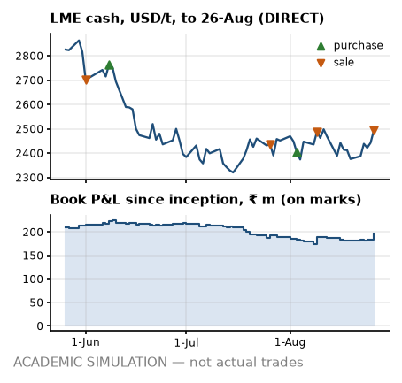

# Desk note 6 — week ending 26-Aug-2022

**Meridian Non-Ferrous Trading Pvt Ltd (SIM) — Aluminium Scrap Desk, Mumbai** · To: Head of Trading (SIM) · From: scrap desk (SIM) · Written after the 26-Aug-2022 close; uses no price, position, trade or event dated later. The anchor premium, grade factors, freight levels and the INR 3M rate are reconstructions that use later publications (footnotes).

> **ACADEMIC SIMULATION — not actual trades.** Counterparties, vessels, tickets and operational events are simulated. LME prices are DIRECT; USD/INR and MCX are PROXY; grade factors and freight levels are hindsight reconstructions (footnotes). **Bottom line:** Sold T09-S1; only two of the six parity cases clear all three screens; the book is fully sold.

## What I saw

- **LME.** Cash closed USD 2,495/t (+119 on the week, +5.0 %); 3M USD 2,485.5. Firm week, 1.3 sigma on our GARCH vol: a real move, but inside what this vol allows. Still 37.4 % under the 7-Mar record close of USD 3,984.5.
- **Cash–3M.** +9.5 USD/t, backwardation, wider than +2.5 a week ago. Nearby metal is tight: M+1 cash averaging implies USD 7.4/t over 3M, so a cash-average purchase costs more than the 3M screen, and on the LME a short rolled forward now pays the spread. No reason to hold metal for carry.
- **Rupee.** USD/INR 79.85 (−2 paise on the week); 3M forward premium⁸ 2.78 % a year. Rupee steady. MCX² near month ₹215.82/kg (+4.9 %).
- **Freight¹.** Gulf lane USD 15.78/t, US East Coast USD 69.96/t; +0.6 % in four weeks. Nothing open to fix: FOB freight is booked and CFR cargo carries it in the price.
- **Headlines³.** Mean VADER tone −0.03 on 25 headlines (s.e. 0.07, z −0.53 against past weeks): inside the noise — colour, not a signal. Loudest aluminium-chain headline from a regular publisher: “Nalco's Panchpatmali bauxite mine took home the prestigious 'Greentech Quality and Innovation Awards 2022'” (AL Circle, VADER +0.68).

## What I did

- **Sold T09-S1** to Taloja Alloys and Smelters Pvt Ltd (SIM) (BUY_JNPT_01): 1,200 MT at ₹168,500/MT fixed, 25 % advance, balance on 30-day credit; line use after booking 27 % on the planned invoice.
- **MCX².** T09 lifted 157 Sep lots at ₹216.82/kg.
- **Forwards⁸.** Bought USD 1.10 m at 80.31 for T09's invoice.
- **Paper and boxes.** On board: T09 L2; arrived: T09 L1.
- **Cash.** MCX margin +₹8.2 m net.
- *Earlier in August:* bought T09; sold T08-S1; a port hold on T08; a radioactivity rejection on T08.

## P&L attribution

<!-- widths: 0.13, 0.085, 0.085, 0.085, 0.085, 0.095, 0.085, 0.085, 0.11, 0.09 -->
| ₹ m | (0) Deal | (a) LME | (b) Basis² | (c) Grade⁴ | (d) Freight¹ | (e) FX | (f) Events | (g) Carry/roll | **Total** |
|---|--:|--:|--:|--:|--:|--:|--:|--:|--:|
| Week | +11.2 | +1.0 | 0.0 | +4.3 | 0.0 | 0.0 | 0.0 | −1.3 | **+15.2** |
| August to date | +27.3 | +2.7 | 0.0 | −7.0 | 0.0 | −1.0 | −3.7 | −10.3 | **+8.1** |
| Since 1-Mar | +165.2 | −36.0 | 0.0 | +103.3 | +1.2 | +13.6 | −4.6 | −46.1 | **+196.6** |

The week was the contract dates: ₹11.2 m of deal margin booked at signature. Book P&L since inception ₹196.6 m on marks, with the cash account at −₹270.8 m. The sales booked so far hang it on our unverified domestic premium⁷: −₹100.3 m to ₹338.6 m across the registered range (−55,000 to +13,000 ₹/MT against −9,000 base); break-even at −39,459 ₹/MT sits inside it, so the sign of this P&L is not robust.

## Risks next week

- **Position.** Net LME −855 MT: physical 0, MCX −855 with no MCX lots open; unsold 0 MT. Today's MCX exits still sit in these deltas, the MCX FX leg and the VaR below (a known engine artefact on exit and roll days); the clean read is the physical and the lots actually open. FX: physical plus forwards short USD 0.06 m, MCX² leg short USD 2.13 m — I read them separately, because the netted number hides the offset.
- **VaR (1-day 95 %), into the next session.** GARCH ₹4.56 m (σ 1.59 %), 250-day ₹5.98 m (σ 2.10 %), 60-day ₹4.86 m. GARCH has decayed below the 250-day window, which still carries March; I size off the higher number. Exceptions so far: GARCH 7, 250-day 5 in 118 days.
- **Credit⁵.** Line use on today's exposure: BUY_RJK_01 74 % of ₹120 m (band D); BUY_MUN_01 41 % of ₹650 m (band C); BUY_JNPT_01 27 % of ₹560 m (band C). BUY_RJK_01 is band D on its advance reliance in the last quarter; the band policy⁵ would allow it no open credit, yet ₹89.2 m is open from sales already booked.
- **Cash⁶.** Funding need ₹299.0 m on the ₹1,000 m working-capital line; headroom after the ₹150 m buffer ₹551.0 m. Initial margin ₹0.0 m. LC line ₹192.6 m of ₹1,000 m.
- **Parity for next week's decisions⁴.** 2 of 6 grade × lane cases clear all three screens; best is Tense on Jebel Ali → Nhava Sheva at ₹17,471/MT base, ₹17,765 point-in-time. Selective: only these cases, and small.

---

¹ **Freight:** lane levels are a reconstruction whose level inputs were published after this note (Drewry WCI shape = PROXY, lane level = ASSUMPTION), and the Gulf lane is a fixed multiple of the US lane, so freight is one factor, not two.
² **MCX:** a duty-paid import-parity proxy built from LME × USD/INR, not MCX bhavcopy. It has unit beta to LME by construction, so basis (b) reads zero and hedge effectiveness is overstated, and its curve is always in contango (INR carry), so roll gains are an artefact.
³ **Headlines:** real Google News RSS titles (DIRECT text, PROXY selection), scored with VADER; a supporting signal, never a reason for a trade.
⁴ **Grade factors:** the parity board, the unsold-cargo marks and bucket (c) use a reconstructed grade-factor mix; the point-in-time mix is shown where it matters.
⁵ **Credit:** bands come from an illustrative logistic model fitted to synthetic data, applied to this book's own utilisation and payment history as of this close; the band policy is a retrospective test the desk did not run at the time.
⁶ **Facilities:** the working-capital line, LC line and buffer are ASSUMPTIONS sized on the 25-Feb-2022 plan, not on this book.
⁷ **Premium:** the domestic anchor premium behind every sale price, and its registered range, come from price prints published after this note; they are simulation assumptions, not evidence a desk had at the time.
⁸ **Rates:** the INR 3M rate behind the forward premium, forward rates and the MCX² proxy's carry is the OECD average for the whole calendar month (PROXY), published after it ends: up to one month of look-ahead.
