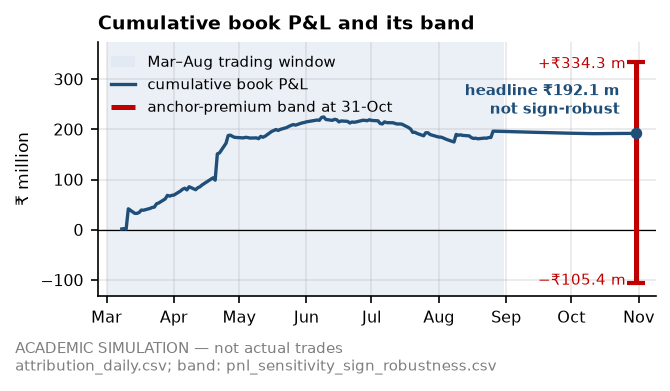
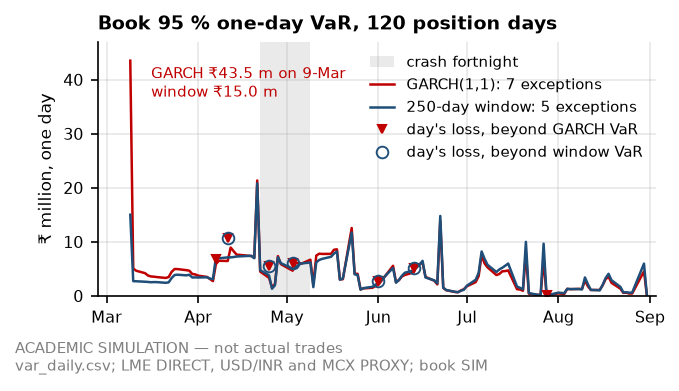

# Virtual Metals Trading Desk — one-page summary

**A simulated physical aluminium-scrap import desk into India, built to be defended in a physical-trading interview.** It buys Zorba 95/5, Taint/Tabor and Tense on Jebel Ali → Nhava Sheva and US East Coast → Mundra, sells to Indian smelters and hedges on MCX and in USD/INR forwards, through the real 1-Mar-2022 to 31-Aug-2022 market, including the 7-Mar LME record close and the crash after it.

> **ACADEMIC SIMULATION — not actual trades.** Counterparties, vessels, banks, tickets and events are fictional (SIM). Market data is real where a public source exists, otherwise flagged PROXY or ASSUMPTION. Every number is filled from the published tables by code, with its source file named.

## The desk in numbers

| Tickets | Tonnes | Containers | Grades · lanes | Counterparties | Traded | Ex-ante trade rule |
|:--:|:--:|:--:|:--:|:--:|:--:|:--:|
| **9** | **14,350 MT** | **656** | **3** · **2** | 3 suppliers, 3 buyers | 8-Mar to 3-Aug-2022 | **9 of 9** tickets pass |

Rule declared before any parity result ([CONTRACTS §5a](../../CONTRACTS.md)): parity window open on the base screen, on the point-in-time grade mix and with conversion cost a step higher. 82 of 162 weekly cases passed (111 on the base screen alone) *([parity_weekly.csv](../tables/parity_weekly.csv))*.

## Headline results

<!-- widths: 0.17, 0.83 -->
| Result | Value and source |
|---|---|
| Book P&L to the horizon (31-Oct-2022) | **₹192.1 m** (₹13,384/MT); ₹195.9 m at the window end (31-Aug-2022) *([attribution_daily.csv](../tables/attribution_daily.csv))* |
| **…read only with its band** | **−₹105.4 m to +₹334.3 m** across the registered `domestic_anchor_premium_inr_t` grid (ASSUMPTION, verification PENDING); break-even −38,702 ₹/MT inside the grid, so the headline is **not sign-robust** *([pnl_sensitivity_sign_robustness.csv](../tables/pnl_sensitivity_sign_robustness.csv))* |
| Where it came from | deal margin at contract dates +₹165.2 m, grade spread +₹103.3 m, carry, roll and cross-terms −₹56.6 m, LME flat price −₹30.0 m; the other 4 buckets +₹10.0 m; residual ₹0. Deal margin (86 % of the total) comes from the desk's own sale-pricing rule on that anchor premium *([attribution_daily.csv](../tables/attribution_daily.csv))* |
| Best trade ([post-mortem](post_mortem.pdf) metric) | **T02**, Tense, Jebel Ali → Nhava Sheva: **+₹50.55 m** (₹42,122/MT). Ranked on worst P&L across 24 registered re-pricing cases, its floor is +₹10.65 m: the only ticket positive in every case. T01 makes more in rupees (+₹64.28 m) but falls to −₹28.93 m in its worst case *([pnl_sensitivity_pricing.csv](../tables/pnl_sensitivity_pricing.csv))* |
| Worst trade | **T08**, Tense, US East Coast → Mundra: **−₹11.73 m** (−₹6,980/MT); hit its hard stop on 1-Aug *([attribution_daily.csv](../tables/attribution_daily.csv))* |

 

## Risk findings, as they came out

<!-- widths: 0.14, 0.86 -->
| Model | Finding and source |
|---|---|
| Daily 95 % VaR: GARCH(1,1) vs 250-day history | **Mixed, not the win the spec expected.** Into March GARCH moved hardest (LME vol forecast for 8-Mar 2.89 % against 1.67 %; book VaR ₹43.5 m on 9-Mar against ₹15.0 m). But on the declared 90th-percentile alert rule the 250-day window crossed first (9-Feb, 3 trading days before GARCH), and into the 22-Apr crash fortnight GARCH (1.85 %) sat below both windows (1.96 % at 250 days, 2.84 % at 60). Mean VaR, 120 days: ₹4.27 m against ₹3.98 m *([var_summary.csv](../tables/var_summary.csv), [var_lead_lag.csv](../tables/var_lead_lag.csv))* |
| Kupiec backtest | Book: 7 GARCH and 5 window exceptions against 6 expected. Neither is rejected, but the test accepts 2 to 11 here, so it cannot separate them. On a fixed LME long, 2019–2022, neither is rejected either; taking 2021 alone, the 250-day window is rejected and GARCH is not *([kupiec.csv](../tables/kupiec.csv))* |
| Monte Carlo, 10,000 paths, 99 % 10-day VaR | On three dates fixed by rule: ₹76.3 m on 8-Mar (no MCX hedge yet), ₹23.0 m on 21-Apr, ₹1.00 m on 27-Jul. An MCX basis factor lifts the last two to ₹32.8 m and ₹14.6 m: on the near-flat 27-Jul book, basis is most of the risk. Beyond every path: BIS-QCO hold + demurrage (HYPOTHETICAL policy) on 21-Apr (−₹45.6 m) and 27-Jul (−₹18.3 m); BUY_RJK_01 (SIM) defaults on 27-Jul (−₹28.3 m) *([mc_summary.csv](../tables/mc_summary.csv), [mc_stress_scenarios.csv](../tables/mc_stress_scenarios.csv))* |
| Credit scoring (logistic) | Riskiest first: **BUY_RJK_01** PD 41.8 %, band D; BUY_JNPT_01 8.2 % (band C); BUY_MUN_01 5.1 % (band C). BUY_RJK_01's contracted exposure reached 2.57× its line, which the model cuts from ₹120 m to ₹60 m. **Illustrative:** fitted on 1,200 synthetic buyer-quarters; profiles written by the book's author *([credit_scores.csv](../tables/credit_scores.csv))* |
| Liquidity and margin | **The book did not fit its bank lines.** Funding need peaked at ₹1,179.0 m on 20-Jul against a ₹1,000 m line sized on the plan's average balance: 19 days over (none on a line one ₹25 crore step higher). LCs peaked at ₹1,414.8 m against ₹1,000 m (17 days over, face plus tolerance). Peak MCX initial margin ₹95.8 m (21-Apr) *([margin_liquidity_summary.csv](../tables/margin_liquidity_summary.csv))* |
| Sentiment overlay (VADER) | 649 real headlines over 28 weeks: 0 of 12 lead tests significant, so no evidence that headline tone led LME. The March spike could not be tested, and 28 weeks can only rule out a strong lead *([sentiment_summary.csv](../tables/sentiment_summary.csv))* |

<!-- columns -->
## What is real, a proxy or an assumption

<!-- widths: 0.33, 0.15, 0.14, 0.23, 0.15 -->
| Count | DIRECT | PROXY | ASSUMPTION | Total |
|---|--:|--:|--:|--:|
| Parameters (register) | 51 | 16 | 165 | 232 |
| Market-panel columns | 7 | 14 | 7 | 28 |

Parameter verification: 47 VERIFIED, 24 PARTIAL, 46 PENDING, 115 N/A (desk policy or model design).

- **Biggest proxy: MCX** at duty-paid import parity, one-for-one with LME × USD/INR, so hedges look perfect. A third-party mirror gives weekly beta 0.75; at that beta mean GARCH VaR is ₹8.5 m, not ₹4.27 m.
- **Reconstructed: freight and grade factors.** Freight levels are hindsight-calibrated; the grade path uses later data. On the point-in-time grade mix the book makes ₹97.3 m and grade spread turns −₹36.8 m.
<!-- column-break -->
## Where to look

- [README.md](../../README.md) (method, re-run steps, caveats) and [docs/INDEX.md](../../docs/INDEX.md) (every spec row mapped to its files).
- In `outputs/reports/`: 6 weekly desk notes, the 2-page [post-mortem](post_mortem.pdf) on T02, the one-page [risk policy memo](risk_policy_memo.pdf) and the 17-question [interview pack](interview_pack.pdf).
- [Metals_Desk_Master.xlsx](../excel/Metals_Desk_Master.xlsx): formula-driven parity, book and P&L attribution; reconciliation **VERIFIED**: 132,447 formula cells recalculated outside Excel, 0 failed checks.

## Built with

Python (pandas, arch, SciPy, scikit-learn, matplotlib, reportlab, VADER); formula-driven Excel (openpyxl, recalculated outside Excel with `formulas`). Seeded, staged through files: `DESK_OFFLINE=1 python run_all.py` rebuilds everything offline from cached raw data.
<!-- end-columns -->
