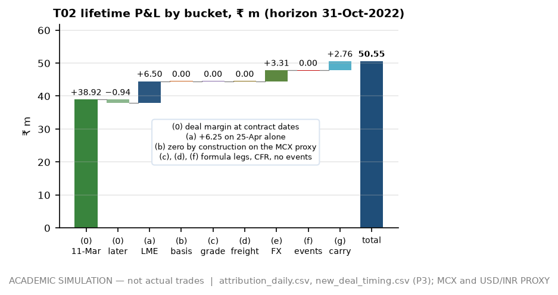
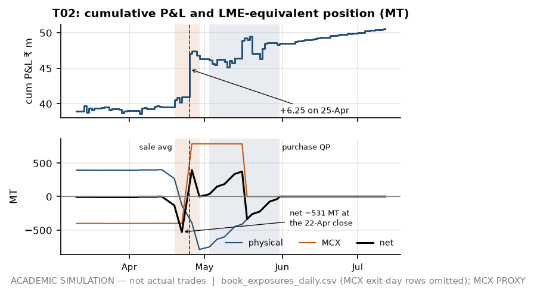

# Deal post-mortem — T02: Tense from Jebel Ali, floating in and floating out

**Meridian Non-Ferrous Trading Pvt Ltd (SIM) — Aluminium Scrap Desk, Mumbai** · Trader's post-mortem on ticket SPA/JEA/2203-02 (SIM), traded 11-Mar-2022, last cashflow 12-Jul-2022. Only §2 is dated: it uses no price, position, trade or event dated after the 11-Mar-2022 close, but the anchor premium behind its netback, the grade factors, freight levels and the INR 3M rate are reconstructions that use later publications (§6). The rest is a retrospective on the Phase 3 tables (horizon 31-Oct-2022).

> **ACADEMIC SIMULATION — not actual trades.** T02 made **₹50.55 m** on 1,200 MT (**₹42,122/MT**), 26 % of the book's ₹192.1 m. That book figure is **not sign-robust**: −₹105.4 m to +₹334.3 m across the registered `domestic_anchor_premium_inr_t` grid, break-even −38,702 ₹/MT inside it. Counterparties, vessels and events are simulated; LME is DIRECT, USD/INR and MCX are PROXY, grade factors and freight levels are hindsight reconstructions.

## 1. Which trade, and by what measure

<!-- widths: 0.05, 0.065, 0.17, 0.09, 0.08, 0.13, 0.13, 0.13, 0.105 -->
| Rank | Ticket | Grade · lane | P&L ₹ m | ₹/MT | Worst re-pricing ₹ m | At anchor −55,000 ₹ m | Peak cash drawn ₹ m | P&L ÷ peak cash |
|--:|---|---|--:|--:|--:|--:|--:|--:|
| **1** | **T02** | tense · JEA_NSA | **+50.55** | **42,122** | **+10.65** | +24.96 | 72.99 | 0.69 |
| 2 | T03 | taint_tabor · JEA_NSA | +29.09 | 24,240 | −7.60 | +4.29 | 251.63 | 0.12 |
| 3 | T05 | tense · USEC_MUN | +33.65 | 16,025 | −12.79 | −10.67 | 333.51 | 0.10 |
| 4 | T09 | tense · JEA_NSA | +10.05 | 8,374 | −15.42 | −15.42 | 46.00 | 0.22 |
| 5 | T06 | zorba · JEA_NSA | +8.62 | 6,630 | −17.26 | −17.26 | 268.14 | 0.03 |
| 6 | T04 | taint_tabor · USEC_MUN | +6.48 | 5,145 | −20.38 | −19.76 | 251.35 | 0.03 |
| 7 | T01 | zorba · USEC_MUN | **+64.28** | 25,509 | −28.93 | +13.69 | 501.83 | 0.13 |
| 8 | T07 | tense · USEC_MUN | +1.06 | 561 | −38.65 | −38.65 | 360.88 | 0.00 |
| 9 | T08 | tense · USEC_MUN | −11.73 | −6,980 | −46.56 | −46.56 | 315.70 | −0.04 |

**Metric: the worst P&L across the 24 registered one-at-a-time re-pricing cases** (`pnl_sensitivity_pricing.csv`), because a post-mortem should study the profit that survives the desk's own assumptions. T02 is the only one of 9 tickets positive in all 24 (floor +₹10.65 m, at a 0 % desk share of the arb), and it also leads on ₹/MT and on P&L per rupee of peak cash drawn. T01 leads on raw rupees (+₹64.28 m) but falls to −₹28.93 m with both legs re-priced on the point-in-time grade mix. I chose the metric after the Phase 3 results were out; the table shows the alternatives so a reader can disagree.

## 2. Thesis — as of the 11-Mar-2022 close

- **Tape.** LME cash made the panel's record close, USD 3,984.5/t, on 7-Mar and lost USD 484 (−12.1 %) the next session; on 11-Mar it closed at USD 3,472/t with cash–3M at −28 USD/t (contango). USD/INR (ECB cross, PROXY) 76.42, from 75.70 on 1-Mar. The Phase 4.1 GARCH(1,1) one-day LME vol forecast for the session, fitted on returns to the previous close, was 4.50 % against 1.86 % on the 250-day window: no tape to be long flat price on a guess.
- **Parity (§5a screen).** Week to 11-Mar: 6 of 6 grade × lane cases eligible, and Tense on JEA_NSA the widest — ₹63,523/MT base, ₹28,042 on the point-in-time grade mix, ₹58,024 with conversion stressed, against a ₹5,000 hurdle. Replacement ₹178,826/MT, smelter netback ₹244,567/MT.
- **Structure.** Buy CFR at 0.638 × the LME cash average of the month after shipment (reconstructed trade-date grade factor 0.6419); sell the same afternoon at 0.916 × the MCX near-month average over the delivery window − ₹51,900/MT, which at the day's MCX priced ₹211,744/MT against ₹211,697 from the desk rule (50 % of the gap). Both legs float, so the trade is the factor gap — 0.31 t of LME-equivalent metal per tonne of scrap: 74 MCX lots short now, flipping to 145 long once the sale has averaged and the purchase has not. A 90-day usance against 30-day buyer credit means the buyer pays before I do. The risk I flagged: Jebel Ali cargo needs a pre-shipment inspection certificate (PSIC), and a failed inspection stops the whole parcel.

## 3. Execution

<!-- widths: 0.11, 0.47, 0.42 -->
| Leg | Ticket terms | What happened |
|---|---|---|
| Purchase | Khaleej Metal Resources FZE (SIM), CFR Nhava Sheva, India; 1,200 MT Tense in 48 × 20ft; 0.638 × LME cash avg 3-May–31-May, 95 % provisional; usance LC 90 days, unconfirmed, opened 21-Mar | B/Ls 5-Apr and 13-Apr (laycan 1-Apr–22-Apr); provisional USD 2,408,157 paid at 78.92 / 79.56 on 4-Jul and 12-Jul; QP averaged USD 2,826/t, final credit USD 244,298 on 9-Jun; net USD 1,803/t |
| Sale | Taloja Alloys and Smelters Pvt Ltd (SIM), FOR buyer's works, Taloja (SIM); 0.916 × MCX M1 avg 19-Apr–29-Apr − ₹51,900/MT; 30-day credit | M1 averaged 261.90 ₹/kg → ₹187,996/MT = ₹225.6 m (vs ₹254.1 m at 11-Mar prices); invoiced 29-Apr, paid 30-May, the due date |
| MCX, ratio 1.00 | SELL 74 lots 11-Mar, rolled 22-Mar and 20-Apr, unwound 25-Apr; BUY 145 lots 25-Apr→17-May; each leg closed at the midpoint fixing of the leg it hedges | Peak initial margin ₹18.7 m; hedge legs' LME bucket −₹4.32 m; 2 rolls +₹0.67 m, proxy INR carry |
| FX, cover 100 % | BUY USD 1,241,900 at 76.04, 5-Apr→4-Jul; BUY USD 1,166,000 at 76.88, 13-Apr→12-Jul; SELL USD 240,000 at 77.68, 1-Jun→4-Jul | Settled +₹6.40 m |
| Credit | BUY_JNPT_01: 45.4 % of its ₹560 m line after booking | Phase 5 score at the 10-Mar close: band A, model PD 0.6 % (synthetic-data model, retrospective) — but this was its first sale with the desk, and every buyer scored band A before its first sale |
| Costs, cash | No quality, logistics or payment events. PSIC ₹0.15 m, port ₹1.92 m, duty ₹4.58 m | Cash drawn peaked at ₹73.0 m (10-May); positive from 30-May, peaking at ₹234.5 m on 9-Jun |

<!-- pagebreak -->
## 4. Attribution — ₹50.55 m lifetime

 

<!-- widths: 0.235, 0.105, 0.66 -->
| Bucket | ₹ m | Where it came from |
|---|--:|---|
| (0) deal margin at contract dates | +37.98 | +₹38.92 m on 11-Mar — the sale rule; −₹0.94 m on later dates (hedge execution costs, LC fees) |
| (a) LME flat price | +6.50 | physical +₹10.82 m, MCX legs −₹4.32 m; **+₹6.25 m on 25-Apr alone**, +₹0.26 m on every other day |
| (b) LME–MCX basis | 0.00 | zero by construction on the proxy; −₹2.29 m on the third-party mirror (PROXY; whole-ticket effect +₹1.04 m) |
| (c) grade · (d) freight · (f) events | 0.00 each | both legs formula-priced; CFR; no events |
| (e) USD/INR | +3.31 | forwards +₹8.58 m, USD purchase legs −₹6.97 m, MCX legs +₹1.60 m, other +₹0.09 m; +₹2.31 m of it between 29-Apr and 17-May (§5) |
| (g) carry, roll, cross-terms | +2.76 | funding +₹1.72 m; the rest +₹1.04 m (rolls +₹0.67 m, all proxy INR carry, and cross-terms) |
| **total** | **+50.55** | residual zero |

## 5. What went right, what went wrong

- **Right — structure, not view.** 77 % of the result was booked the day I signed, and cumulative P&L never closed below ₹38.62 m.
- **Right — tenor.** The buyer paid on 30-May; my usance matured on 4-Jul and 12-Jul. Funding cost ₹0.71 m while cash was drawn and earned ₹2.42 m on the buyer's money after that — credited at the working-capital rate under the symmetric convention of CONTRACTS §7a.5; a deposit would have earned less.
- **Wrong — the midpoint flip.** At the 22-Apr close I was net short 531 MT LME-equivalent: the sale had started fixing, but the 402 MT MCX short stayed on until its midpoint. LME cash fell 4.7 % into 25-Apr (−2.8σ on the GARCH forecast) and paid +₹6.25 m; the same rally would have cost it.
- **Wrong — double dollar cover.** From 29-Apr to 17-May the forwards on the payable and the long MCX leg (whose proxy moves one-for-one with USD/INR) were both long dollars — net about USD 2.44 m — and the rupee's slide paid +₹2.31 m.

## 6. Honest admissions

> **Most of this P&L is my own pricing rule, not a price anyone quoted.** The +₹38.92 m booked on 11-Mar comes from a sale priced at the replacement mark plus 50 % of the gap to a netback built on `domestic_anchor_premium_inr_t` = −9,000 ₹/MT (ASSUMPTION, verification PENDING). Across its registered grid (−55,000 … +13,000) T02 makes +₹25.0 m to +₹62.8 m, break-even −99,859 ₹/MT, far outside it; at a 0 % desk share, +₹10.6 m; re-priced on the point-in-time grade mix, +₹36.1 m. Worse, the premium's base is the median of 15 ADC12 prints dated 1-Dec-2023 to 11-Dec-2025 — published after this trade — all at duty-paid parities below the 11-Mar level of ₹287,226/MT (highest ₹276,068). Their own line (correlation −0.93) puts the premium at −69,961 ₹/MT at that parity, below the grid, where a linear extrapolation leaves T02 +₹16.6 m: 33 % of its ₹50.55 m.

> **And 12 % of it was luck.** The +₹6.25 m on 25-Apr was an exposure my hedge convention created, not a call. Basis is unmeasured too: the hedge P&L sits on an MCX proxy with zero basis and unit beta, while the third-party mirror's beta is 0.75 on weekly closes (t −4.9 against one), so a unit-beta short would leave about 25 % of a parity move open. The daily figure, 0.45, is biased down by MCX's evening close and overstates that.

## 7. Lessons

1. **Keep the template:** formula to formula, both sides signed the same day, payment tenor running in my favour.
2. **Hedge an averaging leg per fixing** — an equal slice of the lots on each of the 9 fixing days — not with a midpoint flip: the flip, not the market, made 12 % of this ticket.
3. **Net the MCX leg's dollars before booking forwards** on the same payable; on a unit-beta proxy the two count the same cover twice.
4. **Put a buyer quote under the rule before calling it margin,** and print each sale's break-even anchor premium on the ticket.
5. **Measure the MCX beta at matched closing times** — 0.75 on weekly closes, 0.94 with a lead/lag, never the biased daily 0.45 — size on that, and carry basis in the risk numbers; here all three are PROXY sensitivities.

*What this does and doesn't tell you.* It shows where T02's P&L came from inside the desk's own engine and how much survives the registered assumptions one at a time. It does not show that a real buyer would have paid this formula, that MCX would have tracked the proxy, or that the grade factor I benchmarked against was knowable on the day — those are reconstructions and proxies, and the ranking in §1 inherits them. No joint case (a low premium together with the point-in-time mix) is published.
